## **Содержание**
[Monitor. Описание типовых аппаратов и агрегатов](#Monitor-описание-типовых-аппаратов-и-агрегатов)    
 1. [Мастер проекта](#1-Мастер-проекта)        
     + 1.1. [Типовые операции](#11-Типовые-операции)           
       + 1.1.1. [Наполнение группы танков](#111-Наполнение-группы-танков)       
         + 1.1.1.1. [Ручной режим](#1111-Ручной-режим)               
         + 1.1.1.2. [Автоматический режим](#1112-Автоматический-режим)
 2. [Линия (технологический агрегат)](#2-Линия-технологический-агрегат)        
     + 2.1. [Типовые операции](#21-Типовые-операции)            
       + 2.1.1. [Мойка](#211-Мойка)            
       + 2.1.2. [Фасовка в автомат](#212-Фасовка-в-автомат)            
       + 2.1.3. [Фасовка в линию](#213-Фасовка-в-линию)

# Monitor. Описание типовых аппаратов и агрегатов
## 1. Мастер проекта
### 1.1. Типовые операции
#### 1.1.1. Наполнение группы танков
##### 1.1.1.1. Ручной режим
Для наполнения группы танков в ручном режиме необходимо нажать кнопку перевода в ручной режим:

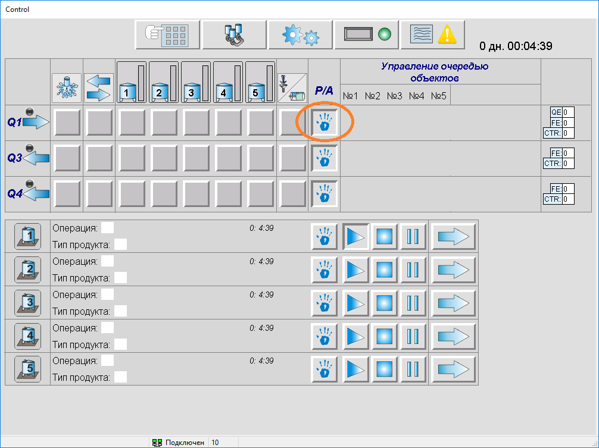

Далее необходимо путем нажатия на соответствующую кнопку выбрать танк для наполнения, после чего соответствующая кнопка поменяет цвет (на бирюзовый):

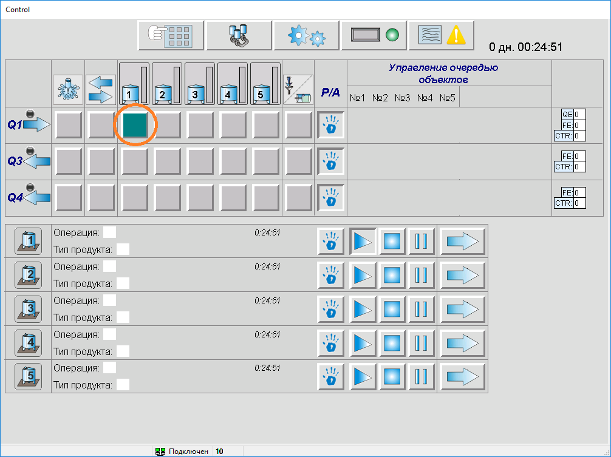

Далее нажимаем на кнопку включения операции наполнения группы танков:

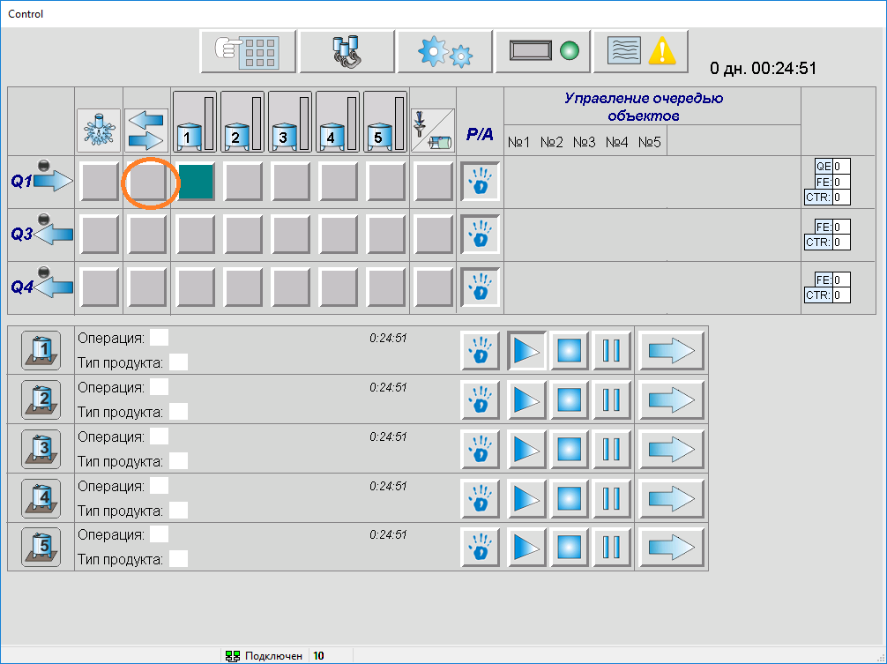

После успешного включения данная кнопка меняет цвет (на синий):

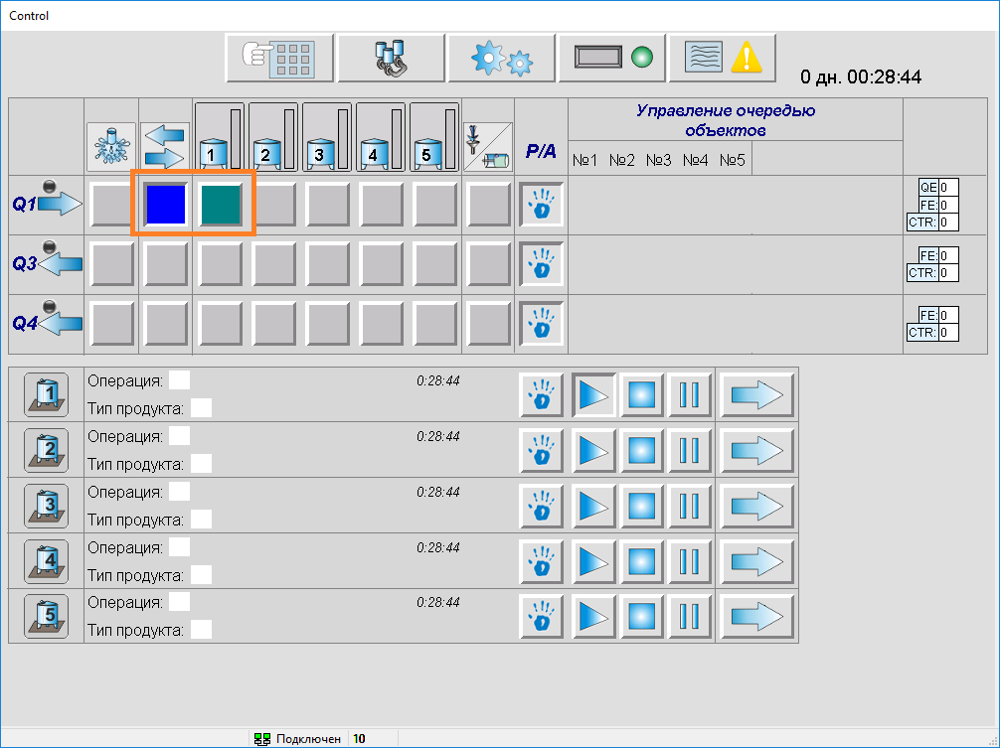

Это говорит о том, что включилась операция наполнения для линии, она находится в шаге "Ожидание действий оператора" - ожидается поворот физического ключа (в положения "В танк" или "В дренаж"), клапана линии закрыты:

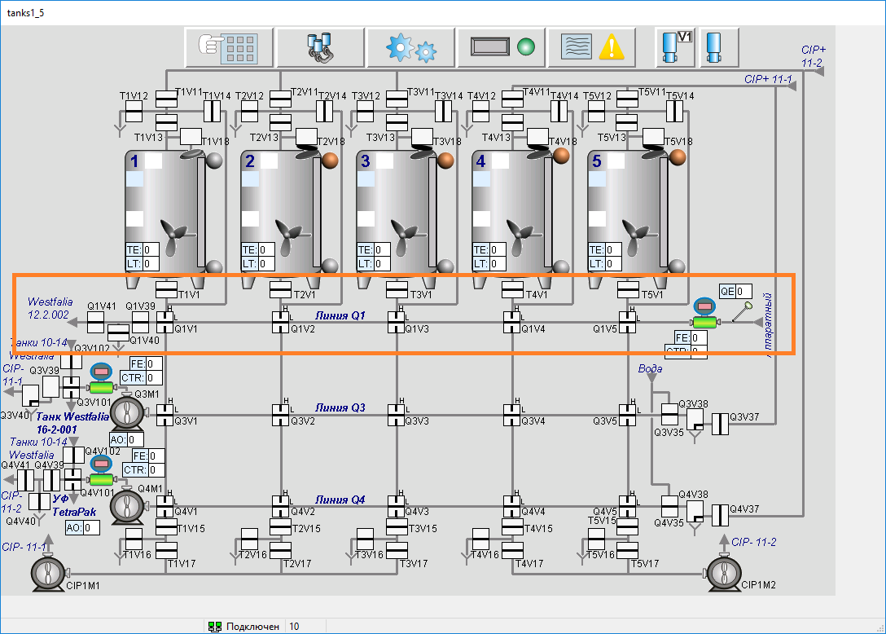

Далее, оператор может повернуть ключ в дренаж или в танк (из промежуточного положения), соответственно включаются нужные шаги операции линии и включается операция наполнения для танка. Положение "В танк":

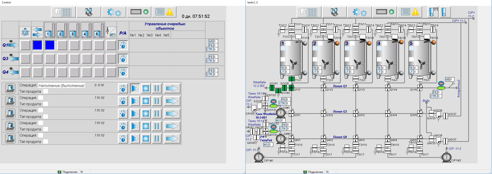

Положение "В дренаж":

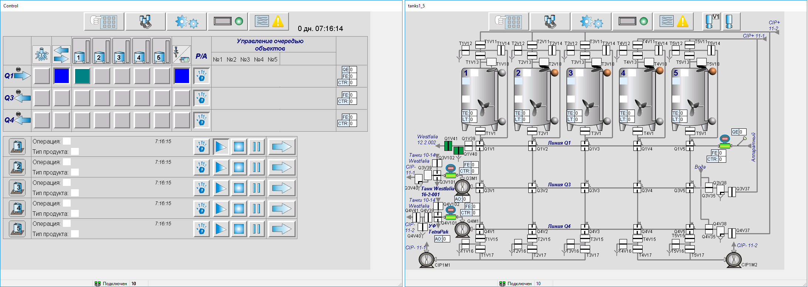

**Синий цвет для кнопки говорит о том, что включился соответствующий шаг, а бирюзовый - что данный шаг ещё не включен, но он включится после каких либо действий или событий.**

Переход к другому танку осуществляется путем нажатия соответствующей кнопки. При этом клапана плавно переключатся из одного в другой танк. По завершению наполнения оператор отключает операцию наполнения для линии.

##### 1.1.1.2. Автоматический режим
Для наполнения группы танков в автоматическом режиме необходимо отжать кнопку перевода в ручной режим (если ранее она была нажата):

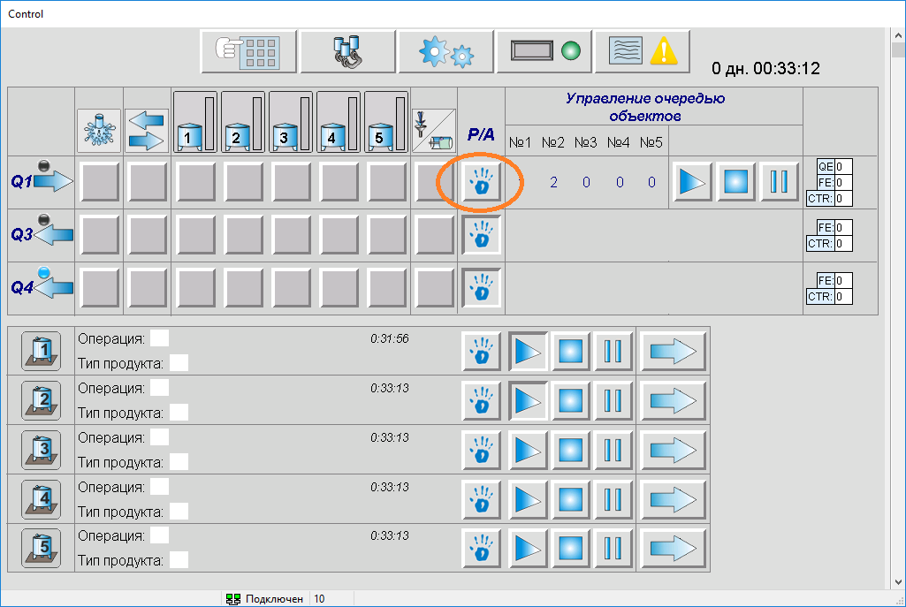

Далее нажатиями на соответствующие элементы задаем номера танков в очереди:

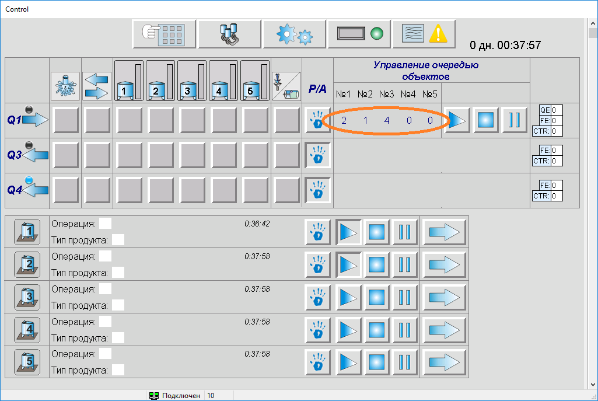

Далее нажимаем кнопку старт:

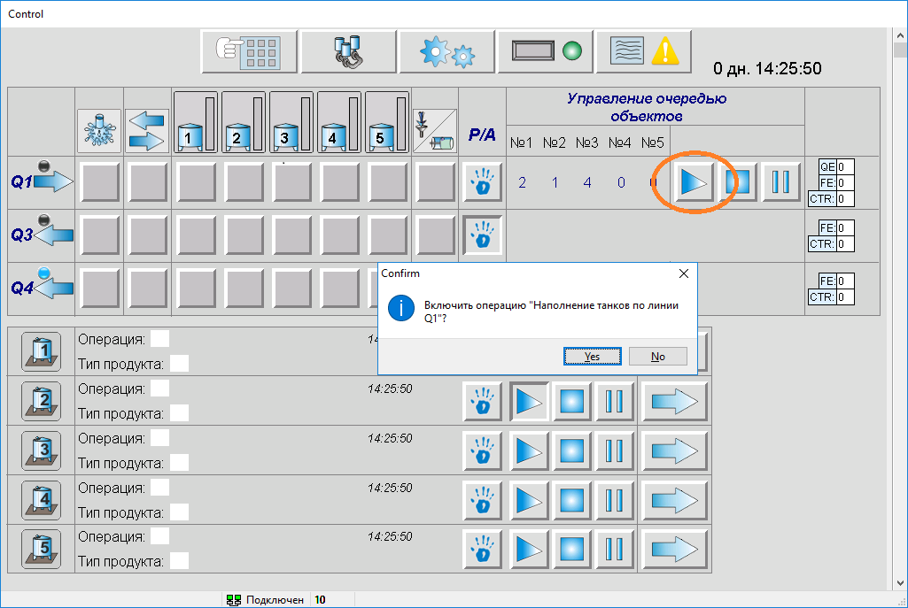

Далее включается операция и на основе показаний концентратомера определяется активный шаг - "В дренаж":

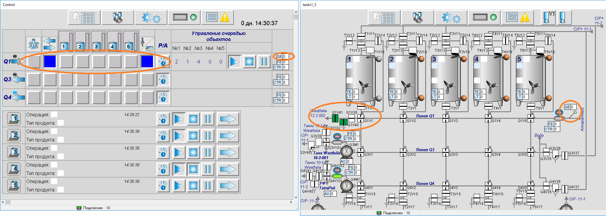

или "В танк":

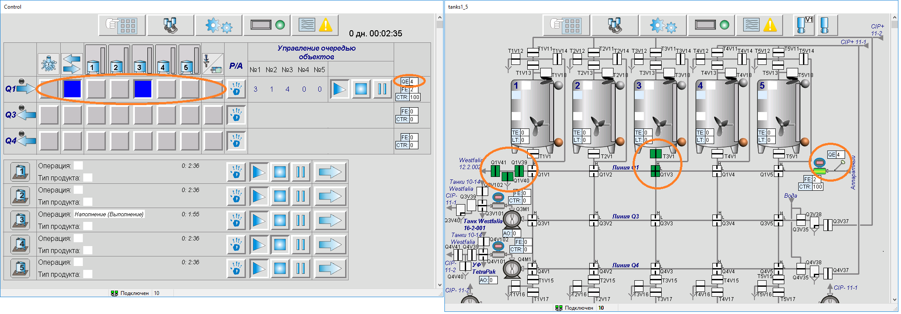

Во время работы на основе показаний концентратомера переключаются шаги "В дренаж" или "В танк". Переход к следующему танку в очереди возможен в следующих случаях:

*  сработал верхний уровень танка;
*  в танк подано заданное количество смеси (параметр);
*  текущий уровень танка достиг заданного значения (параметр).

При возникновении данных событий выдается соответствующее сообщение и осуществляется переход к следующему танку.

Если в очереди данный танк последний и в нем произошло одно из вышеперечисленных событий, а концентратомер показывает наличие смеси, то выдается соответствующее сообщение и операция не отключается.
Если по показаниям концентратомера произошел переход в шаг "В дренаж" и потом заданное время (параметр) расход ниже заданного (параметр), то операция наполнения группы танков отключается и выдается соответствующее сообщение.

## 2. Линия (технологический агрегат)
### 2.1. Типовые операции
#### 2.1.1. Мойка
Мойка состоит из нескольких шагов. Данные шаги промывают различные участки линии. Переключение между ними проходит автоматически по времени. Последний шаг мойки - дренаж, переход к нему осуществляется, когда МСА завершает мойку, т.е. появляется сигнал "Мойка окончена". Насос управляется автоматически по сигналу с МСА.  
Также операция может быть автоматической - включаться по сигналу "Запрос мойки" и выключаться после его пропадания (либо переходить к шагу "Дренаж" при наличии такового). Включение и отключение мойки сопровождается сообщениями (*"... автовключение по запросу"*, *"... автоотключение по запросу"* либо *"... переход к дренажу по запросу"* - см. пример ниже).

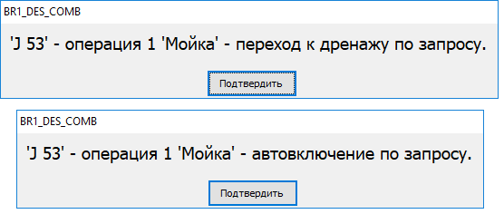

 Если сигнал пришел, а мойка не может включиться, то выдается соответствующее поясняющее сообщение (см. пример ниже). Для повторного включения мойки сигнал должен сброситься и появиться снова.

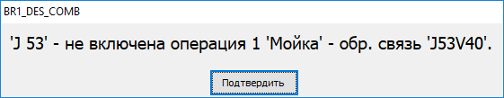

#### 2.1.2. Фасовка в автомат

Операция состоит из шагов, соответствующих количеству подающих линий. Также может быть шаг "В дренаж", задаются сигналы от фасовочного автомата: запрос продукта  (сигнал DI) и запрос производительности (сигнал АI или параметр). При включении соответствующего шага, данные запросы передаются на подающую линию.  
Также может задаваться сигнал **DO "Готов к производству"**. При включении соответствующего шага, данный сигнал зависит от готовности подающей линии.

#### 2.1.3. Фасовка в линию

В операции два шага - "Работа" и "В дренаж". Также имеется сигналы для источника: запрос продукта  (сигнал DO) и запрос производительности (сигнал АO). Данные сигналы формируются на основе активных операций "Фасовка в автомат".  
Также может задаваться сигнал **DI "Источник готов"**. Если он задан, то он обрабатывается так: после включения операции он неактивен, далее он станет активным при включении выдаче в соответствующем источнике, если потом он пропадет, то операция станет на паузу (с выдачей сообщения). Оператор потом может возобновить выполнение операции.  
Взаимодействие данных операций приведено на рисунке ниже.

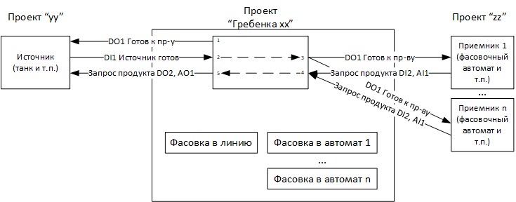

