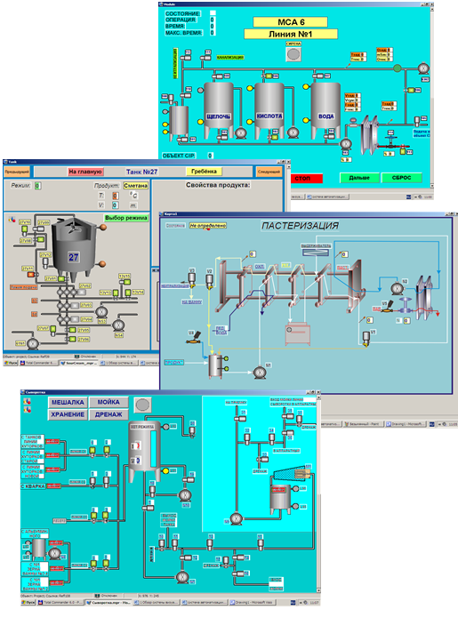
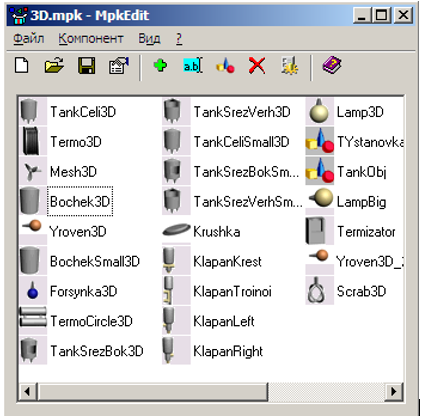
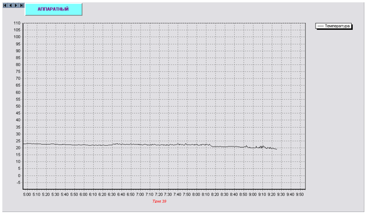
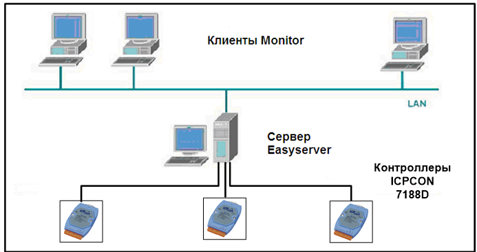
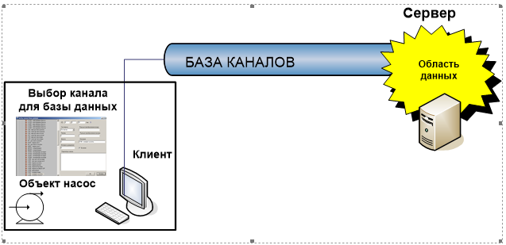

# Обзор системы визуализации процессов "Монитор"

+ [Введение](#введение)
    - [Описание](#описание)
    - [Обзор функций](#обзор-функций)
    - [Построение системы управления](#построение-системы-управления)

🔹 [Описание программы "Monitor"](./Описание%20программы%20Monitor/readme.md)

🔹 [Описание программы "Редактор компонентов"](./Редактор%20компонентов/readme.md)

🔹 [Описание работы с редактором базы каналов](./Редактор%20базы%20каналов/readme.md)

🔹 [Приложение 1 Палитра цветов](./Приложение%201%20Палитра%20цветов/readme.md)

🔹 [Приложение 2 Интерпретатор](./Приложение%202%20Интерпретатор/readme.md)

## Введение

### Описание 

Монитор - является модульной масштабируемой системой визуализации процесса (SCADA -  системой) для приложений различного уровня, начиная с простых  однопользовательских  приложений в промышленности и до сложных многопользовательских систем. Монитор обладает удобным пользовательским интерфейсом для создания промышленных  приложений, и гарантирует  стабильную и надежную  работу.

Рисунок 1 - Интерфейс программы 

	
### Обзор функций

Монитор позволяет инженерам – проектировщикам создавать индивидуальные стандарты путем разработки специфических  меню,  ориентированных  на конкретную  отрасль промышленности и на конкретный проект, путем создания пользовательских  объектов и сохранения их в контейнере.

Рисунок 2 - Контейнер объектов 

Монитор позволяет производить архивирование измеряемых  значений процесса, например, для отображения их  в  виде трендов или в других  отчетах.

Рисунок 3 - Тренд температуры 

### Построение системы управления 

Многопользовательская система позволяет нескольким пользователям одновременно осуществлять управление процессом в одной и той же части  установки, при этом каждый из пользователей видит последствия действия другого.

Действия по управлению  процессом на одной операторской станции выполняются согласованно с действиями на других  станциях. В многопользовательской системе скоординировано работают несколько операторских станций.

При этом станции управления совместно используют централизованные службы, например, сбор данных  или регистрацию.

Операторские станции в многопользовательской системе могут быть расположены вдоль линии производства, при этом оператор может переключаться между ними в зависимости от условий процесса при необходимости вмешиваться в процесс.

Многопользовательские системы работают по принципу клиент-сервер. Клиентские  станции используют сервисы, предоставляемые серверами. Обычно клиентские станции обмениваются данными с сервером по отдельной локальной сети (LAN), которая одновременно обеспечивает связь с офисным уровнем.

Для обмена данными между операторскими станциями  используется стандартный протокол TCP/IP . Клиенты  могут быть подключены на более позднем этапе, без  какого либо нежелательного воздействия на систему.

В качестве сервера выступает программа EASYSERVER, которая предназначена для обмена данными с различными устройствами и контроллерами(ICPCON, Wago, Phoenix), программа MONITOR выполняет функции клиента. Теоретически один сервер может обслуживать неограниченное число клиентов.

Рисунок 4 - Система управления 

Проект, сделанный в программе Monitor, загружается как на сервере, так и локально в качестве клиента.

Часть проекта служит как визуализация технологического процесса и управления (клиент), другая  часть выполняет функции обработки данных.

При создании проекта тэговые свойства объектов привязываются  к тэгу базы каналов.

Рассмотрим этот процесс на примере состояния насоса.

Насос имеет 3 состояния: 

* насос включен; 
* насос выключен; 
* насос не работает.
 
Для отображения его состояния используется привязка к тэгу.

В данном случае тэг является указателем на область памяти (ячейку) области данных. Каждый тэг определяется посредством канала. В проект добавляется объект "насос",  в свойствах state этого объекта выбирается канал  для базы данных. Более подробно этот вопрос рассматривается в главе 3.

Рисунок 5 - Привязка свойств объекта 

