# Описание программмы "Monitor"

## Содержание

+ [Запуск программы monitor](#запуск-программы-monitor)
+ [Пользовательский интерфейс](#пользовательский-интерфейс)
+ [Компоненты рабочей области](#компоненты-рабочей-области)
+ [Основное меню и панели инструментов](#основное-меню-и-панели-инструментов)
+ [Контекстные меню](#контекстные-меню)
+ [Сочетание клавиш](#сочетание-клавиш)
+ [Панель объектов и компонентов](#панель-объектов-и-компонентов)
+ [Рабочая область проекта](#рабочая-область-проекта)
+ [Стартовое окно](#стартовое-окно)
+ [Основное меню](#основное-меню)
    - [Режим работы](#режим-работы)
    - [Режим редактирования](#режим-редактирования)
+ [Основное меню режима работы](#основное-меню-режима-работы)
    - [Меню "Файл" режима работы](#меню-файл-режима-работы)
    - [Меню "Вид" режима работы](#меню-вид-режима-работы)
    - [Меню "Сервер" режима работы](#меню-сервер-режима-работы)
    - [Меню "Вопроса" режима работы](#меню-вопроса-режима-работы)
+ [Основное меню режима редактирования](#основное-меню-режима-редактирования)
    - [Меню "Файл" режима редактирования](#меню-файл-режима-редактирования)
    - [Меню "Правка" режима редактирования](#меню-правка-режима-редактирования)
    - [Меню "Вид" режима редактирования](#меню-вид-режима-редактирования)
    - [Меню "Проект" режима редактирования](#меню-проект-режима-редактирования)
    - [Меню "Карта" режима редактирования](#меню-карта-режима-редактирования)
    - [Меню "Объект" режима редактирования](#меню-объект-режима-редактирования)
    - [Меню "Ссылка" режима редактирования](#меню-ссылка-режима-редактирования)
        * [Подменю группировки](#подменю-группировки)
        * [Подменю выравнивания](#подменю-выравнивания)
        * [Подменю перемещения](#подменю-перемещения)
    - [Меню "Компоненты" режима редактирования](#меню-компоненты-режима-редактирования)
+ [Панели инструментов](#панели-инструментов)
    - [Панель инструментов режима работы](#панель-инструментов-режима-работы)
    - [Панель инструментов режима редактирования](#панель-инструментов-режима-редактирования)
        * [Панель правки](#панель-правки)
        * [Панель задания позиции и размеров ссылок](#панель-задания-позиции-и-размеров-ссылок)
        * [Панель работы с картами](#панель-работы-с-картами)
        * [Панель положения ссылки](#панель-положения-ссылки)
        * [Панель переименования](#панель-переименования)
+ [Панель компонентов](#панель-компонентов)
+ [Строка состояния](#строка-состояния)
+ [Всплывающее меню](#всплывающее-меню)
    - [Подменю группировки всплывающего меню](#подменю-группировки-всплывающего-меню)
+ [Журнал ошибок выполнения](#журнал-ошибок-выполнения)
+ [Комбинации "горячих" клавиш](#комбинации-горячих-клавиш)
+ [Редактор кода](#редактор-кода)
    - [Пользовательский интерфейс редактора кода](#пользовательский-интерфейс-редактора-кода)
        * [Компоненты рабочей области редактора кода](#компоненты-рабочей-области-редактора-кода)
        * [Панель инструментов редактора кода](#панель-инструментов-редактора-кода)
        * [Контекстное меню редактора кода](#контекстное-меню-редактора-кода)
        * [Сочетания клавиш редактора кода](#сочетания-клавиш-редактора-кода)
        * [Рабочая область проекта редактора кода](#рабочая-область-проекта-редактора-кода)
    - [Панель быстрого доступа](#панель-быстрого-доступа)
    - [Панель дерева кода](#панель-дерева-кода)
    - [Информационная панель](#информационная-панель)
    - [Область редактирования](#область-редактирования)
    - [Контекстное меню редактора](#контекстное-меню-редактора)
    - [Подсветка синтаксиса](#подсветка-синтаксиса)
    - [Выделение скобок](#выделение-скобок)
    - [Выделение конструкций языка](#выделение-конструкций-языка)
    - [Автоматические отступы](#автоматические-отступы)
    - [Свёртывание кусков кода](#свертывание-кусков-кода)
    - [Технология "IntelliSense"](#технология-intellisense)
        * [Список автозавершения](#список-автозавершения)
        * [Автоматическое завершение конструкций языка](#автоматическое-завершение-конструкций-языка)
    - [Комбинации горячих клавиш редактора кода](#комбинации-горячих-клавиш-редактора-кода)
    - [Расширенные возможности редактора кода](#расширенные-возможности-редактора-кода)
+ [Разработка](#разработка)
    - [Быстрый старт](#быстрый-старт)
+ [Работа с проектом](#работа-с-проектом)
    - [Создать проект](#создать-проект)
    - [Открыть проект](#открыть-проект)
    - [Сохранить проект](#сохранить-проект)
    - [Закрыть проект](#закрыть-проект)
    - [Переход в режим редактирования](#переход-в-режим-редактирования)
    - [Переход в режим мониторинга](#переход-в-режим-мониторинга)
    - [Инспектор проекта](#инспектор-проекта)
    - [Описание проекта](#описание-проекта)
        * [Дерево объектов](#дерево-объектов)
        * [Дерево карт](#дерево-карт)
        * [Области описания объектов, карт, слоёв и ссылок](#области-описания-объектов-карт-слоёв-и-ссылок)
        * [Кнопки действия над объектами](#кнопки-действия-над-объектами)
        * [Кнопки действия над ссылками](#кнопки-действия-над-ссылками)
        * [Действия инспектора проекта](#действия-инспектора-проекта)
        * [Проверить теги](#проверить-теги)
        * [Изменить драйвер](#изменить-драйвер)
        * [Показать ссылку](#показать-ссылку)
    - [Свойства проекта](#свойства-проекта)
+ [Работа с картами и слоями](#работа-с-картами-и-слоями)
    - [Добавить карту](#добавить-карту)
    - [Переименовать карту](#переименовать-карту)
    - [Удалить карту](#удалить-карту)
    - [Подложка карты](#подложка-карты)
        * [Выбор цвета фона](#выбор-цвета-фона)
        * [Установка рисунка как фон подложки](#установка-рисунка-как-фон-подложки)
    - [Свойства карты](#свойства-карты)
    - [Навигация по картам](#навигация-по-картам)
        * [Навигация по картам в режиме мониторинга](#навигация-по-картам-в-режиме-мониторинга)
        * [Навигация по картам в режиме редактирования](#навигация-по-картам-в-режиме-редактирования)
        * [Навигация по картам с панели инструментов](#навигация-по-картам-с-панели-инструментов)
        * [Навигация по картам с инспектора карт и слоёв](#навигация-по-картам-с-инспектора-карт-и-слоёв)
    - [Масштабирование карты](#масштабирование-карты)
    - [Работа со слоями](#работа-со-слоями)
        * [Добавить слой](#добавить-слой)
        * [Переименовать слой](#переименовать-слой)
        * [Удалить слой](#удалить-слой)
        * [Навигация по слоям](#навигация-по-слоям)
        * [Выбор отображаемых слоёв](#выбор-отображаемых-слоёв)
        * [Смена порядка расположения слоёв](#смена-порядка-расположения-слоёв)
    - [Гиперссылка на карту](#гиперссылка-на-карту)
        * [Параметры гиперссылки](#параметры-гиперссылки)
+ [Работа с контейнерами](#работа-с-контейнерами)
    - [Запуск редактора контейнеров](#запуск-редактора-контейнеров)
    - [Диалог работы с контейнерами проекта](#диалог-работы-с-контейнерами-проекта)
    - [Добавление контейнера в проект](#добавление-контейнера-в-проект)
    - [Удаление контейнера из проекта](#удаление-контейнера-из-проекта)
    - [Добавление компонента в проект](#добавление-компонента-в-проект)
    - [Подмена контейнеров](#подмена-контейнеров)
    - [Важно знать о контейнерах](#важно-знать-о-контейнерах)
+ [Работа с объектами](#работа-с-объектами)
    - [Описание объектов](#описание-объектов)
        * [Вид объекта](#вид-объекта)
        * [Диалог настройки вида объекта](#диалог-настройки-вида-объекта)
        * [Свойства объекта](#свойства-объекта)
        * [Типы свойств](#типы-свойств)
        * [Локальные свойства](#локальные-свойства)
        * [Глобальные свойства](#глобальные-свойства)
        * [Теговые свойства](#теговые-свойства)
        * [Вычисляемые свойства](#вычисляемые-свойства)
        * [Типы значения свойств](#типы-значения-свойств)
        * [Заголовок свойства](#заголовок-свойства)
        * [Сохраняемое](#сохраняемое)
        * [Протоколирование](#протоколирование)
        * [Разрешение для редактирования](#разрешение-для-редактирования)
        * [Уровень доступа](#уровень-доступа)
        * [Событие OnChange](#событие-onchange)
        * [Событие OnCanChange](#событие-oncanchange)
+ [Работа с ссылками](#работа-с-ссылками)
+ [Подсистема тревог](#подсистема-тревог)
+ [Системные компоненты](#системные-компоненты)
+ [Работа с проектом из интерпретатора](#работа-с-проектом-из-интерпретатора)
    - [Введение в управление проектом из среды интерпретатора](#введение-в-управление-проектом-из-среды-интерпретатора)
    - [Функции и свойства доступные для объектов](#функции-и-свойства-доступные-для-объектов)
    - [Функции и свойства доступные для карт и слоёв](#функции-и-свойства-доступные-для-карт-и-слоёв)
    - [Функции и своёства доступные для ссылок системных компонентов](#функции-и-свойства-доступные-для-ссылок-системных-компонентов)
+ [Отладка проекта](#отладка-проекта)

Эта глава детально описывает начало работы и интерфейс программы.

## Запуск программы "Monitor"

Когда вы поставили программу **«Monitor»** на ваш компьютер, папка новой программы называемой Monitor, находиться на диске P **(P:/Monitor)** .

Вы можете запустить программу с иконки на рабочем столе или другим альтернативным способом:
1.	Найти папку P:/Monitor;
2.	Найти файл с названием Monitor.exe;
3.	Запустить Monitor.exe.

>Монитор можно запустить только в единственном экземпляре.

После короткой паузы появиться Стартовое окно (рис. 1). В этом окне вы можете:
* Открыть файл проекта выделенный в списке проектов ( .mpr файл )
* Создать новый проект ( .mpr файл)
* Добавить существующий проект в список проектов (.mpr файл)
* Удалить выделенный в списке проектов проект (.mpr файл )
* Выйти из программы.

## Пользовательский интерфейс

Monitor содержит некоторое количество окон, меню и панелей инструментов описываемых ниже.
Вместе эти элементы обеспечивают простой и гибкий инструмент для разработчика.
Приложение работает в двух режимах: рабочий и редактирования.
<p>Каждому режиму соответствуют свои меню и панели инструментов.

## Компоненты рабочей области

Эта секция обрисовывает компоненты рабочей области.

## Основное меню и панели инструментов

Вверху рабочей области находятся основное меню и панели инструментов. Основное меню даёт доступ к подчинённы подменю.
Там же расположены несколько панелей инструментов, которые можно скрывать или показывать, если необходимо.

## Контекстные меню

На протяжении всей работы с приложением, если вы щёлкаете правой клавишей мыши по рабочему пространству, спискам, ссылкам или объектам, Monitor отображает меню с соответствующим этому элементу содержимым.

Например:

* Меню свойств ссылки.

## Сочетание клавиш

Большинство пунктов основного меню и контекстных меню имеют возможность вызова с помощью комбинаций клавиш. Т.е. вместо выбора пункта меню можно нажать нужную комбинацию клавиш.
Для просмотра всех комбинаций и их функций смотрите главу **«Горячие клавиши»**.

## Панель объектов и компонентов

Monitor содержит панель в которой можно выбрать объекты и поместить на рабочую область проекта. Это важная часть приложения, позволяющая создавать свои компоненты и использовать их в проектах.

## Рабочая область проекта

Большое центральное окно Monitor отображает содержимое проекта. Это место, в котором возможно размещение элементов и их настройки. Когда вы создаете новый проект – эта область не содержит элементов.

## Стартовое окно

Когда вы запустили Monitor, первое что вы увидите – это стартовое окно

<p align="center">
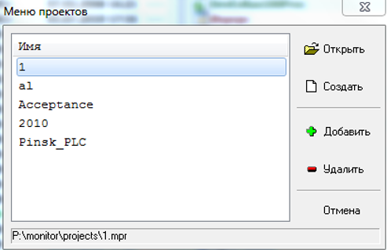
</p>
<p align="center">Рисунок 6 - Меню проектов </p>

В нём вы можете выбрать проект и открыть его для работы или редактирования. В нём содержаться список проектов (по центру окна), строка состояния (внизу окна) и кнопки действий (смотрите ниже).

В строке состояния отображается путь к выделенному в списке названию проекта.

|Название кнопки|Описание действия по нажатию кнопки|
|---------------|-----------------------------------|
| Открыть        | Открывает проект выделенный в списке проектов.|
| Создать        | Создаёт новый проект и переходит в режим редактирования.|
| Добавить       | Добавление проектов в список проектов. При нажатии кнопки происходит вызов диалогового окна открытия файла.|
| Удалить        | Удаляет выделенный проект из списка. |
| Отмена         | Закрывает Monitor |

## Основное меню 

<p align="center">
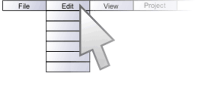
</p>
<p align="center">Рисунок 7 - Основное меню </p>

Основное меню Монитора предоставляет  доступ при помощи мыши к большинству высокоуровневых функций на протяжении жизненного цикла проекта.

Так как в Мониторе присутствуют два режима работы (режим работы и режим редактирования), поэтому для каждого режима существуют отдельные основные меню.

### Режим работы 

<p align="center">
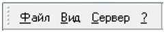
</p>
<p align="center">Рисунок 8 - Режим работы </p>

Порядок расположения меню следующий:

* Меню «Файл»
* Меню «Вид»
* Меню «Сервер»
* Меню «?»

### Режим редактирования 

<p align="center">
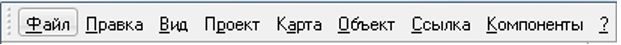
</p>
<p align="center">Рисунок 9 - Режим редактирования </p>

Порядок расположения меню следующий:

* Меню «Файл»
* Меню «Правка»
* Меню «Вид»
* Меню «Проект»
* Меню «Карта»
* Меню «Объект»
* Меню «Ссылка»
* Меню «Компоненты»
* Меню «?»

Описанное выше предоставляет общее описание функций доступных в основных меню, и их основной предметы.

## Основное меню режима работы 

### Меню "Файл" режима работы

<p align="center">
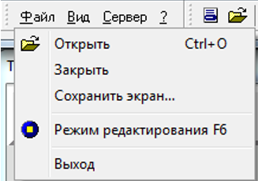
</p>
<p align="center">Рисунок 10 - Меню "Файл" </p>

| Функции меню и горячие клавиши | Описание функции меню |
|--------------------------------|-----------------------|
| Открыть [Ctrl]+[O]             | Открыть проект.       |
| Закрыть                        | Закрыть текущий проект.|
| Сохранить экран…               | Сохранить вид текущей карты.|
| Режим редактирования [F6]      | Переход в режим редактирования. Может не отображаться, если у пользователя нет прав на редактирование. |
| Выход                          | Выход из программы.   |

### Меню "Вид" режима работы

<p align="center">
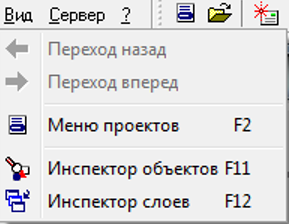
</p>
<p align="center">Рисунок 11 - Меню "Вид" </p>

| Функции меню и горячие клавиши | Описание функции меню |
|--------------------------------|-----------------------|
| Переход назад                  | Переход на предыдущую открытую карту. |
| Переход вперёд                 | Переход на предыдущую карту, если был переход назад. |
| Меню проектов [F2]             | Вызывает окно выбора проекта. |
| Инспектор объектов [F11]       | Вызывает окно инспектора объектов. |
| Инспектор слоёв [F12]          | Вызывает окно инспектора слоёв.   |
> ВНИМАНИЕ: ПЕРЕХОД НАЗАД И ПЕРЕХОД ВПЕРЁД В ТЕКУЩЕЙ ВЕРСИИ НЕ РАБОТАЕТ.

### Меню "Сервер" режима работы

<p align="center">
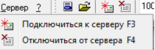
</p>
<p align="center">Рисунок 12 - Меню "Сервер" </p>

| Функции меню и горячие клавиши | Описание функции меню |
|--------------------------------|-----------------------|
| Подключиться к серверу [F3]    | Подключение проекта к серверу проектов. |
| Отключиться от сервера [F4]    | Отключение проекта от сервера проектов. |

### Меню "Вопроса" режима работы

<p align="center">
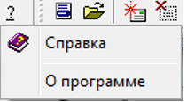
</p>
<p align="center">Рисунок 13 - Меню "?" </p>

| Функции меню и горячие клавиши | Описание функции меню |
|--------------------------------|-----------------------|
| Справка [F1]                   | Вызов справки.        |
| О программе                    | Вызов окна с информацией о программе. |

## Основное меню режима редактирования

### Меню "Файл" режима редактирования

<p align="center">
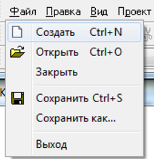
</p>
<p align="center">Рисунок 14 - Меню "Файл" </p>

| Функции меню и горячие клавиши | Описание функции меню |
|--------------------------------|-----------------------|
| Создать [Ctrl]+[N]             | Создать новый проект. |
| Открыть [Ctrl]+[O]             | Открыть проект.       |
| Закрыть                        | Закрыть текущий проект. |
| Сохранить [Ctrl] + [S]         | Сохранить текущие изменения в проекте. |
| Сохранить как…                 | Сохранить текущий проект под другим именем. |
| Выход                          | Выход из программы.   |

### Меню "Правка" режима редактирования

<p align="center">
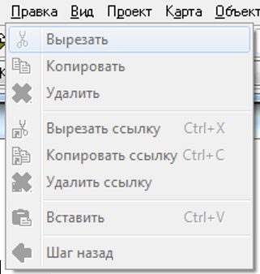
</p>
<p align="center">Рисунок 15 - Меню "Правка" </p>

| Функции меню и горячие клавиши | Описание функции меню |
|--------------------------------|-----------------------|
| Вырезать                       | Вырезать выделенные ссылки вместе с объектами в буфер обмена. |
| Копировать                     | Копировать выделенные ссылки вместе с объектами в буфер обмена. |
| Удалить                        | Удалить выделенные ссылки вместе с объектами. |
| Вырезать ссылку [Ctrl]+[X]     | Вырезать выделенные ссылки в буфер обмена. |
| Копировать ссылку [Ctrl]+[C]   | Копировать выделенные ссылки в буфер обмена. |
| Удалить ссылку [Del]           | Удалить выделенные ссылки. |
| Вставить [Ctrl]+[V]            | Вставить ссылки или объекты, находящиеся в буфере копирования. |
| Шаг назад                      | Убрать последние изменения визуальных элементов. |
>ВНИМАНИЕ: ШАГ НАЗАД В ТЕКУЩЕЙ ВЕРСИИ НЕ РАБОТАЕТ.

### Меню "Вид" режима редактирования

<p align="center">
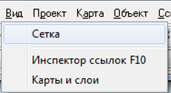
</p>
<p align="center">Рисунок 16 - Меню "Вид" </p>

| Функции меню и горячие клавиши | Описание функции меню |
|--------------------------------|-----------------------|
| Сетка                          | Включение сетки для выравнивания визуальных элементов. |
| Инспектор ссылок [F10]         | Показывает/скрывает окно настроек ссылок. |
| Карты и слои                   | Показывает/скрывает окно работы с картами и слоями. |

Сетка – показывает сетку для выравнивания визуальных элементов.

<p align="center">
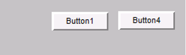
</p>
<p align="center">Рисунок 17 - Без сетки </p>

<p align="center">
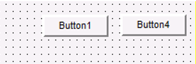
</p>
<p align="center">Рисунок 18 - С сеткой </p>

Инспектор ссылок – вызывает/скрывает окно настроек ссылок. При выделении какой либо ссылки в окне инспектора появляются доступные  для редактирования свойства.

<p align="center">
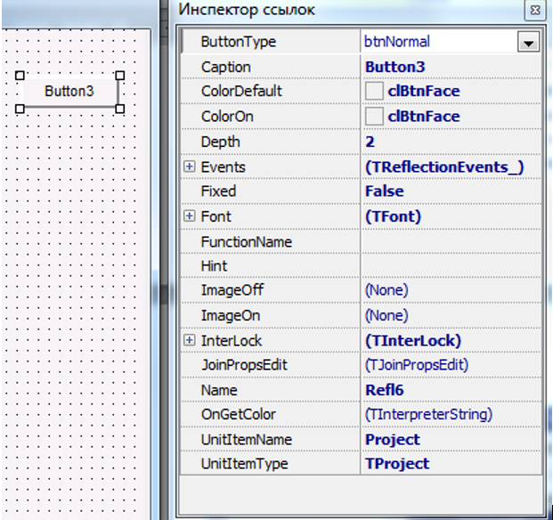
</p>
<p align="center">Рисунок 19 - Инспектор ссылок </p>

Карты и слои – вызывает/скрывает окно работы с картами и слоями. В нём можно выбирать текущую редактируемую карту, слой и делать видимыми нужные слои.

<p align="center">
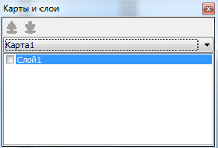
</p>
<p align="center">Рисунок 20 - Окно работы с картами и слоями </p>

### Меню "Проект" режима редактирования

<p align="center">
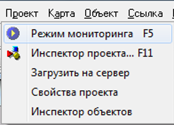
</p>
<p align="center">Рисунок 21 - Меню "Проект" </p>

| Функции меню и горячие клавиши | Описание функции меню |
|--------------------------------|-----------------------|
| Режим мониторинга [F5]         | Переход в режим мониторинга. |
| Инспектор проекта [F11]       | Вызов окна инспектора объектов. |
| Загрузить на сервер            | Загрузить текущий проект на сервер проектов. |
| Свойства проекта               | Вызывает окно настроек проекта. |
| Инспектор объектов             | Показывает/скрывает окно работы с свойствами объектов. |
> ВНИМАНИЕ: ЗАГРУЗИТЬ НА СЕРВЕР В ТЕКУЩЕЙ ВЕРСИИ НЕ РАБОТАЕТ.

Режим мониторинга – переход приложения в состояние мониторинга.

Инспектор проекта – вызывает окно инспектора проекта. Сетка  - добавление сетки для лучшего расположения компонентов на картах.

Инспектор проекта - отображает структуру проекта и позволяет производить поиск и редактирование объектов, которые используются в проекте.

Кнопка "Проверить теги" - показывает информацию о теговых свойствах проекта. Кнопка "Изменить драйвер" - позволяет изменить ID драйвера.

<p align="center">
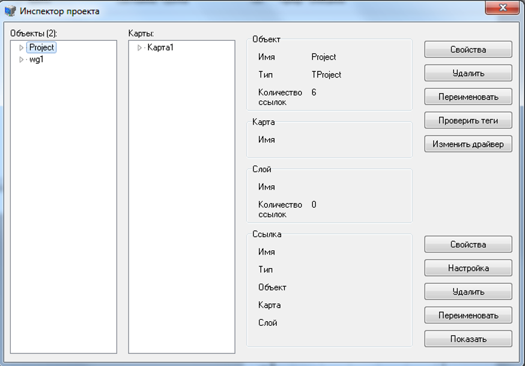
</p>
<p align="center">Рисунок 22 - Инспектор проекта </p>

Свойства проекта – вызывает окно свойств проекта.

<p align="center">
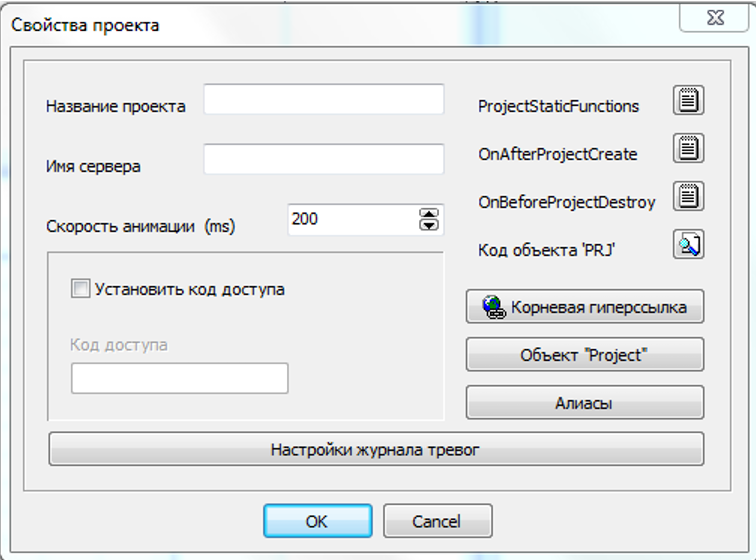
</p>
<p align="center">Рисунок 23 - Окно свойств проекта </p>

* PorjectStaticFunctions - программа основных выполняемых функций,

* OnAfterProjectCreate – функции, которые выполняются при запуске проекта на серверe,

* OnBeforeProjectDestroy - функции, которые выполняются после завершения работы проекта на сервере,

* Код объекта "PRJ" – программа всего проекта.

Кнопки:

* Корневая гиперссылка – служит для выбора стартового экрана при работе клиента;

<p align="center">
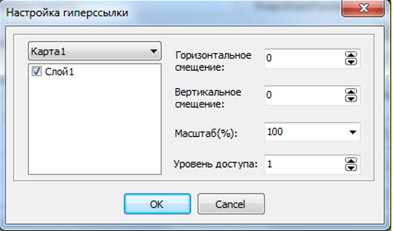
</p>
<p align="center">Рисунок 24 - Окно настройки гиперссылки </p>

* Объект "Project" - предназначен для привязке к графическим элементам (линии, полигоны , кнопки) те обработчикам событий(OnClick , OnHyperLink),

* Опция "Установить код доступа", Алиасы – не используются,
 
Поля:

* Название проекта 

* имя сервера 

* скорость анимации 

> НЕ ИСПОЛЬЗУЮТСЯ.

Инспектор объекта – вызывает/скрывает окно настройки объекта.
<p align="center">
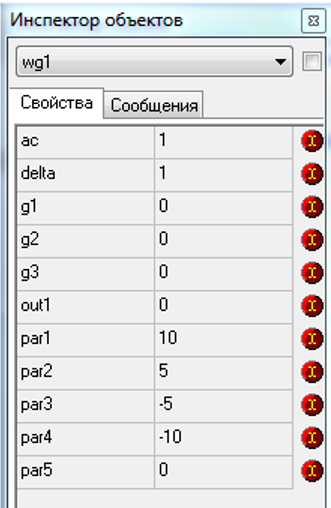
</p>
<p align="center">Рисунок 24 - Инспектор объектов </p>

### Меню "Карта" режима редактирования

<p align="center">
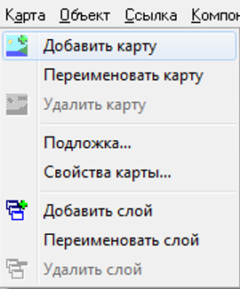
</p>
<p align="center">Рисунок 25 - Меню "Карта" </p>

| Функции меню и горячие клавиши | Описание функции меню |
|--------------------------------|-----------------------|
| Добавить карту                 | Добавить карту к проекту. |
| Переименовать карту            | Переименовать текущую карту. |
| Удалить карту                  | Удалить текущую карту. |
| Подложка…                      | Вызов окна настройки подложки карты. |
| Свойства карты                 | Вызов окна настройки карты. |
| Добавить слой                  | Добавить слой для текущей карты. |
| Переименовать слой             | Переименовать текущий слой. |
| Удалить слой                   | Удалить текущий слой. |

Визуализация технологического процесса может состоять из нескольких карт.

Каждая карта состоит из слоев, это необходимо для отображения определенных  объектов на одной  карте. Меню “Карта” позволяет производить различные действия над картами визуализации.

* Добавить карту – добавить карту к проекту.
* Переименовать карту – переименовать текущую карту.
* Удалить карту – удалить текущую карту.
* Подложка – вызов окна настройки подложки карты: цвет подложки или фоновый рисунок.

<p align="center">
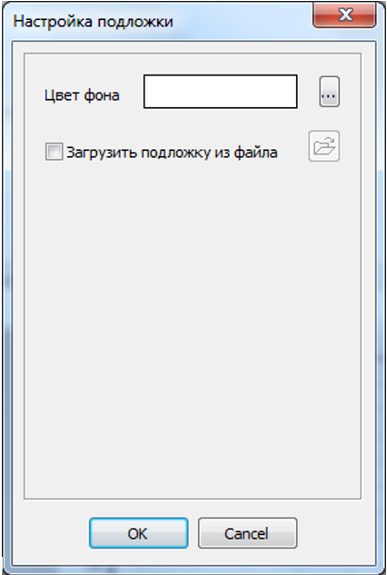
</p>
<p align="center">Рисунок 26 - Окно настройки подложки </p>

Свойства карты – вызов окна настройки карты: размеры и описание событий карты (OnInit, OnDeInit).

<p align="center">
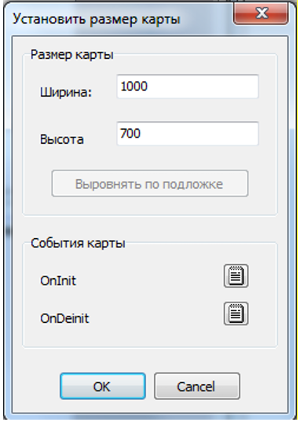
</p>
<p align="center">Рисунок 27 - Окно настройки подложки </p>

* Добавить слой – добавить слой для текущей карты.
* Переименовать слой – переименовать текущий слой.
* Удалить слой – удалить текущий слой.

### Меню "Объект" режима редактирования

<p align="center">
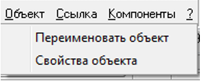
</p>
<p align="center">Рисунок 28 - Меню "Объект" </p>

| Функции меню и горячие клавиши | Описание функции меню |
|--------------------------------|-----------------------|
| Переименовать объект           | Вызывает окно переименования выделенного объекта. |
| Свойства объекта               | Вызов окна свойств объекта.|

Рассмотрим окно свойств объекта на примере клапана :

<p align="center">
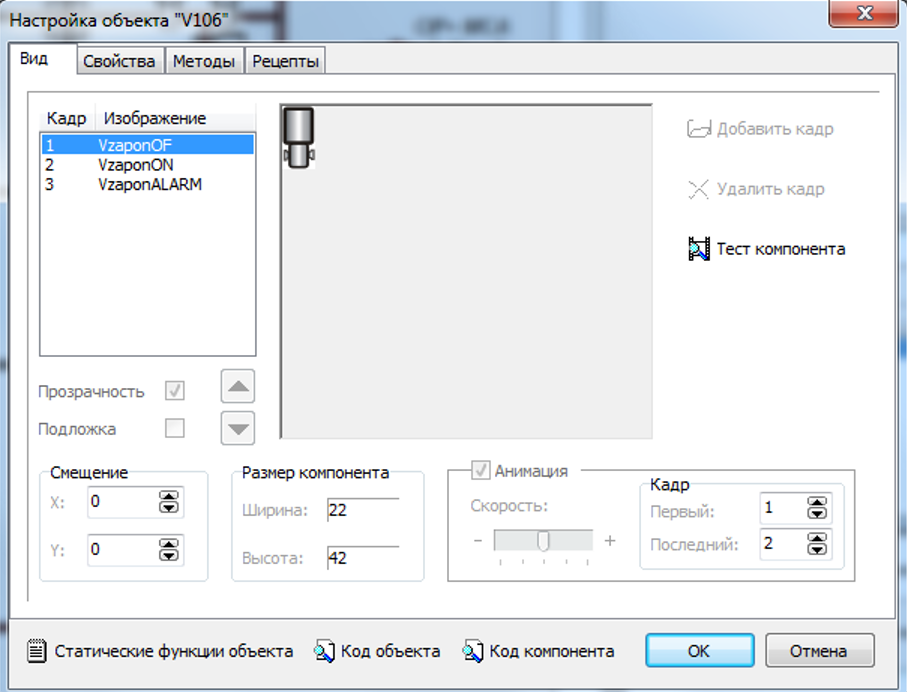
</p>
<p align="center">Рисунок 29 - Закладка "вид" свойств объекта </p>

Внешний вид закладки «Вид» представлен на рис.29. В левой части панели диалога расположен список кадров объекта.

Кадр – это графический файл, характеризующий какое-то состояние объекта. Справа от списка находится окно, в котором отображается текущий кадр. Правее окна расположен ряд кнопок, выполняющих следующие действия:

* Добавить кадр – выбрать графический файл, который будет являться новым кадром объекта;
* Удалить кадр – удалить текущий кадр;
* Справка – загрузить раздел справки по текущей закладке диалога.
 Ниже списка кадров расположены следующие элементы:
* Кнопки со стрелками – изменять порядок следования кадров в списке;
* Смещение – горизонтальное и вертикальное смещение текущего кадра     относительно начала координат объекта;
* Размер компонента – суммарная (по всем кадрам) ширина и высота компонента;
* Анимация – если анимация включена, то кадры компонента будут автоматически сменять друг друга, начиная с того, который указан в поле «Первый», кончая тем, который указан в поле «Последний» (возможен обратный отсчет) со скоростью, указанной в поле «Скорость». Скорость анимации измеряется в разах срабатывания встроенного в ядро программы таймера (каждый раз, через раз, через два раза и т.д.).

<p align="center">
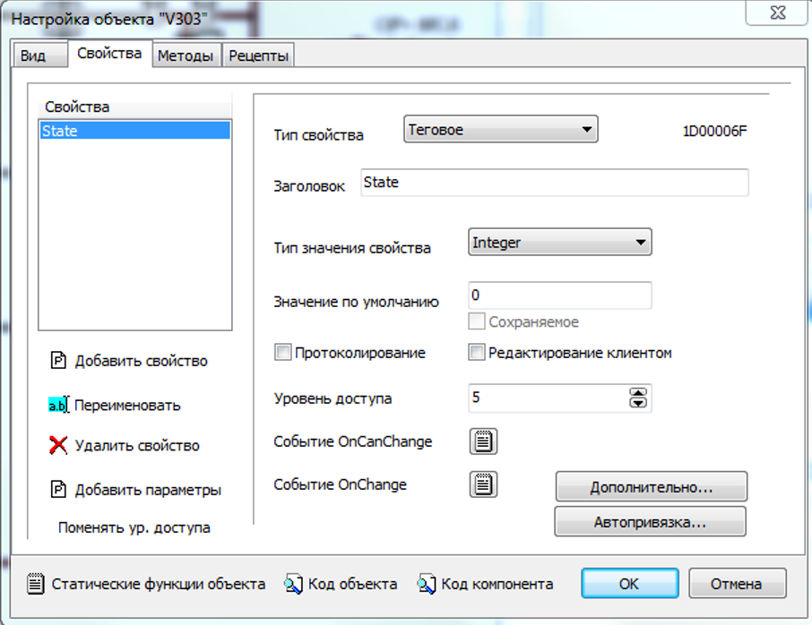
</p>
<p align="center">Рисунок 30 - Закладка "свойтсва" свойств объекта </p>

Внешний вид закладки «Свойства» диалога настройки компонента представлен на рис.30. В левой части панели диалога расположен список свойств объекта. Чуть ниже его расположены команды управления свойствами объекта:
* Добавить свойство – создание нового свойства компонента или объекта;
* Переименовать – изменение имени свойства;
* Удалить свойство – удаление выбранного свойства.

В правой части диалога расположены элементы настройки свойств. Рассмотрим их по порядку.

Тип свойства может быть следующим:
* Локальное – выполняется только на  клиенте;
* Глобальное – выполняется на сервере и на клиенте; 
* Тэговое  -  служит для привязки объекта к базе каналов; 
* Вычисляемое -  выполняется на сервере и на клиенте.

Опция "протоколирование" – протоколирует свойство проекта (только глобальные, тэговые протоколируются в базе каналов).

Опция "редактирование клиентом" – позволяет устанавливать значения свойств объекта с помощью инспектора объектов.

Различают  5 типов значения свойства:

* String – строковый тип;
* Integer – целочисленный тип;
* Float – вещественный тип;
* Boolean – логический тип;
* Date – календарный тип.

В поле «Тип значение по умолчанию» можно задать значение, которое будет у свойства сразу после загрузки проекта (текущие значения свойств в файле проекта не сохраняются).

Уровень доступа – определяет права пользователя.

Например, если уровень доступа равен пяти, то пользователь имеющий  права больше или равные пяти может работать с объектом.

Кнопка “Дополнительно ” служит для привязки свойства объекта к базе каналов.
<p align="center">
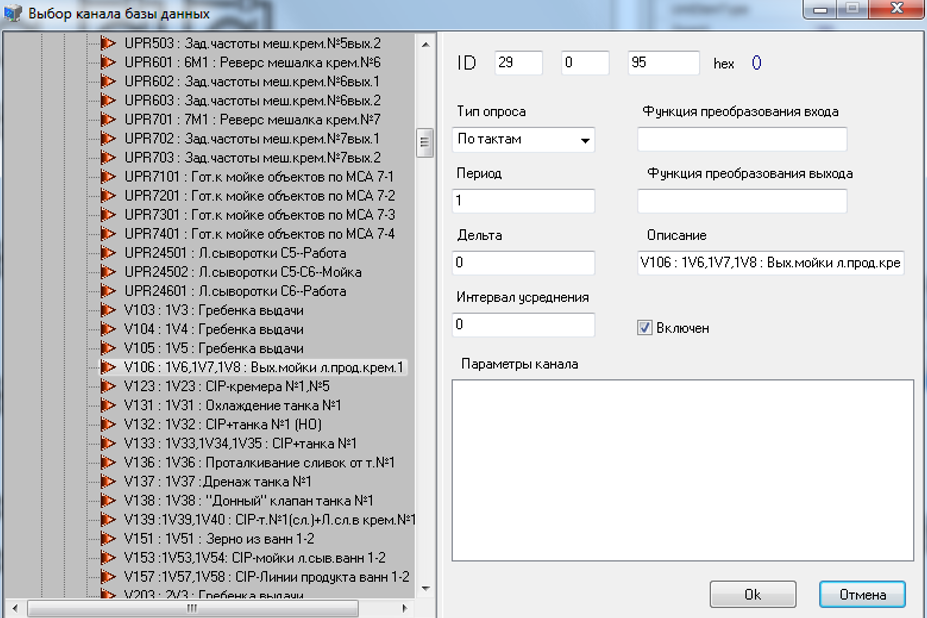
</p>
<p align="center">Рисунок 31 - Привязка к базе каналов </p>

События OnCanChange и OnChange. Различают события происходящие вовремя изменения и до изменения. Событие OnChange выполняется в момент изменения свойства, а OnCanChange до изменения.

Практически используется событие OnChange.

<p align="center">
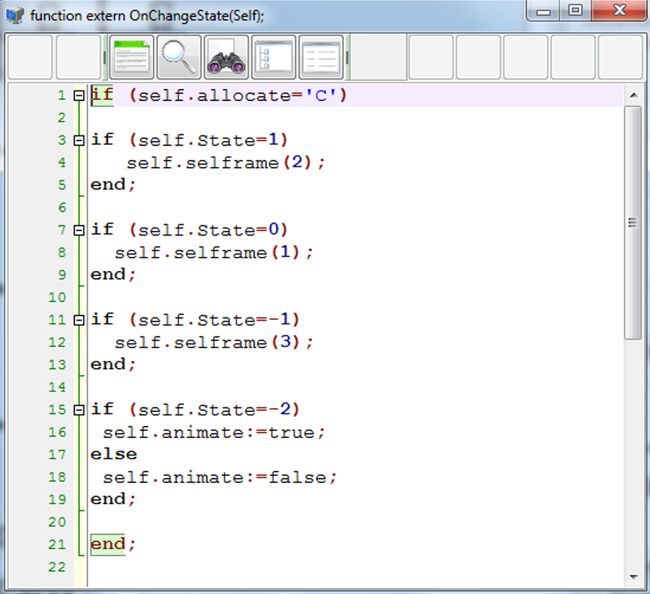
</p>
<p align="center">Рисунок 32 - Пример событие OnChange </p>

Закладка "Рецепты"  предназначена для добавления новых рецептов объекта,  которые  характеризуют его свойства (состояние, режим работы и т.д.).

<p align="center">
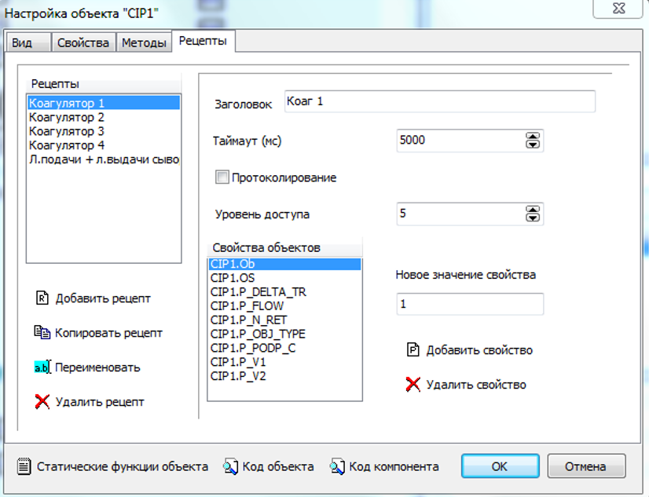
</p>
<p align="center">Рисунок 33 - Закладка "рецепты" свойств объекта </p>

<p align="center">
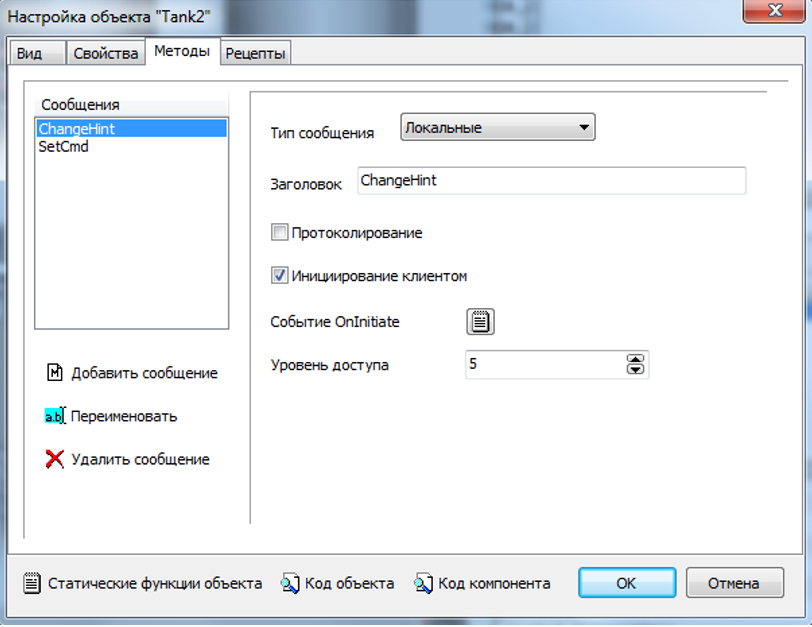
</p>
<p align="center">Рисунок 34 - Закладка "методы" свойств объекта </p>

### Меню "Ссылка" режима редактирования

<p align="center">
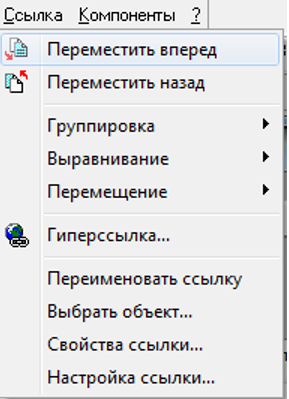
</p>
<p align="center">Рисунок 35 - Меню "Ссылка" </p>

| Функции меню и горячие клавиши | Описание функции меню |
|--------------------------------|-----------------------|
| Переместить вперёд             | Перемещение выделенных ссылок поверх всех объектов.|
| Переместить назад              | Перемещение выделенных ссылок позади всех объектов.|
| Группировка                    | Отображение подменю, содержащее следующие функции группировки: группировать и разгруппировать. |
| Выравнивание                   | Отображение подменю, содержащее следующие функции выравнивания: по левому, по правому, по вертикали, по верху, по низу и по горизонтали. |
| Перемещение                    | Отображение подменю, содержащее следующие функции перемещения: немного влево, немного вправо, немного вверх и немного вниз.|
| Гиперссылка                    | Вызывает окно настройки гиперссылки.|
| Переименовать ссылку           | Вызывает окно переименования выделенной ссылки.|
| Выбрать объект                 | Вызывает окно выбора объекта, к которому принадлежит ссылка.|
| Свойства ссылки                | Вызывает окно свойств ссылки.|
| Настройка ссылки               | Вызывает окно настроек ссылки.|

#### Подменю группировки:

| Функции меню и горячие клавиши | Описание функции меню |
|--------------------------------|-----------------------|
| Группировать                   | Сгруппировать выделенные ссылки.|
| Разгруппировать                | Разгруппировать выделенные ссылки.|

#### Подменю выравнивания:

| Функции меню и горячие клавиши | Описание функции меню |
|--------------------------------|-----------------------|
| По левому                      | Выравнивает выделенные ссылки по левому краю.|
| По правому                     | Выравнивает выделенные ссылки по правому краю.|
| По вертикали                   | Выравнивает выделенные ссылки по вертикали.|
| По верху                       | Выравнивает выделенные ссылки по верхнему краю.|
| По низу                        | Выравнивает выделенные ссылки по нижнему краю.|
| По горизонтали                 | Выравнивает выделенные ссылки по горизонтали.|

#### Подменю перемещения:

| Функции меню и горячие клавиши | Описание функции меню |
|--------------------------------|-----------------------|
| Немного влево [Left]           | Выравнивает выделенные ссылки по левому краю.|
| Немного вправо [Right]         | Выравнивает выделенные ссылки по правому краю.|
| Немного вниз [Down]             | Выравнивает выделенные ссылки по вертикали.|
| Немного вверх [Up]           | Выравнивает выделенные ссылки по верхнему краю.|

Команды "Переместить вперед" и "Переместить назад" позволяют размещать выделенные ссылки  над и за соответственно относительно всех 
объектов.

Команды "Вырезать ссылку", "Копировать ссылку"  и "Переименовать ссылку" предназначены для редактирования ссылок.

Команда "Гиперссылка" предназначена для присвоения ссылке гиперссылки для перехода на другую карту.

<p align="center">
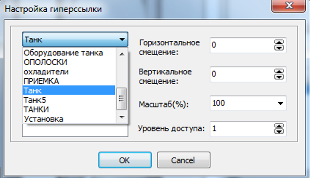
</p>
<p align="center">Рисунок 36 - Присвоения объекту гиперссыки </p>

Команда "Группировка" позволяет объединять несколько объектов при их выделении. Вначале, удерживая клавишу "Shift", последовательно выделяются необходимые объекты. 

Выбираем команду "Группировать" и при последующем выделении одного из объектов автоматически выделяются   
все объединенные объекты.

Команда "Выбрать объект" позволяет для определенной ссылки выбрать объект. Например:

<p align="center">
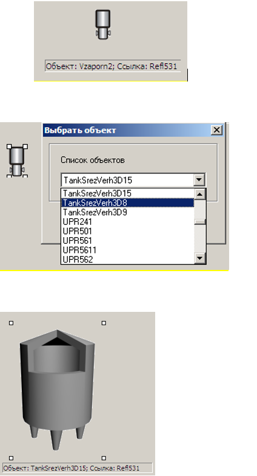
</p>
<p align="center">Рисунок 37 - Команда  “Выбрать объект ” </p>

"Свойства ссылки" – отображает свойства  ссылки и позволяет добавлять обработчики событий по событиям (OnClick – по одиночному щелчку левой клавишей мыши по ссылке, OnDblClick – по двойному щелчку левой клавишей мыши, OnHyperLink – срабатывает если для ссылки определенна гиперссылка).

<p align="center">
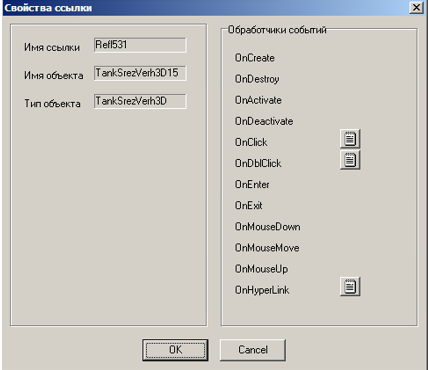
</p>
<p align="center">Рисунок 38 - Свойства ссылки  </p>

"Настройка ссылки" – изменение размеров и положения объекта ссылки. Для различных объектов существуют соответствующие настройки ссылки.

<p align="center">
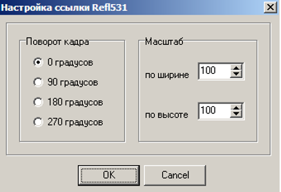
</p>
<p align="center">Рисунок 39 - Настройка ссылки  </p>

### Меню "Компоненты" режима редактирования

<p align="center">
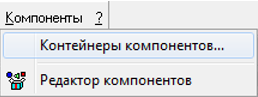
</p>
<p align="center">Рисунок 40 - Меню “Компоненты ”  </p>

Контейнеры компонентов – работа с контейнерами объектов , позволяет добавлять в проект библиотеки  с объектами.

<p align="center">

</p>
<p align="center">Рисунок 41 - Контейнер компонентов  </p>

Кнопка "Добавить" позволяет добавить контейнер с компонентами (объектами).

<p align="center">
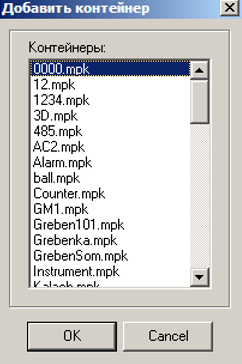
</p>
<p align="center">Рисунок 42 - Добавление нового контейнера  </p>

Обычно используются следующие контейнеры:

* Танки; 
* Valve 1024 768 – различные клапана;
* Instrument – датчики уровня,индикатор включения света, датчик расхода;
* Pump – насос; 
* 3D – объемные танки, датчики уровня и т.д.

В результате появляется закладка в панели инструментов:

<p align="center">
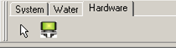
</p>
<p align="center">Рисунок 43 - Панель инструментов  </p>

## Панели инструментов

### Панель инструментов режима работы

<p align="center">
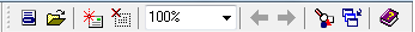
</p>
<p align="center">Рисунок 44 - Панель инструментов режима работы  </p>

Панель инструментов режима работы предоставляет быстрый доступ к следующим функциям (по порядку следования):

* Открыть меню проектов [F2]
* Открыть проект [Ctrl]+[O] – щёлкните левой клавишей мыши по иконке в виде папки для отображения диалога открытия проекта
* Подключиться к серверу [F3]
* Отключиться от сервера [F4]
* Выбор масштаба текущей карты
* Перейти на предыдущую карту
* Перейти на следующую карту
* Открыть инспектор объектов [F11]
* Открыть инспектор слоёв [F12]
* Показать файл помощи [F1]

### Панель инструментов режима редактирования

#### Панель правки

<p align="center">
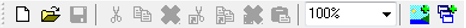
</p>
<p align="center">Рисунок 45 - Панель правки  </p>

Панель правки предоставляет быстрый доступ к следующим функциям (по порядку следования):

* Создать новый проект [Ctrl]+[N]
* Открыть проект [Ctrl]+[O] – щёлкните левой клавишей мыши по иконке в виде папки для отображения диалога открытия проекта
* Сохранить проект [Ctrl]+[S]
* Вырезать выделенные объекты со ссылками в буфер обмена
* Копировать выделенные объекты со ссылками в буфер обмена
* Удалить выделенные объекты со ссылками
* Вырезать выделенные ссылки в буфер обмена[Ctrl]+[X]
* Копировать выделенные ссылки в буфер обмена[Ctrl]+[C]
* Удалить выделенные ссылки [Del]
* Вставить объекты или ссылки из буфера обмена [Ctrl]+[V]
* Выбор масштаба текущей карты
* Вызов диалога добавления карты
* Вызов диалога добавления слоя для текущей карты

#### Панель задания позиции и размеров ссылок

<p align="center">
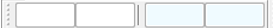
</p>
<p align="center">Рисунок 46 - Панель задания позиции и размеров ссылок  </p>

Панель задания позиции и размеров ссылки предоставляет быстрый доступ к следующим функциям (по порядку следования):

* Поле ввода координаты X
* Поле ввода координаты Y
* Поле ввода длины
* Поле ввода ширины

#### Панель работы с картами

<p align="center">
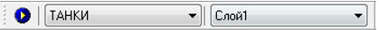
</p>
<p align="center">Рисунок 47 - Панель работы с картами  </p>

Панель работы с картами предоставляет быстрый доступ к следующим функциям (по порядку следования):

* Переход в режим работы [F5]
* Выбор карты
* Выбор слоя на текущей карте

#### Панель положения ссылки

<p align="center">
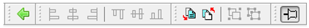
</p>
<p align="center">Рисунок 48 - Панель положения ссылки  </p>

Панель положения ссылки предоставляет быстрый доступ к следующим функциям (по порядку следования):

* Шаг назад
* Выровнять по левому краю
* Выровнять по вертикали
* Выровнять по правому краю
* Выровнять по верхнему краю
* Выровнять по горизонтали
* Выровнять по нижнему краю
* Переместить вперёд
* Переместить назад
* Группировать
* Разгруппировать
* Зафиксировать

#### Панель переименования

<p align="center">
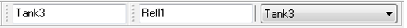
</p>
<p align="center">Рисунок 49 - Панель переименования  </p>

Панель переименования предоставляет быстрый доступ к следующим функциям (по порядку следования):

* Поле ввода имени объекта
* Поле ввода имени ссылки
* Выбор объекта ссылки	

## Панель компонентов

<p align="center">
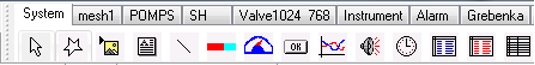
</p>
<p align="center">Рисунок 50 - Панель компонентов  </p>

Панель компонентов содержит контейнер с системными компонентами (вкладка System) и компоненты пользовательских контейнеров (остальные вкладки). 

Вкладка системных компонентов предоставляет быстрый доступ к следующим элементам (по порядку следования):

* Сброс выбранного компонента
* Компонент «Полигон»
* Компонент «Рисунок»
* Компонент «Надпись»
* Компонент «Линия»
* Компонент «Индикатор»
* Компонент «Измеритель»
* Компонент «Кнопка»
* Компонент «График»
* Компонент «Звук»
* Компонент «Таймер»
* Компонент «Таблица» (старая версия)
* Компонент «Журнал тревог»
* Компонент «Таблица» (новая версия)

## Строка состояния

<p align="center">
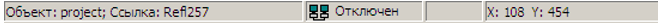
</p>
<p align="center">Рисунок 51 - Строка состояния </p>

Строка состояния предоставляет информацию (по порядку следования):

* Название выделенного объекта
* Название выделенной ссылки
* Индикатор состояния подключения (Отключён/Подключён) к серверу проектов
* Уровень доступа(1-10)
* Координата X положения указателя мыши
* Координата Y положения указателя мыши

## Всплывающее меню

Появляется по нажатию правой клавишей мыши по рабочей области.

<p align="center">
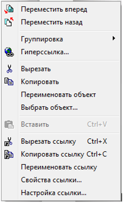
</p>
<p align="center">Рисунок 52 -pВсплывающее меню </p>

| Функции меню и горячие клавиши | Описание функции меню |
|--------------------------------|-----------------------|
| Переместить вперёд             | Перемещение выделенных ссылок поверх всех объектов.|
| Переместить назад              | Перемещение выделенных ссылок позади всех объектов.|
| Группировка                    | Отображение подменю, содержащее следующие функции группировки: группировать и разгруппировать. |
| Гиперссылка                    | Вызывает окно настройки гиперссылки.|
| Вырезать                       | Вырезать выделенные объекты вместе со ссылками в буфер обмена.|
| Копировать                     | Копировать выделенные объекты вместе со ссылками в буфер обмена.|
| Переименовать объект           | Вызов диалога переименования объекта.|
| Выбрать объект                 | Вызов диалога выбора объекта для выделенной ссылки.|
| Вставить [Ctrl]+[V]            | Вставить элементы из буфера обмена.|
| Вырезать ссылку [Ctrl]+[X]     | Вырезать выделенные ссылки в буфер обмена.|
| Копировать ссылку [Ctrl]+[C]   | Копировать выделенные ссылки в буфер обмена.|
| Переименовать ссылку           | Вызывает окно переименования выделенной ссылки.|
| Выбрать объект                 | Вызывает окно выбора объекта, к которому принадлежит ссылка.|
| Свойства ссылки                | Вызывает окно свойств ссылки.|
| Настройка ссылки               | Вызывает окно настроек ссылки.|

### Подменю группировки всплывающего меню

| Функции меню и горячие клавиши | Описание функции меню |
|--------------------------------|-----------------------|
| Группировать                   | Сгруппировать выделенные ссылки.|
| Разгруппировать                | Разгруппировать выделенные ссылки.|

## Журнал ошибок выполнения

Журнал отображает информацию об ошибках, происходящих во время компиляции и работы проекта.

<p align="center">
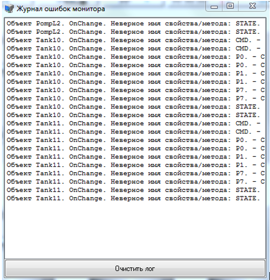
</p>
<p align="center">Рисунок 53 - Журнал ошибок выполнения </p>

Окно журнала вызывается с помощью сочетания клавиш: [Ctrl] + [L].

## Комбинации "горячих" клавиш

В таблице представленной ниже содержаться описание функций вызываемых комбинациями «горячих» клавиш.
Описание столбцов таблицы:

* Функция – производимое действие
* Режим – в каком режиме работает
* М – режим мониторинга
* Р – режим редактирования
* Комбинация – «горячая» клавиша
* Категория – к какой категории относиться «горячая» клавиша.

| Функция                 | Режим | Комбинация | Категория |
|-------------------------|-------|------------|-----------|
| Открыть проект          | M/P   | [Ctrl] + [O] | Файл |
| Создать проект          | P     | [Ctrl] + [N] | Файл |
| Сохранить проект        | P     | [Ctrl] + [S] | Файл |
| Режим редактирования    | M     | [F6] | Проект |
| Режим мониторинга       | P     | [F5] | Проет |
| Меню проектов           | M     | [F2] | Вид |
| Инспектор объектов      | M     | [F11] | Вид |
| Инспектор слоёв         | M     | [F12] | Вид |
| Инспектор ссылок        | P     | [F10] | Вид |
| Подключиться к серверу  | M     | [F3] | Сервер |
| Отключиться от сервера  | M     | [F4] | Сервер |
| Вырезать ссылку         | P     | [Ctrl] + [X] | Правка |
| Копировать ссылку       | P     | [Ctrl] + [C] | Правка |
| Удалить ссылку          | P     | [Del] | Правка |
| Вставить                | P     | [Ctrl] + [V] | Правка |
| Инспектор проекта       | P     | [F11] | Вид |
| Немного влево           | P     | [Left] | Ссылка |
| Немного вправо          | P     | [Right] | Ссылка |
| Немного вверх           | P     | [Up] | Ссылка |
| Немного вниз            | P     | [Down] | Ссылка |
| Журнал ошибок монитора  | M/P   | [Ctrl] + [L] | Проект |
| Справка                 | M/P   | [F1] | Справка |

## Редактор кода

Monitor предоставляет редактор в котором можно редактировать код интерпретатора.

Редактор кода предоставляет различные функции, помогающие в процессе набора кода и включающие в себя:

* Подсветку синтаксиса
* Выделение скобок
* Автоматические отступы
* Выделение конструкций языка
* Технология «IntelliSense»

Ряд этих функций доступно с помощью комбинаций клавиш и/или контекстного меню; смотрите «Горячие клавиши редактора кода» и «Контекстное меню редактора кода».

### Пользовательский интерфейс редактора кода

Редактор кода содержит рабочую область, панель инструментов и контекстное меню, описываемых ниже. 

#### Компоненты рабочей области редактора кода

Эта секция обрисовывает компоненты рабочей области.

#### Панель инструментов редактора кода

Вверху рабочей области находиться панель инструментов. Основное меню даёт доступ к подчинённым подменю. 

#### Контекстные меню редактора кода

На протяжении всей работы с приложением, если вы щёлкаете правой клавишей мыши по рабочему пространству, Редактор кода отображает меню с соответствующим содержимым. 

#### Сочетания клавиш редактора кода

Большинство пунктов основного меню и контекстного меню имеют возможность вызова с помощью комбинаций клавиш. Т.е. вместо выбора пункта меню можно нажать нужную комбинацию клавиш. Для просмотра всех комбинаций и их функций смотрите главу «Горячие клавиши».

#### Рабочая область проекта редактора кода

Большое центральное окно Редактора кода отображает содержимое кода интерпретатора. Это место, в котором возможно редактирование текста.

Общий вид окна редактора кода

<p align="center">
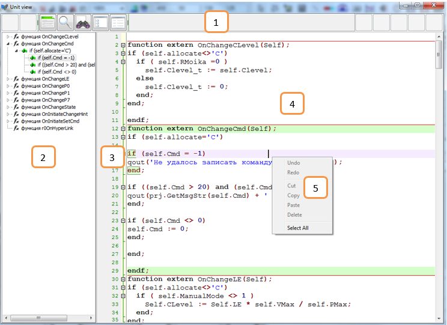
</p>
<p align="center">Рисунок 54 - Окно редактора кода </p>

1.	Панель инструментов.
2.	Панель дерева кода.
3.	Информационная панель.
4.	Область редактирования.
5.	Контекстное меню.

### Панель быстрого доступа

<p align="center">
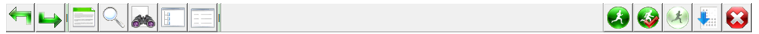
</p>
<p align="center">Рисунок 55 - Панель инструментов </p>

Панель инструментов предоставляет быстрый доступ к следующим функциям (по порядку следования):

| Функции меню и горячие клавиши | Описание функции меню |
|--------------------------------|-----------------------|
| Отменить действие [Ctrl] + [Z]              | Отменяет последнее выполненное действие редактирования.|
| Вернуть изменения [Ctrl] + [Shift] + [Z]    | Возвращает изменения после события Отмены действия.|
| Синхронное редактирование                   | Синхронное редактирование выделенного текста.|
| Поиск [Ctrl] + [F]                          | Поиск текста.|
| Замена [Ctrl] + [R]                         | Поиск и замена текста.|
| Дерево кода                                 | Показать/скрыть панель дерева кода.|
| Автоматические отступы                      | Делает автоматическое форматирование кода по отступам.|
| Выполнить [F9]                              | В режиме отладки выполнить весь последующий код.|
| По шагам [F8]                               | В режиме отладки выполнить код до следующего операнда.|
| По шагам с заходом в вызываемую функцию [F7]| В режиме отладки выполнить код с заходом в вызываемую функцию до следующего операнда.|
| Игнорировать                                | В режиме отладки выполнение кода игнорируя ошибки.|
| Сброс	                                      | Прекращение режима отладки и выход из редактора кода.|

### Панель дерева кода

Позволяет производить навигацию по коду интерпретатора. Для перехода на нужный участок кода произведите двойной щелчок мышью по выделенной строке.

### Информационная панель

Отображает номера строк редактора кода. Позволяет ставить точки прерывания и свёртывать/развёртывать куски кода.

### Область редактирования

Область редактирования служит для основной работы с текстом интерпретатора.

### Контекстное меню редактора

| Функции меню и горячие клавиши | Описание функции меню |
|--------------------------------|-----------------------|
| Undo [Ctrl] + [Z]              | Отменяет последнее выполненное действие редактирования.|
| Redo [Ctrl] + [Shift] + [Z]    | Возвращает изменения после события Отмены действия.|
| Cut [Ctrl]+[X]                 | Вырезать выделенный текст.|
| Copy [Ctrl]+[C]                | Копировать выделенный текст.|
| Paste [Ctrl]+[V]               | Вставить текст из буфера обмена.|
| Delete [Del]                   | Удалить выделенный текст.|
| Select All [Ctrl] + [A]        | Выделить весь текст содержащийся в редакторе кода..|

### Подсветка синтаксиса

Редактор кода подсвечивает текст разными цветами в соответствии с форматом синтаксиса интерпретатора:

<p align="center">

</p>
<p align="center">Рисунок 56 - Подсветка синтаксиса </p>

### Выделение скобок

Когда вы помещаете курсор возле скобки, редактор кода подсвечивает соответствующую ей пару: 

<p align="center">

</p>
<p align="center">Рисунок 57 - Выделение скобок </p>

### Выделение конструкций языка

Когда вы перемещаете курсор по тексту, редактор кода автоматически подсвечивает конструкции языка, в которых находится курсор:

<p align="center">

</p>
<p align="center">Рисунок 58p- Подсветка синтаксиса </p>

### Автоматические отступы

Редактор кода автоматически выделяет отступом новую строку на такой же размер как и предыдущая.

### Свертывание кусков кода

Редактор кода позволяет сворачивать/разворачивать куски кода. Для свёртывания вам надо щёлкнуть курсором мыши по «минусу» находящемуся слева от текста, для развёртывания – «плюс».

До:

<p align="center">

</p>
<p align="center">Рисунок 59 - Код проекта до свертывания </p>

После:

<p align="cepter">

</p>
<p align="centpr">Рисунок 60 - Код проекта после свертывания </p>

### Технология IntelliSense

«IntelliSense» предоставляет контекстных помощников, таких как список авто завершения, всплывающая подсказка параметров и автоматическое завершение конструкции языка.

#### Список автозавершения

Список авто завершения предоставляет список возможных завершений для текущего текста. Список появляется, когда вы нажимаете сочетание клавиш [Ctrl] + [Spacebar].

<p align="center">

</p>
<p align="center">Рисунок 61 - Список автозавершения </p>

Выберите необходимый элемент в списке и нажмите [Enter] или [Tab] для вставки этого элемента в текст. Для отмены авто завершения нажмите [Esc].

#### Автоматическое завершение конструкции языка

При наборе конструкции языка и нажатии [Enter] редактор кода автоматически завершает эту конструкцию.

До:

<p align="center">

</p>
<p align="center">Рисунок 62 - До автоматического завершения конструкции </p>

После:

<p align="center">

</p>
<p align="center">Рисунок 63 - После автоматического завершения конструкции </p>

### Комбинации «горячих клавиш» редактора кода

В таблице представленной ниже содержаться описание функций вызываемых комбинациями «горячих» клавиш.
<p>Описание столбцов таблицы:

* Функция – производимое действие
* Комбинация – «горячая» клавиша
* Категория – к какой категории относиться «горячая» клавиша.

| Функция                                           | Комбинация              |      Категория       |
|---------------------------------------------------|-------------------------|----------------------|
| Вырезать                                          | [Ctrl] + [X]            | Правка               |
| Копировать                                        | [Ctrl] + [C]            | Файл                 |
| Вставить                                          | [Ctrl] + [V]            | Файл                 |
| Удалить                                           | [Del]                   | Проект               |
| Отменить действие                                 | [Ctrl] +[Z]             | Проект               |
| Вернуть изменения                                 | [Ctrl] + [Shift] + [Z]  | Вид                  |
| Выделить всё                                      | [Ctrl] + [A]            | Вид                  |
| Выполнить                                         | [F9]                    | Вид                  |
| Выполнить по шагам                                |[F8]                     | Вид                  |
| Выполнить по шагам с заходом в внутреннюю функцию | [F7]                    | Сервер               |
| Поиск                                             |[Ctrl] + [F]             | Сервер               |
| Замена                                            | [Ctrl] + [R]            | Правка               |
| Авто заполнение                                   | [Ctrl] + [Spacetab]     | Правка               |

### Расширенные возможности редактора кода

В данном документе описаны не все возможные функции редактора кода. Для более углубленного изучения прочитайте документ - «Редактор кода EControl.chm».

## Разработка

В Monitor используется графическое представление информации для автоматизации процессов. Используя Monitor, вы можете быстро построить проект, используя пользовательские контейнеры компонентов и ранее написанные функции.

<p> В главе «Быстрый старт» показано, каким образом можно быстро создать простейший проект. Для более детального изучения смотрите:

* Работа с проектом.
* Работа с картами и слоями.
* Работа с объектами.
* Работа с ссылками.
* Работа с контейнерами.

### Быстрый старт

В качестве примера  проектирования рассмотрим автоматизацию танка.

<p align="center">

</p>
<p align="center">Рисунок 64 - Автоматизация танка </p>

Для танка определены следующие режимы: мойка, наполнение, дренаж.

1.  Составляем базу каналов (см п2.3)
2. С помощью палитры компонентов создаем новую вкладку в панели инструментов (см п2.1.6). 

<p align="center">

</p>
<p align="center">Рисунок 65 - Панель инструментов </p>

3. Устанавливаем объекты на карту и наносим надписи (правой кнопкой мыши “Настройка ссылки”).

<p align="center">

</p>
<p alignp"center">Рисунок 66 - Добавление надписи </p>

4.	Наносим линии. Для того чтобы закончить линию, ставим конечную точку и нажимаем правую кнопку мыши.

<p align="center">

</p>
<p align="center">Рисунок 67 - Добавление линии </p>

5.	После того как схема собрана,  подключаем объекты к базе каналов. Для этого двойным кликом по объекту открываем “Свойства объекта”,  в закладке “Свойства” подключаем его к базе каналов.

<p align="center">

</p>
<p align="center">Рисунок 68 - Подключение объекта к базе каналов  </p>

6.	Для управления устройствами добавляем функции управления.

<p> Различают ручной и автоматический режимы, в данном проекте рассмотрим ручной режим. Необходимо чтобы при  клике  на устройство выдавалось сообщение  о подтверждении его  включения.

<p align="center">

</p>
<p align="center">Рисунок 69 - Сообщение  о подтверждении  включения насоса  </p>

Для этого двойным кликом по объекту открываем “Свойства ссылки”, выбираем событие “OnClick” и вводим “prj.ObjClick( self );” (Вызов функции, которая возвращает 1 если подтверждается действие и -1 когда нет).

<p align="center">

</p>
<p align="center">Рисунок 70 - Программирование  сообщения  о подтверждении действия   </p>

7.	Переходим в режим мониторинга, нажимаем F5.

## Работа с проектом

### Создать проект

Создать новый проект возможно двумя способами:	

* Нажать на клавишу «Создать» в Стартовом окне.
* Выбрать пункт «Создать» в меню «Файл» главного меню в режиме редактирования.

### Открыть проект

Монитор позволяет открыть проект несколькими способами. 
Со стартового окна
Выделите проект в списке проектов и нажмите кнопку «Открыть».
Для добавления файлов в список проектов нажмите кнопку «Добавить», и в диалоговом окне открытия файлов выберите нужный файл проекта (*.mpr).

<p align="center">

</p>
<p align="center">Рисунок 71 - Диалоговое окно открытия проекта   </p>

С главного меню
Выберите пункт «Открыть» в меню «Файл», и в диалоговом окне открытия файлов выберите нужный файл проекта (*.mpr).

С проводника
Для открытия файла проекта из проводника ОС выберете нужный файл и запустите его. После запуска Монитора выберите нужный файл в стартовом окне. Если при открытии файла Монитор не запустился, откройте файл при помощи пункта «Открыть с помощью» контекстного меню проводника.


>Примечание: для запуска проекта из проводника, минуя стартовое окно, необходимо запустить один раз файл «Запуск проекта, минуя стартовое окно.reg».

### Сохранить проект

Сохранение проекта происходит по выбору пункта «Сохранить» в меню «Файл».

Если проект был недавно создан и не сохранялся вместо быстрого сохранения, появляется диалоговое окно сохранения файла, в котором надо ввести имя для сохраняемого проекта.

<p align="center">

</p>
<p align="center">Рисунок 72 - Диалоговое окно сохранения проекта   </p>

Для сохранения проекта под другим именем выберите пункт «Сохранить как…» в меню «Файл».

> Перед каждой перезаписью файла проекта, предыдущая версия помещается в архив восстановления (папка «_archive» в папке хранения проекта) с текущим именем проекта и расширением «.sav».

### Закрыть проект

Для закрытия проекта выберите пункт «Закрыть» в меню «Файл».

### Переход в режим редактирования

Переход в режим редактирования осуществляется при помощи действия выполняемого при выборе пункта «Режим редактирования» в меню «Файл».

### Переход в режим мониторинга

Переход в режим мониторинга осуществляется при помощи действия выполняемого при выборе пункта «Режим мониторинга» в меню «Файл» или по нажатию кнопки «Переход в режим редактирования» на панели инструментов «Панель работы с картами».

### Инспектор проекта

Инспектор проекта предназначен для быстрого доступа ко множеству объектов, ссылок и карт, и работ с ними. Для открытия инспектора выберите пункт «Инспектор проекта» в меню «Проект».

### Описание проекта

<p align="center">

</p>
<p align="center">Рисунок 73 - Описание </p>

1.	Дерево объектов.
2.	Дерево карт.
3.	Область описания объекта.
4.	Область описания карты.
5.	Область описания слоя.
6.	Область описания ссылки.
7.	Кнопки действий над объектами.
8.	Кнопки действий над ссылками.

#### Дерево объектов

В этом дереве содержится список всех объектов проекта. Для каждого объекта в дереве есть список ссылок (ответвления от объекта), к которым он присоединён.

#### Дерево карт

В этом дереве содержится список всех карт проекта. Для каждой карты в дереве есть список слоёв (ответвление от карты) содержащихся в ней, и соответственно для слоёв – список ссылок (ответвление от слоя).

#### Области описания объектов, карт, слоёв и ссылок

При выделении элементов в деревьях в областях 3,4,5,6 отображается соответствующая общая информация о выделенном элементе.

#### Кнопки действия над объектами

Работают только для выделенного объекта.

| Название кнопки                  | Описание действия по нажатию кнопки              |
|----------------------------------|--------------------------------------------------|
| Свойства                         | Показывает окно свойств выделенного объекта.     |
| Удалить                          | Удаляет выделенный в дереве объектов объект.    |
| Переименовать                    | Вызывает диалог переименования выделенного в дереве объекта.     |
| Проверить тэги                   | Выполняет проверку присоединения тэговых свойств всех объектов проекта.     |
| Изменить драйвер                 | Вызывает диалог замены идентификатора драйвера для тэговых свойств.     |

#### Кнопки действия над ссылками

Работают только для выделенной ссылки.

| Название кнопки                  | Описание действия по нажатию кнопки              |
|----------------------------------|--------------------------------------------------|
| Свойства                         | Показывает окно свойств выделенной ссылки.    |
| Удалить                          | Удаляет выделенную ссылку.  |
| Переименовать                    | Вызывает диалог переименования выделенной ссылки. |
| Настройка                        | Вызывает диалог настройки выделенной ссылки.     |
| Показать                         | Выделяет на карте выделенную в инспекторе ссылку.  |

#### Действия инспектора проекта

Большинство действий в инспекторе проекта дублируют возможности, действующие в других местах Монитора. Эти действия будут рассмотрены позже в рамках  отдельных глав посвящённых этим элементам. 

#### Проверить тэги

Проверка тэгов нужна для определения, какие тэговые свойства не привязаны, а если привязаны то к какому (с каким идентификатором) каналу базы каналов.

После выполнения этого действия появиться окно с отчётом о проверке, в котором может содержаться следующая информация:

НЕПОДКЛЮЧЕННЫЕ ТЭГИ:

* CTR28.FE
* CTR28.Value

ПОТЕРЯННЫЕ ТЭГИ:

* LS1.State

ВСЕ ТЭГИ ПРОЕКТА:

* 43874587 – V1.STATE
* 43874588 – V3.STATE
* 53874587 – V4.STATE

В этом примере:

* Не подключённые тэги – это тэги, для которых не был выбран канал базы каналов.
* Потерянные тэги – хез.
* Все тэги проекта – список всех привязанных тэгов проекта: цифры в начале – это идентификатор канала, следом за цифрами идёт название тэга.

>Примечание: идентификаторы драйверов (первые 2 цифры идентификатора канала) могут не совпадать, если проект работает с несколькими контроллерами. 

#### Изменить драйвер

Служит для смены идентификатора драйвера для всех тэгов принадлежащих этому драйвера.

Пример использования: использование шаблонного проекта привязанного к узлу базы каналов X, и перепривязка его к идентичному узлу базы каналов Y с изменённым идентификатором драйвера.

Шаг 1 – вводится старый идентификатор:

<p align="center">

</p>
<p align="center">Рисунок 74 - Ввод старого идентификатора </p>

Шаг 2 – вводится новый идентификатор:

<p align="center">

</p>
<p align="center">Рисунок 75 - Ввод нового идентификатора </p>

Идентификатор драйвера можно посмотреть в свойствах тэгового свойства – первые 2 символа в идентификаторе.

<p align="center">

</p>
<p align="center">Рисунок 76 - Переход на карту и слой </p>

#### Показать ссылку

Переходит на карту и слой где находиться, выделенная в инспекторе, ссылка, и выделяет её.

### Свойства проекта

Диалог свойств предоставляет доступ к базовым настройкам проекта, таким как название проекта, настроек подсистемы тревог, кода интерпретатора для объекта «Project».

Для запуска диалога выберите пункт «Свойства проекта» в меню «Проект».

<p align="center">

</p>
<p align="center">Рисунок 77 - Свойства проекта </p>

1.	Поле ввода названия проекта (сейчас не используется).
2.	Поле ввода имени сервера, где запущен данный проект (сейчас не используется).
3.	Поле ввода скорости прорисовки проекта (сейчас не используется).
4.	Поле ввода кода доступа к проекту (сейчас не используется).
5.	Кнопки редактирования кода интерпретатора
* ProjectStaticFunctions – код блока кода проекта.
* OnAfterProjectCreate – код выполняемый при загрузке проекта.
* OnBeforeProjectDestroy – код выполняемый при закрытии проекта.
* Код объекта «PRJ» (только для чтения) – код в котором содержится: ProjectStaticFunctions,  OnAfterProjectCreate, OnBeforeProjectDestroy, а так же все OnInit и DeInit карт проекта. 
6.	Вызов диалога выбора корневой (стартовая карта при загрузке проекта) гиперссылки. Диалог описан в главе …
7.	Вызов диалога свойств объекта «Project». Диалог описан в главе…
8.	Алиасы – не используется.
9.	Вызов настройки подсистемы тревог. 

## Работа с картами и слоями

Визуальная часть проекта состоит из трёх составляющих: карт, слоёв и ссылок.

Карта – графическая область, на которой располагаются графические элементы (ссылки). В проекте может быть несколько карт, между которыми можно перемещаться.

Слой – пласт из графических элементов, лежащий в ряду других пластов или на карте. Карта всегда содержит минимум один слой. Именно на нём и располагаются графические элементы.

Слоёв на карте может быть разное количество. Они могут быть скрытыми или располагаться в разной последовательности. В зависимости от того на каком слое расположена ссылка, она может быть перекрыта другой ссылкой, расположенной на более верхнем слое или, наоборот, перекрывать другую ссылку, расположенную на более нижнем слое.   

### Добавить карту

Для добавления карты выберите пункт «Добавить карту» в меню «Карта». После выбора пункта появиться окно ввода имени новой карты:

<p align="center">

</p>
<p align="center">Рисунок 78 - Добавление карты </p>

Введя имя карты, нажмите кнопку «ОК» для подтверждения добавления или «Cancel» для отмены добавления. После нажатия «ОК» на рабочем пространстве будет активна новая карта.

### Переименовать карту

Для переименования текущей карты выберите пункт «Переименовать карту» в меню «Карта». После выбора пункта появиться окно ввода нового имени текущей карты:

<p align="center">

</p>
<p align="center">Рисунок 79 - Переимеонвание карты </p>

Введя новое имя карты, нажмите кнопку «ОК» для подтверждения переименования или «Cancel» для отмены переименования.

> Примечание: при переименовании карты гиперссылки продолжают ссылаться на переименованную карту.

### Удалить карту

Для удаления текущей карты выберите пункт «Удалить карту» в меню «Карта». После выбора пункта появиться окно подтверждения на удаление карты:

<p align="center">

</p>
<p align="center">Рисунок 80 - Удаление карты </p>

Нажмите кнопку «ОК» для подтверждения удаления или «Cancel» для отмены удаления.

> Примечание: при удалении карты гиперссылки на эту карту удаляются с управляющих элементов.

### Подложка карты

Подложка карты нужна для задания цвета карты или фонового рисунка. 
<p> Для вызова диалога настройки подложки выберите пункт «Подложка…» в меню «Карта».

<p align="center">

</p>
<p align="center">Рисунок 81 - Подложка карты </p>

1.	Общий вид карты с подложкой.
2.	Текущий цвет фона подложки.
3.	Кнопка вызова диалога для смены цвета фона подложки.
4.	Флаг использования для подложки рисунка из файла.
5.	Кнопка вызова диалога выбора рисунка.
6.	Вид выбранного рисунка подложки.

#### Выбор цвета фона

После нажатия на кнопку выбора цвета фона (3) появиться диалог выбора цвета:

<p align="center">

</p>
<p align="center">Рисунок 82 - Цвет фона </p>

Для смены цвета щёлкните левой клавишей мыши по нужному цвету и нажмите кнопку «ОК»; для отмены выбора цвета нажмите кнопку «Отмена».

#### Установка рисунка как фон подложки

Для активации данной функции поставьте галочку в (4). Чтобы выбрать рисунок нажмите кнопку (5). В появившемся диалоге выберите нужный рисунок и нажмите открыть.

<p align="center">

</p>
<p align="center">Рисунок 83 - Выбор рисунка </p>

Выбранный рисунок отобразиться в области (6).	

<p align="center">

</p>
<p align="center">Рисунок 84 - Настройка подложки </p>

Нажмите «ОК» чтобы применить данный рисунок для подложки.

### Свойства карты

В свойствах карты задаются размеры карты, а также обработчики, срабатывающие при инициализации или деинициализации карты.

Вызов диалога свойств карты осуществляется выбором меню «Свойства карты» в меню «Карта».	

<p align="center">

</p>
<p align="center">Рисунок 85 - Настройка размера карты </p>

1.	Поле ввода ширины карты.
2.	Поле ввода высоты карты.
3.	Кнопка «Выровнять по подложке» - заполняет поля ширины (1) и высоты (2) по размерам подложки, если она есть.
4.	Кнопка вызова правки кода инициализации карты. Инициализация происходит при переходе на эту карту до её отрисовки.
5.	Кнопка вызова правки кода деинициализации карты. Деинициализация происходит при переходе на другую карту с текущей.

### Навигация по картам

#### Навигация по картам в режиме мониторинга

Вызовите инспектор слоёв выбором пункта «Инспектор слоёв» в меню «Вид» или нажатием соответствующей кнопки на панели инструментов.

<p align="center">

</p>
<p align="center">Рисунок 86 - Инспектор слоев </p>

Для смены карты выберите необходимую в выпадающем списке инспектора слоёв:


<p align="center">

</p>
<p align="center">Рисунок 87 - Выбор слоя </p>

#### Навигация по картам в режиме редактирования

Смена карты в режиме редактирования возможна из двух мест:
1.	С панели инструментов.
2.	С инспектора карт и слоёв.

#### Навигация по картам с панели инструментов

Для смены карты выберите необходимую в выпадающем списке в панели инструментов:

<p align="center">

</p>
<p align="center">Рисунок 88 - Смена карты с панели инструментов </p>

#### Навигация по картам с инспектора карт и слоёв

Для смены карты выберите необходимую в выпадающем списке в инспекторе:

<p align="center">

</p>
<p align="center">Рисунок 89 - Смена карты с инспектора карт и слоев </p>

### Масштабирование карты

Для изменения масштаба отображения карты выберите нужный масштаб из списка:

<p align="center">

</p>
<p align="center">Рисунок 90 - Список масштаба </p>

* 100% 

<p align="center">

</p>
<p align="center">Рисунок 91 - Масштаб 100% </p>

* 50% 

<p align="center">

</p>
<p align="center">Рисунок 92 - Масштаб 50% </p>

### Работа со слоями 

#### Добавить слой

Для добавления нового слоя для текущей карты выберите пункт «Добавить слой» в меню «Карта». После выбора пункта появиться окно ввода имени нового слоя:

<p align="center">

</p>
<p align="center">Рисунок 93 - Добавление слоя </p>

Введя имя слоя, нажмите кнопку «ОК» для подтверждения добавления или «Cancel» для отмены добавления. После нажатия «ОК» на рабочем пространстве будет активен новый слой текущей карты.

> Примечание: при добавлении слоя, все гиперссылки, ссылающиеся на карту, которой принадлежит слой, будут содержать активный добавленный слой.

#### Переименовать слой

Для переименования текущего слоя активной карты выберите пункт «Переименовать слой» в меню «Карта». После выбора пункта появиться окно ввода нового имени текущего слоя:

<p align="center">

</p>
<p align="center">Рисунок 94 - Переименование слоя </p>

Введя новое имя слоя, нажмите кнопку «ОК» для подтверждения переименования или «Cancel» для отмены переименования.

> Примечание: при переименовании слоя гиперссылки продолжают ссылаться на переименованный слой.

#### Удалить слой

Для удаления текущего слоя активной карты выберите пункт «Удалить слой» в меню «Карта».

После выбора пункта появиться окно подтверждения на удаление слоя:

<p align="center">

</p>
<p align="center">Рисунок 95 - Удаление слоя </p>

Нажмите кнопку «ОК» для подтверждения удаления или «Cancel» для отмены удаления.

> Примечание: при удалении слоя, гиперссылки на этот слой  удаляются с управляющих элементов.

#### Навигация по слоям

Навигация по слоям возможно только в инспекторе карт и слоёв.

Для выбора активного слоя выделите необходимый в списке слоёв текущей карты.

<p align="center">

</p>
<p align="center">Рисунок 96 - Наввигация по слоям </p>

#### Выбор отображаемых слоёв

Выбирать отображаемые слои можно как в режиме редактирования, так и в режиме мониторинга.

##### В режиме мониторинга

Для выбора отображаемых слоёв поставьте галочки в инспекторе слоёв в списке слоёв.

<p align="center">

</p>
<p align="center">Рисунок 97 - Выбор отображаемого слоя в режиме мониторинга </p>

##### В режиме редактирования

Для выбора отображаемых слоёв поставьте галочки в инспекторе карт и слоёв в списке слоёв.

<p align="center">

</p>
<p align="center">Рисунок 98 - Выбор отображаемого слоя в режиме редактирования </p>

#### Смена порядка расположения слоёв

Для смены расположения слоёв выполните следующие действия:

1.	В инспекторе карт и слоёв выделите перемещаемый слой в списке слоёв.
2.	В зависимости от того куда надо перемещать слой нажмите соответствующие кнопки со стрелками.

<p align="center">

</p>
<p align="center">Рисунок 99 - Смена расположения слоев </p>

### Гиперссылка на карту

Гиперссылка – это ссылка на  другое место в файле или на сам файл, в данном случае это ссылка на другую карту с определёнными параметрами.

Гиперссылка может быть вызвана при щелчке левой клавиши мыши на графический элемент карты. По гиперссылке можно перейти к той карте, которая текущая.

Для активации гиперссылки:

1.	Выделите необходимый графический элемент.
2.	Выберите пункт «Гиперссылка…» в меню «Ссылка».
3.	В появившемся окне в выпадающем списке карт списке карт выберите необходимую.

<p align="center">

</p>
<p align="center">Рисунок 100 - Активация гиперссыки </p>

4.	Настройте остальные параметры, если необходимо.
5.	Нажмите кнопку «ОК» для завершения.
Для деактивации гиперссылки в выпадающем меню окна настройки гиперссылки выберите пункт «Нет» и нажмите кнопку «ОК».

<p align="center">

</p>
<p align="center">Рисунок 101 - Деактивация гиперссыки </p>

#### Параметры гиперссылки

<p align="center">

</p>
<p align="center">Рисунок 102 - Параметры гиперссыки </p>

1.	Выпадающий список выбора карты.
2.	Список слоёв карты. Слои выделенные  галочками будут отображены при переходе на эту карту с помощью этой гиперссылки.
3.	Поле ввода горизонтальное смещения. Смещает изображение на карте на величину этого значения.

<p align="center">

</p>
<p align="center">Рисунок 103 - До смещения </p>

После (смещено на 50 пикселей):

<p align="center">

</p>
<p align="center">Рисунок 104 - После смещения </p>

4.	Поле ввода вертикального смещения.

До:

<p align="center">

</p>
<p align="center">Рисунок 105 - До вертикального смещения </p>

После (смещено на 20 пикселей):

<p align="center">

</p>
<p align="center">Рисунок 106 - После вертикального смещения </p>

5.	Поле ввода масштаба.
6.	Поле ввода уровня доступа к гиперссылке. Если текущий уровень доступа меньше уровня доступа гиперссылки – переход на другую карту не происходит.

## Работа с контейнерами

Контейнеры – это элемент, содержащий в себе пользовательские компоненты.

При создании проекта, по умолчанию, в проект встроен контейнер «System», содержащий системные компоненты. Пользовательские контейнеры создаются с помощью редактора контейнеров (MpkEdit.exe), и добавляются в проект по мере необходимости. Все пользовательские контейнеры содержаться в папке «MPK» где находиться приложение «Монитор».

При каждом открытии проекта контейнеры, содержащиеся в проекте, считываются заново.

### Запуск редактора контейнеров

<p align="center">

</p>
<p align="center">Рисунок 107 - Редактор контейнеров </p>

1.	Запустите приложение «MpkEdit.exe» с папки где содержится «Монитор».
2.	Откройте файл контейнера (файл с расширением «*.mpk») с помощью «MpkEdit.exe».
3.	Выберите пункт «Редактор компонентов» в «Мониторе» в режиме редактирования в меню «Компоненты».

Описание редактора контейнеров будет описана ниже в другой главе.

### Диалог работы с контейнерами проекта

<p align="center">

</p>
<p align="center">Рисунок 108 - Меню работы с контейнером </p>

1.	Список контейнеров проекта.
2.	Список компонентов выделенного контейнера.
3.	Кнопка добавления контейнера в проект.
4.	Кнопка удаления выделенного контейнера из проекта.

### Добавление контейнера в проект

Для добавления контейнера в проект нажмите кнопку «Добавить…» (3). В появившемся списке доступных контейнеров выберите необходимый и нажмите кнопку «ОК».

<p align="center">

</p>
<p align="center">Рисунок 109 - Добавление контейнера в проект </p>

Список доступных проектов формируется из всех контейнеров находящихся в папке «MPK».

Для подтверждения добавления контейнеров в проект нажмите кнопку «ОК» в окне «Настройка списка контейнеров.

После выполненных операций в панели компонентов добавятся одноимённые вкладки с компонентами:

<p align="center">

</p>
<p align="center">Рисунок 110 - Панель компонентов с одноименными вкладками </p>

### Удаление контейнера из проекта

Для удаления контейнера выделите в списке контейнеров (1) необходимый контейнер и нажмите кнопку «Убрать» (4). Для подтверждения удаления нажмите кнопку «Yes» в появившемся сообщении:

<p align="center">

</p>
<p align="center">Рисунок 111 - Удаление контейнера из проекта </p>

Для подтверждения удаления контейнеров из проекта нажмите кнопку «ОК» в окне «Настройка списка контейнеров.
После выполненных операций в панели компонентов удаляться одноимённые вкладки с компонентами.

> Внимание: будьте осторожны при удалении контейнеров из проекта!!! Убедитесь, что в проекте вы удалили все объекты, относящиеся к этому контейнеру. Если вы всё-таки удалили контейнер без удаления объектов и затем сохранили проект – впоследствии он не откроется! Если проект после ваших действий не открывается – возьмите предыдущую версию из архива восстановления.

### Добавление компонента в проект

Для добавления компонента в проект выполните следующие шаги:

1.	Выберите необходимый компонент, щёлкнув левой клавишей мыши по его иконке в панели компонентов (курсор должен поменять свой вид – стрелка с прямоугольником).

<p align="center">

</p>
<p align="center">Рисунок 112 - Выбор необходимого компонента </p>

2.	Переместите курсор к месту на рабочей области, куда вы хотите вставить компонент.

<p align="center">

</p>
<p align="center">Рисунок 113 - Добавление компонента на рабочую область </p>

3.	Щёлкните левой клавишей мыши для помещения компонента на рабочую область.

<p align="center">

</p>
<p align="center">Рисунок 114 - Размещение компонента на рабочую область </p>

При добавлении в проект компонент становиться связкой из ссылки и объекта. Ссылка отвечает за отрисовку объекта, а объект за логику работы.

### Подмена контейнеров

Подмена контейнеров – это замена одного контейнера другим с похожим содержанием.

> Внимание! Работа по подмене контейнеров опасна для вашего проекта. Будьте осторожны с этой функцией! 

Пример:

Есть проект «Мойка1» с контейнером «МойкаКонтейнер1» содержащем в себя компонент «CIP». 

Вы хотите создать новый проект «Мойка2» на основе «Мойка1», но с немного изменённым компонентом «CIP». 

Для этого вы копируете или пересохраняете проект «Мойка1» под именем «Мойка2» и тоже самое делаете с контейнером: «МойкаКонтейнер1» -> «Мойка контейнер2». 

Делаете какие либо изменения в компоненте «CIP» контейнера «Мойкаконтейнера2». Затем открываете проект «Мойка2» и делаете подмену контейнера «Мойкаконтейнер1» на «Мойкаконтейнер2». 

Всё, теперь ваш компонент «CIP» в проекте относиться к контейнеру «Мойкаконтейнера2».

Для подмены контейнеров необходимо удалить подменяемый контейнер из списка контейнеров проекта, а затем добавить изменённый контейнер. 

Всё это обязательно надо делать последовательно, не закрывая окно «Настройка списка контейнеров». 

Список компонентов содержащихся в обоих контейнерах должен полностью совпадать по названиям пересекаемых компонентов.

### Важно знать о контейнерах

Имена для компонентов должны быть уникальны для всех контейнеров. 

Чтобы избежать одинаковых имён добавляйте часть названия контейнера в начало имени компонента.

Если же всё-таки в проекте окажутся компоненты с одинаковыми именами, то приоритет будет у компонента, который загружается первым при загрузке проекта, т.е. последующие не будут работать.

В каждом контейнере есть счётчик сохранений, который используется для определения изменения контейнера. Поэтому после изменения контейнера и открытия проекта содержащий этот контейнер сравнивается счётчик сохранённый в проекте и в загружаемом контейнере. Если счётчики не совпадают – выдаётся сообщение об этом. Для того чтобы этого сообщения не было надо сохранить проект с этой версией контейнера. Так как контейнеры могут использоваться в разных проектах, то при изменении контейнера обязательно надо пересохранить все проекты его использующие.

## Работа с объектами

### Описание объектов

Один из основных элементов проекта являются объекты. Объекты могут быть системными и пользовательскими. 
Системный объект – это объект «Project». Он существует изначально с созданием проекта. К этому объекту присоединены все системные компоненты.

Пользовательские объекты – это объекты, содержащиеся в пользовательских компонентах.

Объекты отвечают за логику работы проекта. Каждый объект содержит в себе описание визуализации, свойств, методов и рецептов. Визуализация описывает отображение объекта на карте. 

Свойства описывают свойства объекта. Методы – действия над визуализацией, рецептами и свойствами этого объекта (или любого другого в проекте). Рецепты позволяют устанавливать группу значений различных свойств разных объектов за одно действие. 

Диалог настроек объекта можно вызвать двумя способами:

* Произвести двойной щелчок мышью по объекту.
* Нажать кнопку «Свойства» для выделенного объекта в  дереве объектов «Инспектора проекта».

#### 	Вид объекта

Вид объекта представлен картинками, добавленными в контейнере. Каждый объект может содержать несколько кадров, которые соответствуют определённому состоянию объекта. Если необходимо особо выделить какое то состояние объекта – можно включить анимацию (смена определённых кадров объекта за промежуток времени).

Редактирование кадров объекта возможно только в редакторе компонентов. В режиме редактирования проекта есть возможность посмотреть свойства вида объекта, кадров, анимации, и протестировать анимацию объекта (если включена).

В режиме мониторинга или редактирования на слое отображается тот кадр, который был выделен в свойствах вида объекта. Для смены кадра или включения анимации в режиме мониторинга необходимо написать код в интерпретаторе.

Доступ к объекту из интерпретатора осуществляется: в коде проекта – по имени объекта, в коде объекта – по имени или через «Self» (ссылка объекта на самого себя).

Смена кадра:

```	Self.SelFrame( 1 );  //в скобках номер кадра.	```

Включение анимации:

``` Self.Animate := 1 ;  // 1 – включение анимации, 0 – выключение. ```

#### Диалог настройки вида объекта

Диалог настроек вида объекта можно вызвать двумя способами:

* Произвести двойной щелчок мышью по объекту.
* Нажать кнопку «Свойства» для выделенного объекта в  дереве объектов «Инспектора проекта».

В появившемся окне выбрать вкладку «Вид».

<p align="center">

</p>
<p align="center">Рисунок 115 - Вид объекта </p>

1.	Список кадров.
Отображает название кадра и его номер (именно он используется в интерпретаторе для смены кадра). Если возле номера кадра отображается «*», значит этот кадр является подложкой изображения объекта.

2.	Область отображения выделенного кадра.

3.	Кнопка тестирования анимации компонента – вызывает окно где она происходит.

<p align="center">

</p>
<p align="center">Рисунок 116 - Тест компонента </p>

4.	Прозрачность – цвет нижнего левого пиксела кадра становится прозрачным.
5.	Подложка – при отображении кадра рисуется подложка (первый кадр объекта).

<p align="center">

</p>
<p align="center">Рисунок 117 - Подложка </p>

6.	Кнопки перемещения выделенного кадра в списке кадров.
7.	Координаты смещения – смещает изображение в кадре на величину координат.

<p align="center">

</p>
<p align="center">Рисунок 118 - Координаты смещения </p>

8.	Размер кадров объекта (изменять нельзя).
9.	Возможность включения анимации объекта.
10.	Первый и последний кадры объекта используемых в анимации.
11.	Скорость смены кадров при анимации объекта.

#### Свойства объекта

Свойства объекта представлены свойствами описывающими объект. Объект может содержать неограниченное количество свойств разных типов. Вся работа со свойствами сводиться к изменениям их значения (при изменении значения срабатывает событие «OnChange»).

Свойства описываются типом свойства и типом значения свойства.

#### Типы свойств

Типы свойств:
1.	Локальное.
2.	Глобальное.
3.	Теговое.
4.	Вычисляемое.
5.	Межсерверное (не реализовано).
6.	OPC (поддержка прекратилась).

#### Локальные свойства

Локальные свойства – это свойства, которые могут меняться только по месту выполнения.

Пример: у нас есть проект с локальным свойством, выполняемым на сервере, и несколько клиентов. Если это свойство, в каком либо месте сменит своё значение – в других местах оно не поменяется (если только смена значения этого свойства одинакова во всех местах). Т. е. если поменялось на сервере, то на клиентах не поменялось.

Значение свойства (так же и по умолчанию) храниться в проекте и может меняться в процессе выполнения проекта.

#### Глобальные свойства

Глобальные свойства – это свойства, которые, если меняются в одном месте – меняются и в другом. К примеру: если значение свойства поменялось на сервере – то и на всех клиентах оно поменяется (если поменялось на клиенте – поменяется и на сервере и на остальных клиентах ).

Важно: так как при изменении значения свойства в одном месте, меняется во всех остальных -  появляется неоднозначность (рассинхронизация по времени и значению свойства), если во всех местах поменяется всё сразу. Поэтому изменение глобального свойства должно происходить только в одном месте (желательно на сервере).

Значение свойства (так же и по умолчанию) храниться в проекте и может меняться в процессе выполнения проекта.

#### Теговые свойства

Теговые свойства по принципу действия такие же, как и глобальные, но с одним отличием: значение свойства берётся/устанавливается из/в базы каналов.

Значение свойства (так же и по умолчанию) храниться в другом устройстве, которое связанно с проектом через базу каналов, и может меняться в процессе выполнения проекта.

#### Вычисляемые свойства

Вычисляемые свойства – значение свойства может быть получено при обращении к нему из интерпретатора. Возвращает значение функции интерпретатора вычисляемого свойства ( OnPropEvaluate).

#### Типы значения свойств

Типы значения:
1.	String – строковое значение ( текст).
2.	Integer – четырёхбайтное целое знаковое число.
3.	Float – 8-байтное дробное знаковое число.
4.	Boolean – логическое число (True/False).
5.	Date – дата (пишется строкой – 10.02.2011).

#### Заголовок свойства

Заголовок свойства – текстовое описание свойства. Используется в некоторых системных компонентах (TTrend, TTable2). 

#### Сохраняемое

Начальное значение берётся из базы данных. В текущий момент в стадии постановки задачи.

#### Протоколирование

Протоколирование при изменении значения свойства в базу данных. Действует только для глобальных свойств.

#### Разрешение для редактирования

Позволяет устанавливать значения свойству через инспектор объектов.

#### Уровень доступа

Уровень доступа ограничивает изменение свойств для разных пользователей. Если уровень доступа клиента >= уровню доступа к свойству изменение свойства разрешено, иначе – нет.

#### Событие «OnChange»

При изменении значения свойства выполняется код на интерпретаторе написанный в этом месте. Именно этот код выполняет основную работу с объектом: смена кадров, установка разлтчных значений объекта, вызов методов и др.

#### Событие «OnCanChange»

Позволяет контролировать изменение значения свойства. Если функция «OnCanChange» возвращает «False» изменение не происходит, следовательно, событие «OnChange» тоже не срабатывает.

## Работа с ссылками

В разработке.

## Подсистема тревог

В разработке.

## Системные компоненты

Описание системных компонентов: 

* TPolygon, 
* TBitmapLabel, 
* TInscription,
* TLine, 
* TProgress,
* TGauge,
* TButton,
* TTrend,
* TSound,
* TTimer,
* TTable.

**TPolygon** – рисование различных фигур.

Свойства:
  
<p align="center">

</p>
<p align="center">Рисунок 135 - Компонент TPolygon   </p>

Область «Карандаш»:

* Толщина – толщина контура.
* Цвет – цвет контура.
   
Область «Кисть»:

* Заливка – вид заливки.
* Цвет – цвет заливки.		

Свойства доступные из среды интерпретатора: Color – цвет (см. [Приложение 1](../Приложение%201%20Палитра%20цветов/readme.md)) заливки полигона.
    
Пример: 

```
Self.R(‘RTPolygon’).Color := clBlack;
```

**TBitmapLabel** – вставка картинки из файла.

Свойства:

<p align="center">

</p>
<p align="center">Рисунок 136 - Компонент TBitmapLabel   </p>

**TInscription** – вставка надписи.

Свойства:

<p align="center">

</p>
<p align="center">Рисунок 137 - Компонент TInscription   </p>


Возможности компонента TInscription:

* Кнопка изменения свойств шрифта надписи.
* Велечина угла наклона надписи.
* Кнопка изменения свойств фона надписи.
* Кнопка изменения свойств границы надп	иси.
* Кнопка для выбора свойства, которое необходимо выводить через надпись. Это же действие можно сделать из среды интерпретатора с помощью функции JoinToProp (описанно выше по тексту).

Функции доступные из среды интерпретатора:

```
SetNewText(newText : string) – задание текста надписи.
```

Пример:

```
Self.R(‘RTInscription’).SetNewText(‘New Text’);
```

**TLine** – рисование линии.

Свойства:

<p align="center">

</p>
<p align="center">Рисунок 138 - Компонент TLine   </p>

Свойства доступные из среды интерпретатора:

**Length** – общая длина линии (только чтение).

Пример:

```
    local lineLength;
    lineLength := self.R(‘RTLine’).Length;
```
    
**Color** – цвет (см. [Приложение 1](../Приложение%201%20Палитра%20цветов/readme.md))   заливки линии.

Пример:

```
    Self.R(‘RTLine’).Color := clBlue;
```

**TProgress** – индикатор состояния.

Свойства:

<p align="center">

</p>
<p align="center">Рисунок 139 - Компонент TProgress   </p>

Функции доступные из среды интерпретатора:

```
    SetRange(minValue, maxValue  : integer)
``` 
    
Задание текста надписи.
    
Пример:

```	
    Self.R(‘RTProgress’).SetRange( 0, 100 );
```
    
    
**TGauge** – измеритель.

 Свойства:
 
<p align="center">

</p>
<p align="center">Рисунок 140 - Компонент TGauge   </p>

**TButton** – кнопка.

Свойства:

<p align="center">

</p>
<p align="center">Рисунок 141 - Компонент TButton   </p>

Свойства доступные из среды интерпретатора:

**Pressed** – флаг, нажата ли конопка (только чтение).

Пример:

```	
    local buttonPressed;
    buttonPressed := self.R(‘RTButton’).Pressed;
```
    
**Color** – цвет (см. [Приложение 1](../Приложение%201%20Палитра%20цветов/readme.md))  отжатой кнопки.

Пример: 

```	
    Self.R(‘RTButton’).Color := clBlue;
```

**ColorOff** – цвет (см. [Приложение 1](../Приложение%201%20Палитра%20цветов/readme.md))  нажатой кнопки.

Пример: 

```
    Self.R(‘RTButton’).ColorOff := clBlue;
```

Функции доступные из среды интерпретатора:

**CancelPress** – отжатие кнопки.

Пример:

```
    SelfR.CancelPress;
```

**TTrend** – отображение графиков.

Свойства:

<p align="center">

</p>
<p align="center">Рисунок 142 - Компонент TTrend   </p>

Функции доступные из среды интерпретатора:

```
    SetCaption(unitName, propName, newCaption : string)
```
Переименование легенды свойства.

```
    SetStairs(unitName, propName: string; k, b: float; inverted: boolean)
``` 

Пример:

```
    Self.R(‘RTTrend’).SetCaption(‘tank’, ‘state’, ‘Состояние’ );
    SetStairs(unitName, propName: string; k, b: float; inverted: boolean)
``` 

Задание свойств линии графика (y=kx+b).
    
Пример:

```	
    Self.R(‘RTTrend’).SetStairs(‘tank’, ‘state’, 1, 0, 0 );
    SetDefVal(unitName, propName: string; value: float)
```

Задание значения по умолчанию.
    
Пример:

```	
    Self.R(‘RTTrend’).SetDefVal(‘tank’, ‘state’, 1 );
    SetFooter(newFooter : string)
```

Задание нижнего колонтитула тренда.
    
Пример:

```	
    Self.R(‘RTTrend’).SetFooter ‘Танк №1’ );
    SetTitle(newTitle : string)
```

Задание названия тренда.
    
Пример:

```
    Self.R(‘RTTrend’).SetTile( ‘Танк №1’ );
    ClearTrend 
``` 
Очистка тренда.
    
Пример:

```
    Self.R(‘RTTrend’).ClearTrend;
    ShowArchive
```

Отображение тренда.
    
Пример:

```
    Self.R(‘RTTrend’).ShowTrend;
```

**TSound** – проигрывание звуковых файлов.

Функции доступные из среды интерпретатора:

```
    PlayI(event, file1, file2, …, fileN: string)
```

Показывает сообщение и проигрывает звуковые файлы.

Пример:

```
    self.R(‘RTSound’).PlayI(‘Событие’, wav1, wav2 );
    PlayOnce( file1, file2, …, fileN: string)
``` 

Проигрывает звуковые файлы.
    
Пример:

```
    self.R(‘RTSound’).PlayOnce( wav1, wav2 );
```

> Примечание: звуковые файлы должны быть в формате«WAV» и находиться в папке: имя проекта без расширения + files (test.files). Имя файлов в 2-х предыдущих функциях необходимо писать без расширения (sound.wav->'sound').

**TTimer** – таймер. По событию выполняется действие.

Свойства:

<p align="center">

</p>
<p align="center">Рисунок 143 - Компонент TTimer   </p>

Свойства доступные из среды интерпретатора:

**Enabled** – пуск/стоп таймера.
    
Пример:

```
    self.R(‘RTTimer’).Enabled := True;
```
    
**Interval** – время интервала таймера.

Пример:

```
    self.R(‘RTTimer’).Interval := 1000; //в мс
```
    
**Interval** – время интервала таймера в мс.

**TTable** – таблица(бета версия).

Свойства:

<p align="center">

</p>
<p align="center">Рисунок 144 - Компонент TTable    </p>

Функции доступные из среды интерпретатора:

**AddLine(newLine : string)** – добавить строку в таблицу.
    
Пример:

```
    Self.R(‘RTTable’).AddLine(‘Состояние’ );
```

**Repaint** – обновить таблицу.

Пример:

```
    Self.R(‘RTTable’).Repaint;
```

Обновление таблицы **RTTable**

## Работа с проектом из интерпретатора

### Введение в управление проектом из среды интерпретатора

<p align="center">

</p>
<p align="center">Рисунок 145 - Схема управления проектом из среды интерпретатора </p>

> Примечание:

1.	Каждая ссылка содержит указатель на объект.
2.	Каждый объект содержит список ссылок ссылающихся на него.
3.	Ссылки системных компонентов ссылаются на объект «project».

В среде интерпретатора доступны действия над объектами и ссылками. Над ссылками производятся действия связанные с отображением объектов. Над объектами – такие же действия как и в программировании на языках высокого уровня.

### Функции и свойства доступные для объектов:

* Функции:

**SelFrame( nmr: integer )** - установить nmr кадр для отображения объекта.

**CallM( methodName: string; value: variant )** - вызвать метод объекта с заданными параметрами.

**StartRC( rcName: string )** - запускает статический рецепт (Статический рецепт – рецепт задаваемый при разработке проекта во вкладке «Рецепты»).

**StartNewRC( rcName: string )** - запускает динамический рецепт (Динамический рецепт – пустой рецепт задаваемый при разработке проекта во вкладке «Рецепты» с возможностью манипулирования свойствами и значениями во время выполнения проекта).

**SelectRC** - запускает статический рецепт через диалог выбора рецептов. Возвращает имя выбранного рецепта.
    
**AddRCPar( rcName, rcUnit, rcProp: string; value: variant )** - добавляет параметр рецепта с новым значением.

**ClearRC( rcName: string )** -  удаляет все параметры динамического рецепта.	

**WriteToLog( serviceID: integer; value: variant )** – запись значений в сервис.

**SendSrvQuery( serviceID, timeOut: integer; value: variant )** – получение значений из сервиса.

**SetMutexProp( propName: string; value: variant; timeOut: integer )** – функция пытается установить значение value свойству propName текущего объекта в течении timeOut миллисекунд; если попытка не удалачь возвращает False.

**WaitPropChange( unitName, propName: string; timeOut: integer )** – ожидает в течении промежутка времени изменения значения свойства. Если поменялось – True, нет – False.

**R( reflName: string )** – возвращает указатель на ссылку (reflName – название ссылки).

* fСвойства:

**Name: string** – имя объекта (только чтение).

**TypeName: string** – имя объекта в компоненте (только чтение).

**ActiveMap или AMap: string** – ссылка на текущую карту (только чтение).

**Component: string** – имя компонента в котором содержится объект (только чтение).

**Blinked: boolean** – вкл/выкл мигания объекта.

**Animate: boolean** – вкл/выкл анимации объекта.

**Allocate: string** – принимает два значения 'C' и ‘S’ (только чтение). Отслеживает выполнение кода: 'C' – код выполняется только на клиенте, 'S' – код выполняется только на сервере.

**Login: string** – имя пользователя под которым подключён клиент (только чтение).

**Machine: string** – сетевое имя компьютера на которым запущен «Monitor» (только чтение).

**Priority: integer** – уровень доступа подключения клиента (только чтение).

**Login: string** – имя пользователя под которым подключён клиент (только чтение).

**Connected: boolean** – подключён/отключён клиент к серверу (только чтение).

#### Функции и свойства доступные для карт и слоёв:

* Свойства:

**LastSelRfl: pointer** – последняя выбранная ссылка (только чтение).

**PrevSelRfl: pointer** – предыдущая выбранная ссылка (только чтение).

**LayersCount или LCount: integer** – количество слоёв на карте (только чтение).

**MapName: string** – имя карты (только чтение).

**Visible: boolean** – показать/скрыть слой.
    
* Функции:

**Layers( layerIndex: integer )** – возвращает указатель на слой.

**FindMap( mapName: string )** – возвращает указатель на карту. 

**FindLayer( layerName: string )** – возвращает указатель на слой. 

**M( mapName: string )** – возвращает указатель на карту. 

**L( layerName: string )** – возвращает указатель на слой.

**Refls( reflIndex: integer)** – возвращает указатель на ссылку. 

**FindReflection( reflName: string)** – возвращает указатель на ссылку. 

**R( reflName: string)** – возвращает указатель на ссылку.

### Функции и свойства доступные для ссылок системных компонентов:

* Свойства:

**RName: string** – имя ссылки (только чтение).

**RType: string** – тип ссылки (только чтение).

**Hint: string** – всплывающая подсказка.

**LinesCount: integer** – количество линий  (только чтение).

**Blinked: boolean** – вкл/выкл мигание.

**Visible: boolean** – показать/скрыть ссылку.

* Функции:

**GetLine( lineIndex )** – возвращает указатель на линию.

**JoinToProp( unitName, propName: string )** – присоединение свойства(свойств) к списку присоединённых свойств системного компонента.

**ClearJoinList** – очищает список присоединённых свойств компонента.

**ChangeUnit( unitName )** – изменяет объект на который ссылается ссылка.

* Диалоги:

**EditI( caption: string; defValue: integer )** – ввод целого значения.

**EditF( caption: string; defValue: float )** – ввод дробного значения.

**EditS( caption: string; defValue: string )** – ввод строки.

**EditB( caption: string; defValue: boolean )** – ввод логического значения.

**EditIK( caption: string; defValue, minVal, maxVal: integer; 0 )** – ввод целого значения с помощью экранной клавиатуры.

**EditFK( caption: string; defValue, minVal, maxVal: float; 1 )** – ввод дробного значения с помощью экранной клавиатуры.

**ShowMenu( string1, string2, … , stringN: string )** – выводит на экран выпадающий список. Для диалога доступно свойство **MenuSize** – размер шрифта надписей списка; если необходимо изменить размер шрифта – в блоке **OnInit** карты с которой инициализируется проект необходимо установить свойство **MenuSize**.

Функции и глобальные переменные, описанные в блоке ProjectStaticFunction доступны в других блоках интерпретатора через префикс «prj.»:

Пример:
Функция в ProjectStaticFunction:

```
function extern ObjClick(self);
   ……
  endf;
```

Вызов функции ObjClick по событию OnClick свойства ссылки:

```
    prj.ObjClick(self);
```

Функция **InitBlock** в блоке **ProjectStaticFunction** предназначена для инициализации глобальных переменных, объектов, а так же для других действий при загрузке проекта.

## Отладка проекта

В разработке.
