# Редактор базы каналов DBEditorXML

[Назад](../readme.md)

## Содержание

- [Редактор базы каналов DBEditorXML](#редактор-базы-каналов-dbeditorxml)
  - [Содержание](#содержание)
  - [Описание редактора базы каналов](#описание-редактора-базы-каналов)
  - [Пример создания базы каналов](#пример-создания-базы-каналов)
  - [Особенности работы с OPCUACppDriver.dll](#особенности-работы-с-opcuacppdriverdll)
    - [Обрабатываемые параметры OPCUACppDriver.dll](#обрабатываемые-параметры-opcuacppdriverdll)
    - [Порядок наследования общих параметров](#порядок-наследования-общих-параметров)
    - [Формат записи каналов OPCUA](#формат-записи-каналов-opcua)
      - [определение описания канала](#определение-описания-канала)
    - [Ключевое слово None](#ключевое-слово-none)
  - [Работа с OPCUA подпиской в редакторе базы каналов](#работа-с-opcua-подпиской-в-редакторе-базы-каналов)
    - [Описание OPCUA подписки](#описание-opcua-подписки)
    - [Подписка на тег](#подписка-на-тег)
    - [Подписка на устройство](#подписка-на-устройство)
    - [Подписка на драйвер](#подписка-на-драйвер)
    - [Сокращённые записи типа чтения](#сокращённые-записи-типа-чтения)
    - [Приоритет подписок](#приоритет-подписок)
    - [Мониторинг тегов](#мониторинг-тегов)
    - [Подписка в условиях обрыва связи](#подписка-в-условиях-обрыва-связи)
      - [Восстановление подписки при краткосрочном обрыве связи](#восстановление-подписки-при-краткосрочном-обрыве-связи)
      - [Восстановление подписки при долгосрочном обрыве связи](#восстановление-подписки-при-долгосрочном-обрыве-связи)

## Описание редактора базы каналов

<p align="center">
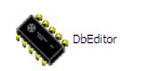
</p>
<p align="center">Рисунок - Редактор базы каналов </p>

DbEditor - программа, предназначенная для создания базы каналов.

Как говорилось ранее, база каналов позволяет связать сервер и устройства измерения и управления.

Перед созданием проекта автоматизации в программе “Monitor” необходимо создать базу каналов.

Результатом будет создание файла, описывающего область адресов устройств (датчики, клапана, насосы  и т.д.), которые будут использоваться в проекте.

## Пример создания базы каналов

Рассмотрим создание базы каналов на примере автоматизации танка. Как видно из рисунка, для автоматизации танка необходимо 3 клапана с  обратной связью, два датчика уровня, насос с обратной связью, мешалка  
с обратной связью.

<p align="center">
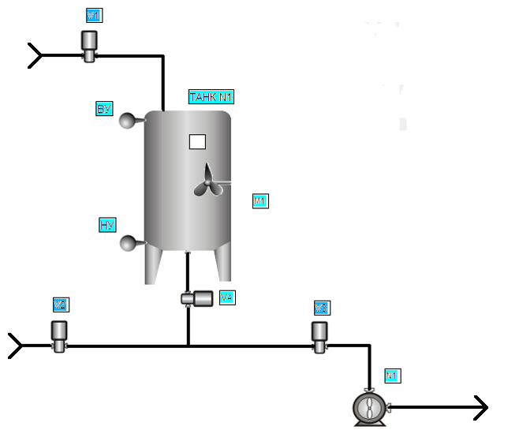
</p>
<p align="center">Рисунок - Автоматизация танка</p>

Для работы с программой нужен исходный файл  с расширением cdb.

<p align="center">
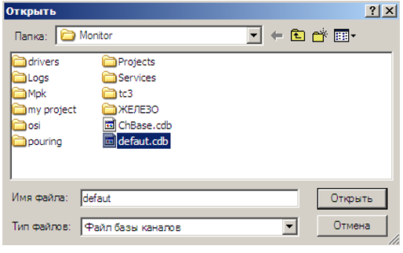
</p>
<p align="center">Рисунок - Открытие базы каналов  </p>

Правой кнопкой мыши в левом окне вызываем меню  и выбираем “Добавить новое устройство”. 

<p align="center">
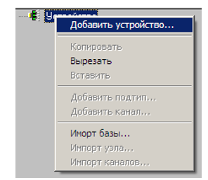
</p>
<p align="center">Рисунок 128 - Добавление нового устройства  </p>

Затем необходимо указать драйвер устройств. Для каждого проекта выбирается определенный драйвер устройств. В данном случае это «tank.dll».

> Примечание: В последних  проектах  используется универсальный драйвер  для всех  устройств.

<p align="center">
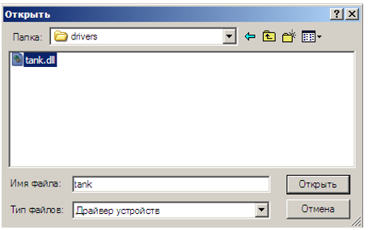
</p>
<p align="center">Рисунок 129 - Выбор драйвера устройств </p>

Заполняем поля **“Имя”**  и  **“Описание”**.

Пункт «Включён» позволяет вкл/откл узлы (если выкл. драйвер этот узел не обрабатывает). Этот пункт доступен в любой точке базы каналов.

ID – для устройства это идентификатор драйвера. По двойному щелчку на номер его можно поменять. 

> ВАЖНО: если поменяли идентификатор драйвера в базе каналов необходимо изменить идентификатор драйвера в проекте (в инспекторе проектов - кнопка «Изменить драйвер»); соответственно, если поменять в проекте идентификатор то необходимо поменять его и в базе каналов.

Тип доступа может быть автономный или разделяемый. Автономный - используется для связи с контроллером, разделяемый – для связи с устройствами подключёнными непосредственно к COM  портам сервера.

<p align="center">
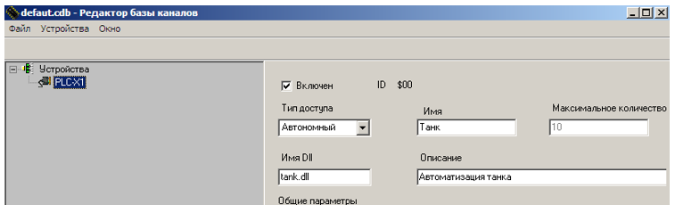
</p>
<p align="center">Рисунок 130 - Редактор базы каналов  </p>

Теперь нужно описать устройства, которые будем использовать в проекте. Для этого добавляем новый подтип и назовем его **“Датчики”**:

<p align="center">
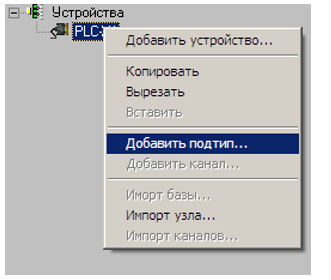
</p>
<p align="center">Рисунок 131 - Добавление нового подтипа   </p>

Добавляем каналы:

<p align="center">
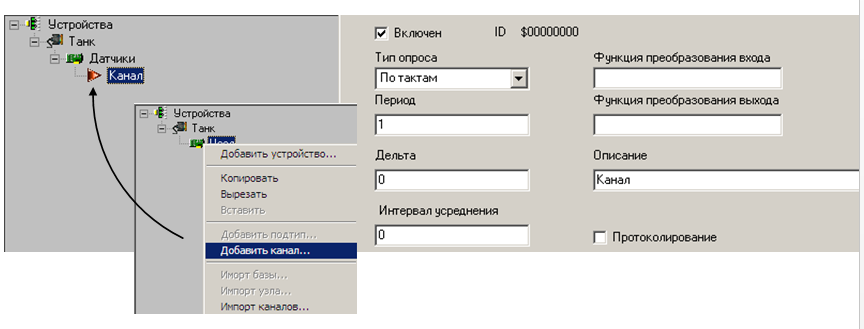
</p>
<p align="center">Рисунок 132 - Добавление нового канала </p>

Тип опроса может быть по тактам системы или по времени. При этом период опроса по тактам системы подразумевает что каждый n-й такт значение будет фиксироваться драйвером, по времени – каждые n миллисекунд.

Дельта – если текущее значение больше предыдущего на дельту, обработать это значение.

Протоколирование – протоколирование канала (тэговое свойство в проекте).

Для каждого узла могут быть прописаны различные параметры (зависит от вида и версии драйвера). 

В описании указываем тип канала – LS1: Нижний	уровень танка (пробелы после «LS1» и «:»), нажимаем кнопку применить. 

Первые  буквы и номер определяют тип устройства.
Различают следующие типы:

|Тип | Описание|
|----|---------|
|AO| Аналоговый выход (4-20 mA)|
|FQT| Счетчик|
|V| Клапан (D, 4-20 mA)|
|N| Насос (D)|
|M| Электродвигатель|
|LS| Уровень (D)|
|TE| Датчик температуры (4-20 mA)|
|FE| Текущий расход (л/с, 4-20 mA)|
|QE| Концентрация (4-20 mA)|
|FS| Расход (есть/нет)|
|LE| Текущий уровень (л ,4-20 mA)|
|OS| Обратная связь (D)|
|UPR| Канал  управления |
|D |1– 20 мА – Аналоговый сигнал   |

<p align="center">
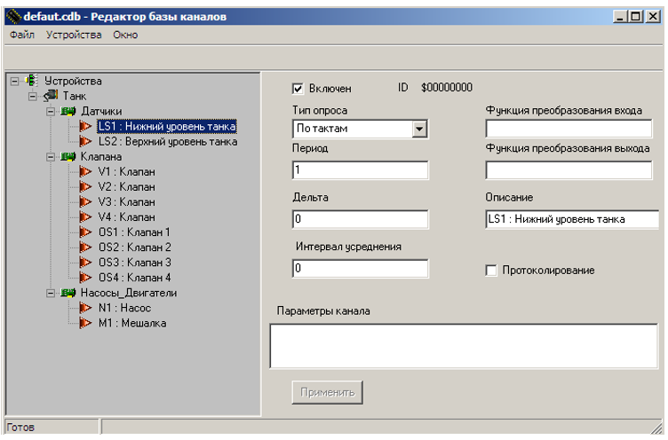
</p>
<p align="center">Рисунок 133 - База каналов для автоматизации танка  </p>

Для наглядности, на рисунке каналы  разбиты условно, допускается добавлять все каналы для одного подтипа.

Также в базу каналов включаются  дополнительная информация о объектах (состояние, команды, параметры)

|Команда     | Описание|
|------------|---------|
|LPSTn       | Состояние гребенки|
|LPCMPn      | Канал команд гребенки|
|LPP 00-n    | Параметры гребенки|
|TPSTn       | Состояние танка|
|TPP00-nP00-n| Параметры танка (TPP 00-n – номер танка ,P 00-n  - номер параметра) |
|TPCMD00-n   | Канал  команд (00-n -  номер)  |
|AVT00-nLN   | Состояние автомата |

Для нашего примера включим дополнительный параметр состояния  танка.

<p align="center">
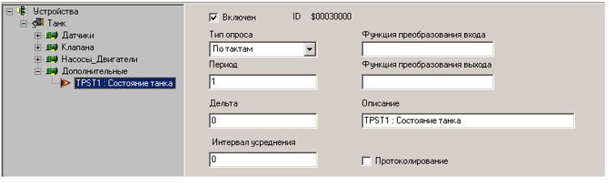
</p>
<p align="center">Рисунок 134 - Состояние танка  </p>

## Особенности работы с OPCUACppDriver.dll

В случае если база каналов требует использование `OPCUACppDriver.dll`, то существует несколько особенностей, о которых необходимо знать.

Чтобы убедиться в том, что драйвер использует `OPCUACppDriver.dll`, достаточно посмотреть на поле `имя Dll`:

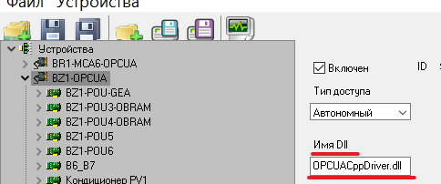

У таких драйверов `Тип доступа` должен быть указан как `Автономный`.

### Обрабатываемые параметры OPCUACppDriver.dll

Ниже представлена таблица параметров, которые может обрабатывать `OPCUACppDriver.dll`, а также на каком уровне можно задавать такие параметры: на уровне драйвера, устройства или канала.

В таблице нижу под колонками Драйве, Устройств и Канал будут указаны следующие параметры: ✔️ или ❌.
✔️ - обозначает, что параметр обрабатывается на определённом уровне.
❌ - обозначает, что параметр не обрабатывается на определённом уровне и его использование будет проигнорировано.

|Параметр|Драйвер|Устройство|Канал|Описание|
|-|-|-|-|-|
|IP|✔️|✔️|❌|Задаёт IP-адрес для подключения.|
|Port|✔️|✔️|❌|Задаёт порт для подключения.|
|Timeout|✔️|✔️|❌|Задаёт интервал опроса.|
|ReadType|✔️|✔️|✔️|Задаёт способ обращения к данным.|
|UserName|✔️|✔️|❌|Задаёт имя пользователя для подключения. Если не задано, то подключение анонимное.|
|UserPassword|✔️|✔️|❌|Задаёт пароль для пользователя. Игнорируется, если UserName не задан.|
|Encrypted|✔️|✔️|❌|Указывает шифрование соединения.|
|ByteOrder|❌|❌|✔️|Задаёт порядок байт.|

### Порядок наследования общих параметров

При использовании `OPCUACppDriver.dll` есть возможность указать параметры в поле `Общие параметры`, которые будут унаследованы всеми устройствами драйвера при условии отсутствия этих же параметров у самих устройств. Например, если у драйвера указан параметр `Username` со значением `User`, то все устройства будут иметь параметр `Username` со значением `User`. Если у устройства всё-таки указан этот параметр, то приоритет у параметра устройства будет выше. Это значит, что если у устройства имеется параметр `Username`, который указан как `Admin`, то устройство сохранит это уникальное для себя значение.

### Формат записи каналов OPCUA

Для того, чтобы создать канал, по которому можно будет обращаться к необходимому свойству, необходимо сделать следующие шаги:

1) Открыть `DBEditorXML`.

2) Открыть `базу каналов`.

3) Развернуть драйвер `базы каналов`.

4) Развернуть узел устройства, в котором будет находится новый канал, он же тег.

5) Далее нажать `ПКМ > Добавить канал`, выделив необходимый узел.

6) Задать имя канала в поле `Описание` в соответствии с шаблоном ниже:

<пространство имён> : <тип узла> : <описание узла>

#### определение описания канала

Если Вам не известно откуда взять значение пространства имён, типа узла и описание узла, то можно воспользоваться приложением `UaExpert`. Для этого выполним следующие действия:

1) Откроем `UaExpert`.

2) Далее нажимаем на кнопку `Add Server`:

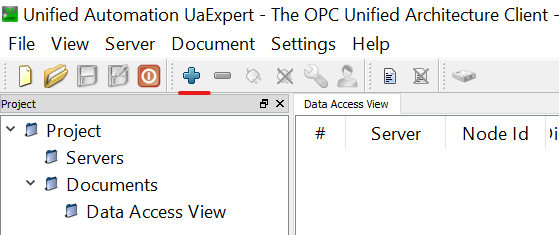

3) Далее переходим во вкладку `Advanced`.

4) Указываем реквизиты подключения. В первую очередь IP и Port в области `Server Information` в поле `Endpoint Url` в формате `opc.tcp://IP:PORT`. Далее указываем анонимное ли это подключение или нет. Для этого есть радиокнопки в области `Authentication Setting`. В случае, если соединение не анонимное, то выбираем соответствующую радиокнопку и указываем реквизиты пользователя и пароль в поля `Username` и `Password` соответственно:

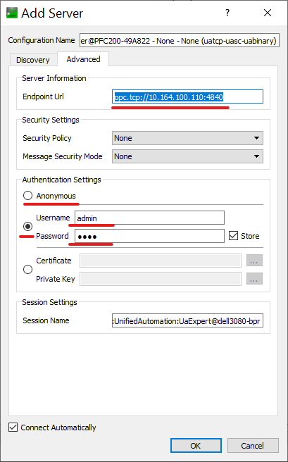

5) После настройки нажимаем кнопку `OK`. Нас перекинет в главное окно, где слева в поле появится наше подключение. По умолчанию, добавленное подключение сразу устанавливает связь. Если этого не произошло, тогда попробуйте нажать на это подключение `ПКМ > connect`:

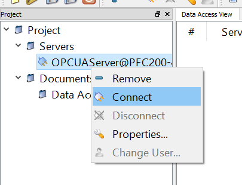

Если подключиться не удалось, то проверьте параметры подключения. Для этого нажмите `ПКМ > properties`.

6) Находим необходимое нам свойство, развернув иерархическую структуру ниже:

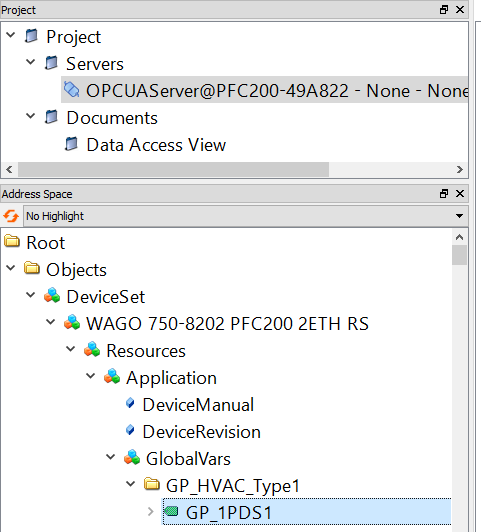

7) Выбираем объект, как правило, помеченный зелёной биркой.

8) Справа появляется описание выбранного объекта, где можно найти значения пространства имён, типа узла и описание узла:

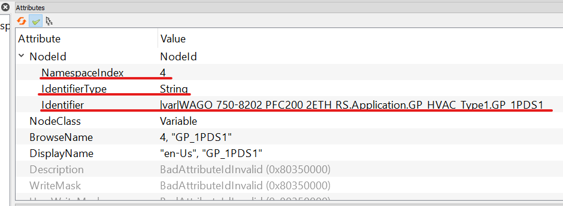

Таким образом `Описание` канала должно быть следующим:

```xml
4 : String : |var|WAGO 750-8202 PFC200 2ETH RS.Application.GP HVAC Type1.GP 1PDS1.
```

### Ключевое слово None

Рассмотрим случай, когда для драйвера заданы параметры `UserName` и `UserPassword`, соответственно, для всех устройств эти параметры будут совпадать, если у отдельных устройств они не переопределены. В случае, если устройство необходимо подключать анонимно, то можно воспользоваться ключевым словом None для указания того, что параметры `UserName` и `UserPassword` не заданы, благодаря чему эти параметры игнорируются и появляется возможность осуществить анонимное подключение.

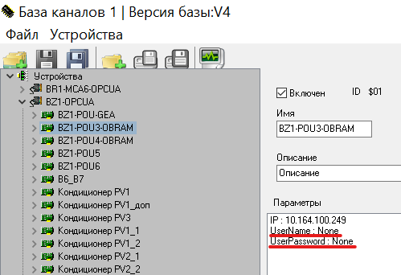

## Работа с OPCUA подпиской в редакторе базы каналов

### Описание OPCUA подписки

Редактор базы каналов позволяет оформлять подписку на устройства или на отдельные теги.

Если нигде явно не указывать ничего в этом отношении, то информация с тегов будет получена с помощью принципа запрос-ответ. Другими словами, информация с тегов не будет получена до тех пор, пока не будет соответствующего запроса. Однако подход запрос-ответ имеет серьёзный недостаток - медлительность. Запрос создаётся на один конкретный тег, а когда тегов много, время считывания информации с тегов значительно увеличивается. Так, например, для одного проекта актуализация информации с тегов происходит через 7 - 10 секунд, для другого проекта немного больше, для третьего немного меньше и так далее.

Подписка решает вопрос со скоростью, позволяя получать информацию с тегов гораздо быстрее. Впрочем, такой подход будет сильнее нагружать систему. Не нужно отправлять отдельный запрос для того, чтобы получить информацию с тега. Вместо этого, если тег изменяется, то с помощью callback-функций можно уловить и обработать это изменение.

Подписка сделана средствами `open62541`.

### Подписка на тег

Для того, чтобы подписаться на тег, который нужно отслеживать, необходимо выполнить следующие шаги:

1) Открыть `DBEditorXML`.

2) Открыть `базу каналов`.

3) Развернуть драйвер `базы каналов`.

4) Развернуть узел устройства, в котором находится необходимый тег.

5) Выбрать тег и создать для него параметр `ReadType` со значением `Subscription`. Для того, чтобы создать параметр в поле `Параметры канала`, нажимаем `ПКМ > Добавить`.

6) Сохраняем изменения.

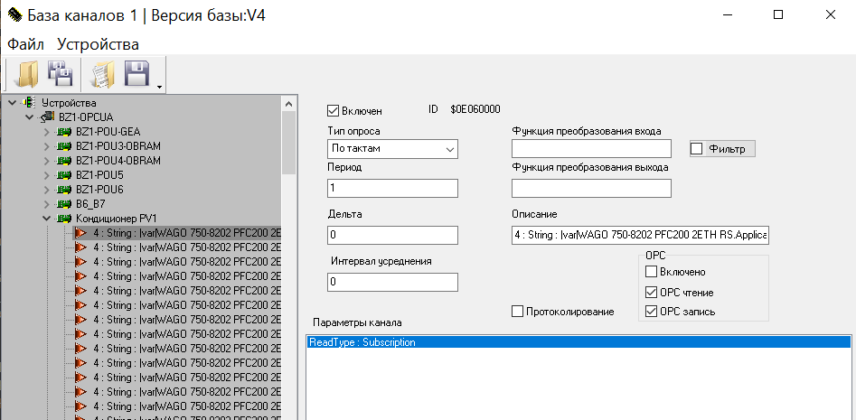

Теперь тег будет добавлен в подписку.

### Подписка на устройство

Для того, чтобы подписаться на все теги конкретного устройства, необходимо сделать следующие шаги:

1) Открыть `DBEditorXML`.

2) Открыть `базу каналов`.

3) Развернуть драйвер `базы каналов`.

4) Выбрать устройство и создать для него параметр `ReadType` со значением `Subscription`. Для того, чтобы создать параметр в поле `Параметры канала`, нажимаем `ПКМ > Добавить`.

5) Сохраняем изменения.

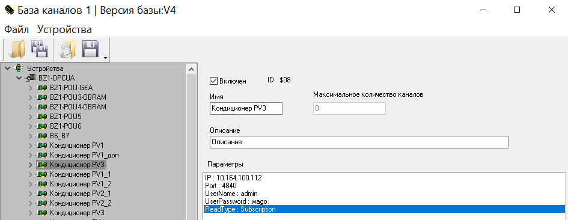

Теперь все теги устройства будут добавлены в подписку.

### Подписка на драйвер

Для того, чтобы подписаться на все теги всех устройств конкретного драйвера, необходимо сделать следующие шаги:

1) Открыть `DBEditorXML`.

2) Открыть `базу каналов`.

3) Выбрать драйвер и создать для него **общий** параметр `ReadType` со значением `Subscription`. Для того, чтобы создать параметр в поле `Общие параметры`, нажимаем `ПКМ > Добавить`.

4) Сохраняем изменения.

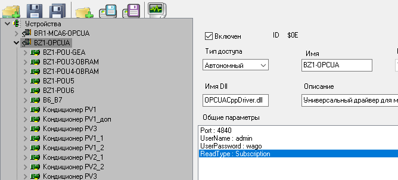

Теперь все теги всех устройств (подтипов) будут добавлены в подписку.

### Сокращённые записи типа чтения

Для параметра `ReadType` предусмотрены сокращённые записи его значений. Таким образом `Subscription` можно сократить до `Sub`, а `RequestResponse` можно сократить до `RR`.

### Приоритет подписок

Приоритет параметра `ReadType` у отдельного тега выше, чем этот же параметр у устройства, где содержится этот тег.

Если `ReadType` у устройства указан как `Subscription`, то сделать так, чтобы какой-то тег не отслеживался можно следующим образом. Достаточно задать параметр `ReadType` у тега как `RequestResponse`. Такая запись будет явно указывать на то, что доступ к данному тегу будет осуществляться только по принципу запрос-ответ.

Такая же логика и в случае с драйвером. Если у драйвера `ReadType` указан как `Subscription`, а у устройств или отдельных тегов этот параметр указан как `RequestResponse`, то такие устройства или теги будут работать по принципу запрос-ответ.

### Мониторинг тегов

Чтобы начать мониторинг тегов, на которые организована подписка, необходимо выполнить следующие шаги.

1) Открыть `EasyServer`.

2) Загрузить базу каналов, которая требует `OPCUACppDriver.dll`. Например:

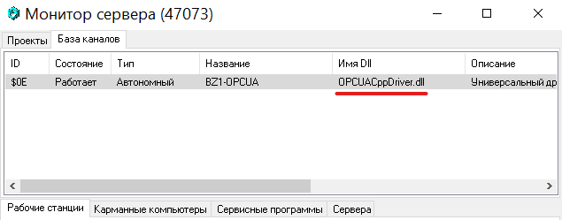

3) Открыть проект, который для своей корректной работы требует загруженную в прошлом пункте базу каналов.

4) Открыть `Monitor` и открыть загруженный в прошлом пункте на сервере проект, после чего подключиться к серверу.

5) Проверить обновление тегов.

Проще всего изменение тегов можно определить по счётчику времени, который будет изменяться в течение 1 - 2 секунд. Например:

Первое состояние:

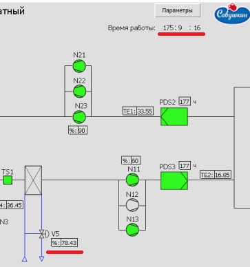

Второе состояние спустя 2 секунды:

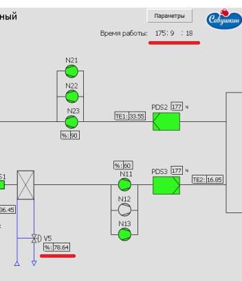

На самом деле подписка работает быстрее, просто в этом случае сыграла роль задержка при совершении скриншотов.

### Подписка в условиях обрыва связи

Чтобы понять, как будет вести себя подписка в условиях обрыва связи, необходимо обратить внимание на 3 параметра: `PublishingInterval`, `KeepAliveInterval`, `LifetimeInterval`. Если `PublishingInterval` задаётся вручную при инициализации подписки, то `KeepAliveInterval = KeepAliveCount × PublishingInterval` и `LifetimeInterval = LifetimeCount × PublishingInterval`, где `KeepAliveCount` и `LifetimeCount` вручную при инициализации подписки.

1) `PublishingInterval` - интервал в миллисекундах, с которым сервер будет отправлять сообщения клиенту.

2) `KeepAliveInterval` - интервал, с которым сервер будет отправлять клиент сообщение `keep-alive`, говоря, что подписка ещё жива, если `KeepAliveInterval` < `LifetimeInterval`. Параметр `KeepAliveCount` задаёт количество раз, сколько будет отправлено такое сообщение, а `PublishingInterval` задаёт интервал между этими сообщениями.

3) `LifetimeInterval` - время, в течение которого будет жива подписка. `LifetimeCount` - по сути задаёт количество раз, сколько проверять серверу, живали ли подписка и установлено ли соединение с отслеживаемым элементом. По истечению `LifetimeInterval` подписка уничтожается.

Итог: подписка может быть удалена, а может быть не удалена в условиях обрыва связи. Понять, жива ли подписка можно по сообщению `keep-alive`.

#### Восстановление подписки при краткосрочном обрыве связи

Краткосрочным обрывом связи будем называть обрыв, который не превышает время жизни подписки, т.е. параметр `LifetimeInterval`. В условиях краткосрочного обрыва связи все ID соединений и отдельных тегов "затираются" в любом случае. Если подписка не была удалена, тогда при попытке инициализировать новую подписку будут возвращены существующие ID, благодаря чему восстановится связь с существующей подпиской.

#### Восстановление подписки при долгосрочном обрыве связи

Долгосрочным обрывом связи будем называть обрыв, который превышает время жизни подписки, т.е. параметр `LifetimeInterval`. В условиях долгосрочного обрыва связи все ID соединений и отдельных тегов "затираются" в любом случае. Если подписка была удалена, тогда будет создаваться новая подписка и теги будут иметь уже новые ID подписки.