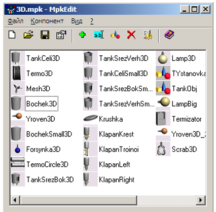
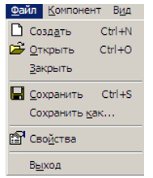
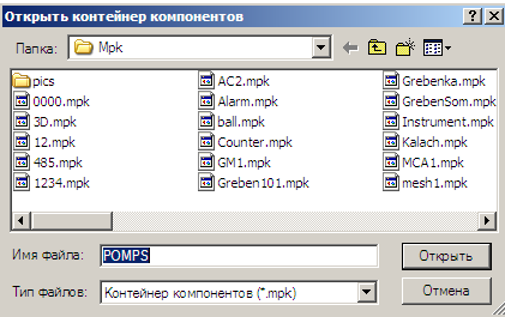
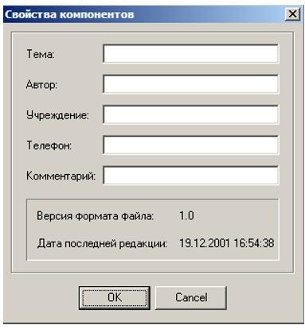
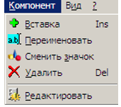
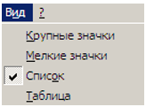

# Редактор компонентов MpkEdit

[Назад](../readme.md)

## Содержание

+ [Описание программы "Редактор компонентов"](#описание-программы-редактор-компонентов)
+ [Описание меню редактора компонентов](#описание-меню-редактора-компонентов)
    - [Меню "Файл" редактора компонентов](#меню-файл-редактора-компонентов)
    - [Меню "Компонент" редактора компонентов](#меню-компонент-редактора-компонентов)
    - [Меню "Вид" редактора компонентов](#меню-вид-редактора-компонентов)

## Описание программы "Редактор компонентов"

Редактор компонентов позволяет изменять свойства объекта

Рисунок - Окно редактора компонентов 

## Описание меню редактора компонентов

### Меню "Файл" редактора компонентов

Рисунок - Меню “Файл ” 

Файл контейнера компонентов имеет расширение .mpk

Рисунок - Открыть контейнер компонентов 

Свойства - отображение версии контейнера компонентов, а также других свойств.

Рисунок - Свойства контейнера компонентов 

### Меню "Компонент" редактора компонентов

Рисунок - Меню "Компонент" 

С помощью меню "Компонент" можно изменять свойства выбранного компонента. Настройка свойств компонента описана выше .

### Меню "Вид" редактора компонентов

Рисунок - Меню "Вид" 

