# Инструкция по работе с моечными станциями

# Содержание
1. [Общие сведения](#Общие-сведения)
2. [Обслуживание операторского пульта](#Обслуживание-операторского-пульта)
4. [Начало работы](#Начало-работы)
5. [Описание технологического процесса](#Описание-технологического-процесса)
6. [Описание программ режимов мойки](#Описание-программ-режимов-мойки)
7. [Запуск проекта мойки на новом контроллере](#Запуск-проекта-мойки-на-новом-контроллере)
8. [Описание возмежных ошибок](#Описание-возмежных-ошибок)

## Общие сведения

Проект моечной станции пердназначен для проведения автоматической мойки различных объектов.
Проект "МСА" поддерживает 8 различных режимов мойки, каждый из которыхвключается при выборе его оператором.

## Обслуживание операторского пульта

### Карта выбора линии мойки

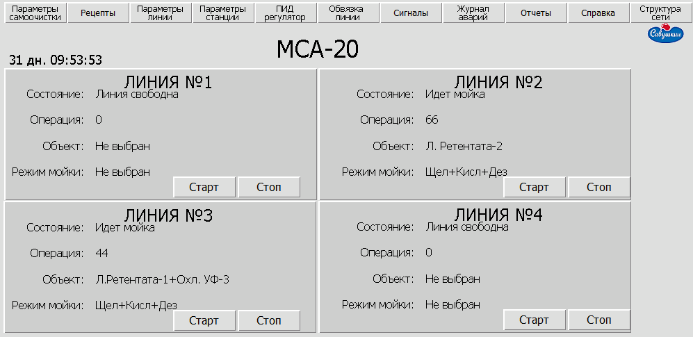

### Карта линии мойки

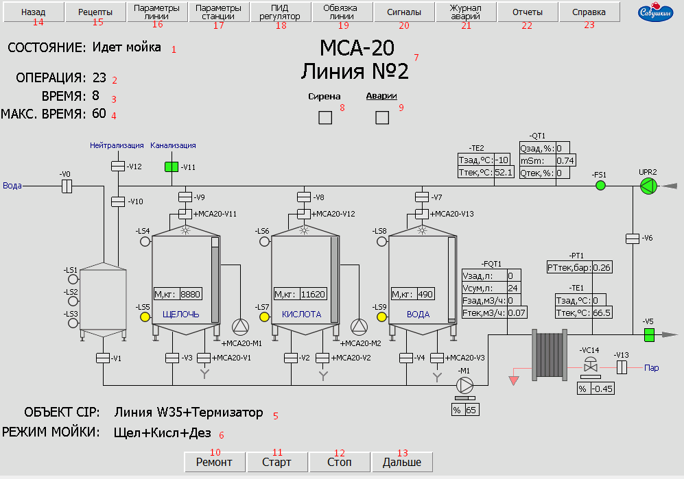

1 - Состояние линии;  
2 - Номер выполняемой операции;  
3 – Время операции;  
4 – Максимальное время для данной операции;  
5 – Выбор объекта CIP (для мойки);  
6 – Выбор режима мойки для линии N;  
7 – Название проекта и линии;  
8 - Индикатор звуковой сирены при аварии;  
9 - Индикатор аварии;  
10 - Остановка линии на время выполнения ремонта
11 – Начать  данный режим;  
12 – Остановить данный режим;  
13 – Переход к следующей операции данного режима;  
14 - Вернуться на начальную страницу;  
15 - Параметры рецептов;  
16 - Параметры линии;  
17 - Параметры станции;  
18 - Параметры PID регулятора;  
19 - Схема обвязки линии;  
20 - Сигналы линии;  
21 - Журнал аварий;  
22 - Отчеты МСА;  
23 - Справка МСА;  

 – Сброс всей мойки,  переходит  в нулевое состояние;  
 – Сирена, срабатывает при возникновении ошибки;  
 – Переход к окну линий мойки.  
* Все переходы к следующей операции реализованы автоматически. Используется при возникновении неполадок или диагностики оборудования.

### Карта оборудования моек

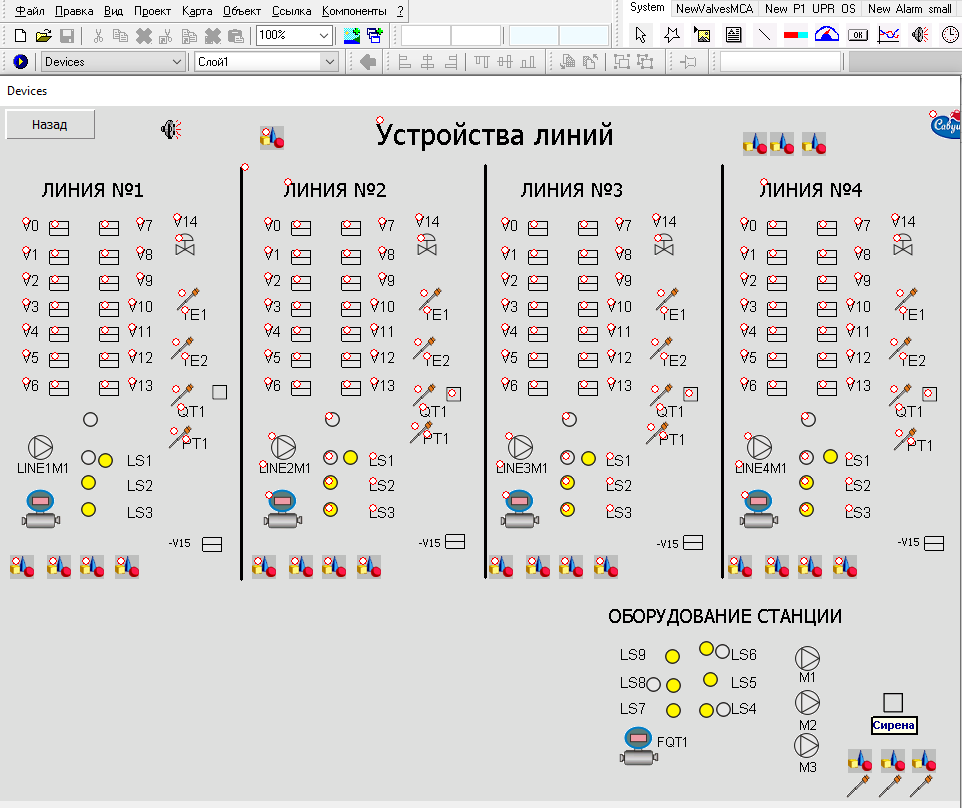

* Доступна только в режиме редактирования

### Карта PID-регулятора

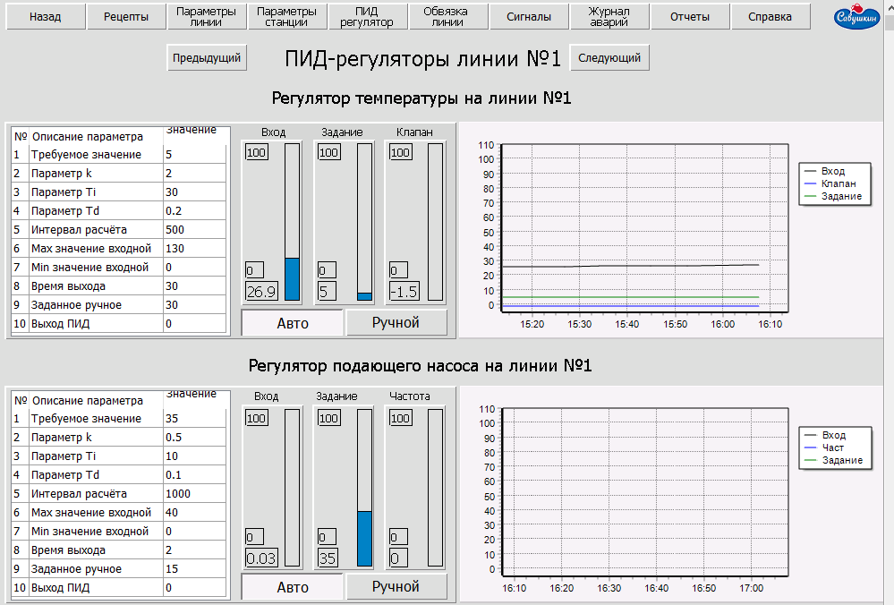

Для настройки температуры подогревателя и поддержания заданной производительности насоса предназначена карта PID-регулятор (рисунок 3.4).  

На верхней части карты регулятора температуры отображаются текущие и заданные значения температуры, степень открытия парового клапана. На  графике отображаются и протоколируются указанные величины.  
В нижней части карты регулятора подающего насоса отображаются текущие и заданные значения производительности, частота (в процентах) вращения насоса. На  графике отображаются и протоколируются указанные величины.  
Для обоих регуляторов существует возможность изменения их настроек. Для этого необходимо щелкнуть по интересующему параметру и ввести новое значение (рисунок 3.5). 

### Карта параметров станции

Данная карта предназначена для отображения и изменения текущих параметров моечной станции.

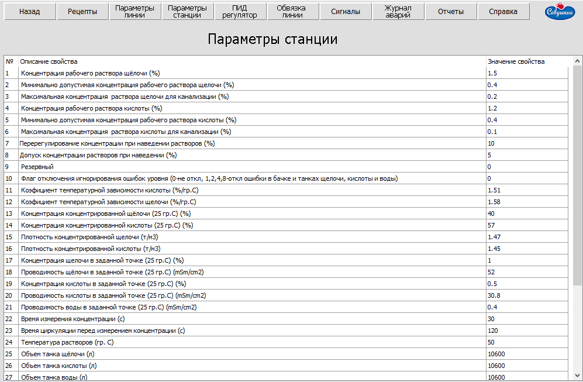

Если возникла необходимость изменения параметров в ходе работы моечной станции, то нужно щелкнуть по интересующему параметру и ввести новое значение.

### Карта параметров линии

Данная карта аналогична карте параметры станции. На ней отображаются текущие параметры для каждой линии МСА. Здесь также существует возможность редактирования величин.

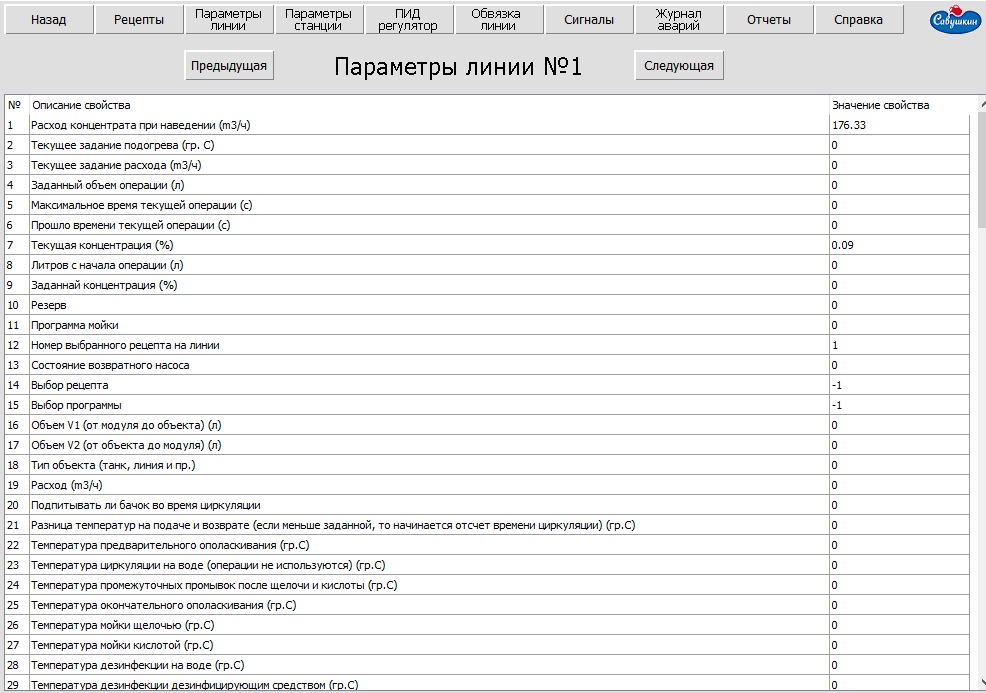

## 4 Начало работы

Перед началом мойки необходимо удостовериться, что уровень моющих растворов в танках достаточный для проведения мойки. Если необходимо приготовить моющий раствор, нажимаем кнопку “ Режим мойки”, при этом объект мойки не выбираем. 

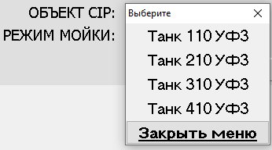

В появившемся окне выбираем рецепт моющего раствора. 

### Включение режима мойки

Для включения режима мойки необходимо выбрать объект, который нужно помыть  и выбрать режим мойки: 
1) Нажимаем кнопку “ОБЪЕКТ СIP” и в появившемся окне выбираем объект мойки и нажимаем “Выбрать”

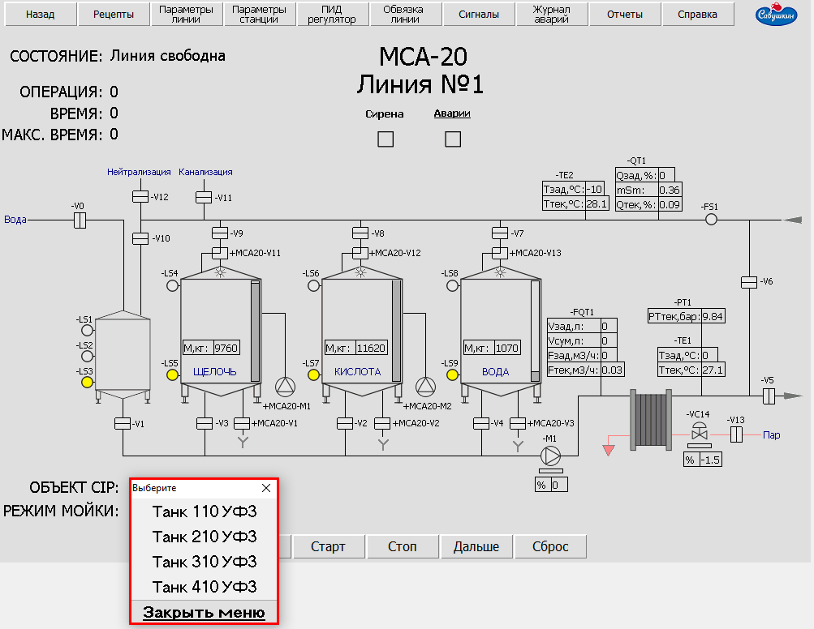

2) Нажимаем кнопку “РЕЖИМ МОЙКИ” и в появившемся окне выбираем режим мойки также как и для объекта мойки. 
3) Нажимаем кнопку  “ СТАРТ ”. 

Для остановки режима мойки нажимаем “СТОП”, продолжить режим мойки можно нажатием кнопки “СТАРТ”.  
Для того чтобы изменить параметры мойки нажимаем “СБРОС” и выбираем  параметры заново. 

## 5 Описание технологического процесса

### 5.1 Режимы мойки  
Проект “Мойка” включает  следующие режимы: 
1. Кислота  
2. Щелочь  
3. Ополаскивание  
4. Дезинфекция  
5. Щелочь+Кислота (Щ+К)  
6. Щелочь+Дезинфекция (Щ+Д)  
7. Кислота+Дезинфекция (К+Д)  
8. Щелочь+Кислота+Дезинфекция (Щ+К+Д)  
9. Наведение раствора  

### 5.2 Режим "Наведение раствора"

Перед началом работы, если это необходимо, включается  режим “Наведения раствора”. Рассмотрим его на примере щелочи:  

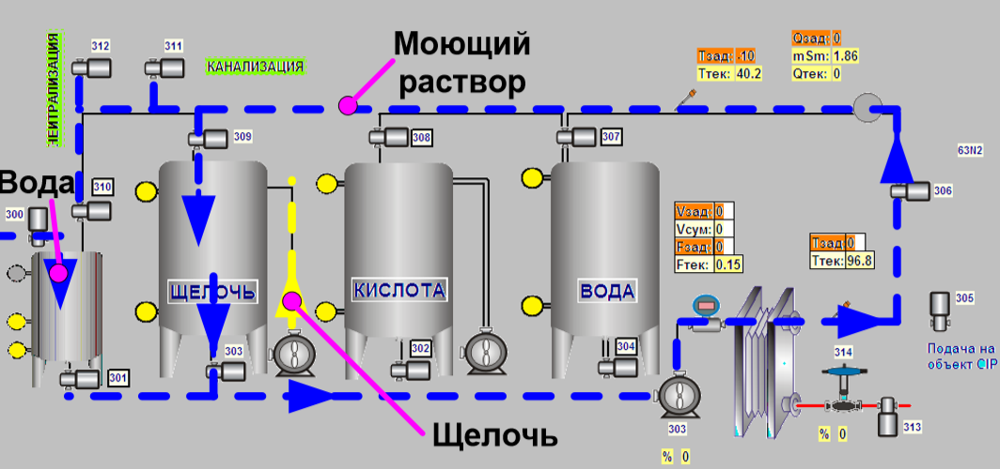

Как видно из рисунка, для приготовления моющего раствора используется чистая вода и щелочь.  
В процессе приготовления раствора осуществляется циркуляция моющего раствора заданное время.  
После циркуляции выполняется проверка концентрации моющего раствора.  
Если концентрация ниже заданного значения, происходит добавление необходимого количества щелочи, и осуществляется повторная циркуляция моющего раствора. 

### 5.3 Режим "Щелочь", "Кислота"

Режимы “Щелочь” и “Кислота” функционируют одинаково. Рассмотрим режим “Щелочь”:  

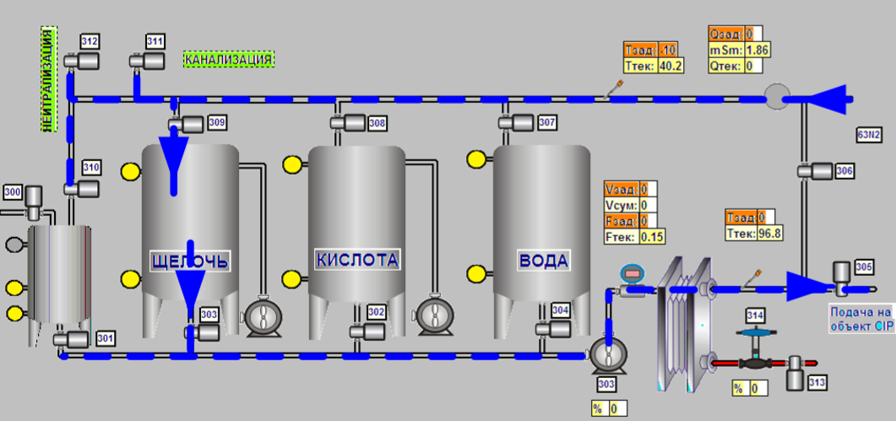

Готовый моющий раствор подается на объект CIP и возвращается обратно в танк.

### 5.4 Режим "Ополаскивание"

Режим используется как промежуточный режим после моющего раствора или для окончательной промывки.  
В первом случае осуществляется сбор разбавленной щелочи (кислоты), если концентрация моющего раствора превышает заданную, при этом открывается клапан нейтрализации.  
Если концентрация моющего раствора ниже заданной, то осуществляется слив в канализацию. 

### 5.5 Режим "Дезинфекция"

Осуществляется циркуляция воды нагретой до температуры 95 градусов. 

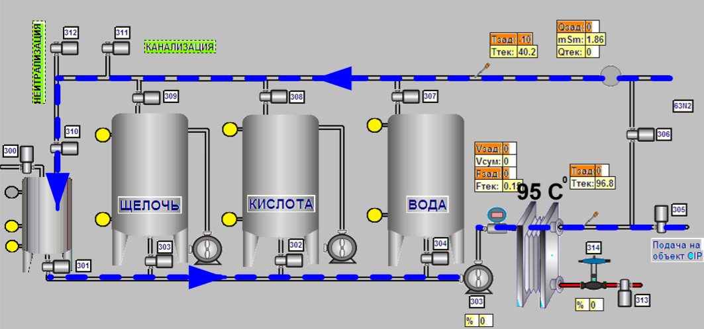

### 5.6 Другие режимы

Режимы Щ+К, Щ+Д, К+Д, Щ+К+Д включают в себя несколько режимов и выполняются последовательно. 

## 6. Описание программ режимов мойки

**Режим “Щелочь”**  
1. Инициализация  
2. Предварительная промывка  
3. Щелочь  
4. Промежуточная промывка 1  
5. Окончательная промывка  
6. Конец  
 
**Режим “Кислота”**  
1. Инициализация  
2. Предварительная промывка  
3. Кислота  
4. Промежуточная промывка 2  
5. Окончательная промывка  
6. Конец  
 
**Режим “Щелочь и Кислота”**  
1. Инициализация  
2. Предварительная промывка  
3. Щелочь  
4. Промежуточная промывка 1  
5. Кислота  
6. Промежуточная промывка 2  
7. Окончательная промывка  
8. Конец  

**Режим “Щелочь и Дезинфекция”**  
1. Инициализация  
2. Предварительная промывка  
3. Щелочь  
4. Промежуточная промывка 1  
5. Дезинфекция  
6. Окончательная промывка  
7. Конец  
 
**Режим “Кислота и Дезинфекция”**  
1. Инициализация  
2. Предварительная промывка  
3. Кислота  
4. Промежуточная промывка 2  
5. Дезинфекция  
6. Окончательная промывка  
7. Конец  
 
**Режим “Дезинфекция”**  
1. Инициализация  
2. Дезинфекция  
3. Конец  
 
**Режим “ Ополаскивание ”**  
1. Инициализация  
2. Горячая вода  
3. Конец  
  
**Режим “Щелочь, Кислота и  Дезинфекция”**  
1. Инициализация  
2. Предварительная промывка  
3. Щелочь  
4. Промежуточная промывка 1  
5. Кислота  
6. Промежуточная промывка 2  
7. Дезинфекция  
8. Конец  

## 7. Описание операций мойки

### 7.1 Предварилбная промывка
|Шаг | Операция            | Описание                           |
|----|------------------------------|--------------------------------|
|5   | Подача воды на объект        | Подача объема V1 на объект CIP из танка со вторичной водой. T=30C |
|7   | Возврат воды с объекта       | На объект CIP подается объем V2 из танка со вторичной водой. Операция заканчивается после появления потока на возврате, если же поток не появляется некоторое время после подачи объема V2 то выдается ошибка «Нет расхода в возвратной трубе» |
|8   | Подача воды на объект        | Подача объема (V1+V2)*Par33(150)/100 на объект CIP из танка с вторичной водой |
|16  | Опорожнение танка циркуляции.| Опорожнение бачка для циркуляции в канализацию |
|9   | Опорожнение объекта          | Опорожнение объекта CIP в  канализацию |

### 7.2 Циркуляция: (температура задается 27 параметром станции)
|Шаг | Операция            | Описание                           |
|----|------------------------------|--------------------------------|
|10  | Заполнение танка для циркуляции  | Заполнение танка для циркуляции возвратом |
|11  | Циркуляция                       |  |
|12  | Опорожнение танка для циркуляции | В канализацию |
|13  | Заполнение танка для циркуляции  | Заполнение танка для циркуляции возвратом |
|14  | Подача вторичной воды на объект  |  |
|15  | Опорожнение танка циркуляции     | В канализацию |

### 7.3 Щелочь
|Шаг | Операция            | Описание                           |
|----|------------------------------|--------------------------------|
|22  | Подача щелочи на объект          | Подача объема V1 щелочи на объект CIP. T=80C. На данном шаге открыты клапаны N03, N05, N11 |
|23  | Опорожнение объекта CIP          | Используется только для танков, открыты клапаны N05, N11. Операция длится по времени. |
|24  | Возврат щелочи с объекта         | Возврат объема V2 щелочи с объекта CIP, температура операции T1=80ºC, T2=70ºC. На данном шаге открыты клапаны N03, N05, N11. |
|26  | Заполнение танка для циркуляции  | Операция длится до момента достижения верхнего уровня, открыты клапаны N01, N03, N05, N10 |
|28  | Циркуляция щелочи                | На данном шаге открыты клапаны N01, N05, N10, циркуляция происходит через танк для циркуляции. Операция длится по времени, отсчет начинается после достижения заданной температуры. |
|29  | Опорожнение танка для циркуляции | Открыты клапаны N01, N05, N09. Операция происходит по времени.|
|31  | Заполнение танка для циркуляции  | Открыты клапаны N00, N01, N05, N09. Продолжается до момента достижения верхнего уровня в танке. |
|33  | Подача воды на объект            | Подача объема (V1+V2)*Par33(150)/100 на объект CIP.  Если в программе присутствует мойка кислотой, то вода берется из танка с вторичной водой. Идет вытеснение щелочи в танк со щелочью. Открыты клапаны N04, N05, N09. Иначе вода поступает из танка для циркуляции, т.е. открыты клапаны N01, N05, N09. Периодически открывается клапан N00. |
|34  | Опорожнение объекта              | Полный возврат щелочи, открыты клапаны N05, N09. Операция длится по времени. |
|35  | Возврат воды с объекта           | Возврат объема V2 щелочи с объекта CIP, открыты клапаны N01, N05, N09. N00 периодически открывается и закрывается в зависимости от показаний датчика уровня на танке для циркуляции |
|37  | Подача воды на объект            | Подача объема (V1+V2)*Par33(150)/100 на объект CIP . Если в программе присутствует мойка кислотой, то вода берется из танка с вторичной водой – открыты клапаны N04, N05, N11, иначе вода берется из танка для циркуляции – открыты клапаны N01, N05, N07. Периодически открывается клапан N00. |
|39  | Опорожнение танка для циркуляции | В танк с вторичной водой либо в канализацию, т.е. открыты клапаны N01, N05, N07 либо N01, N05, N11. Операция заканчивается по достижению верхнего уровня в танке.|
|40  | Опорожнение объекта CIP          | В танк с вторичной водой либо в канализацию, т.е. открыты клапаны N05, N07 либо N05, N11. |

### 7.4 Кислота
|Шаг | Операция            | Описание                           |
|----|------------------------------|--------------------------------|
|42  | Подача кислоты на объект              | Подача объема V1 кислоты на объект CIP. T=70C. На данном шаге открыты клапаны N02, N05, N11 |
|43  | Опорожнение объекта CIP               | Используется только для танков, открыты клапаны N05, N11.  |
|44  | Возврат кислоты с объекта CIP         | Возврат объема V2 кислоты с объекта CIP, температура операции T1=70ºC, T2=60ºC. На данном шаге открыты клапаны N02, N05, N11. Клапан слива в канализацию открыт, пока с объекта мойки происходит возврат воды, что контролируется по показаниям датчика концентрации. Как только проводимость достигнет определенного уровня, откроется клапан N08 подачи  в танк кислоты, а N11 – закроется. |
|46  | Заполнение танка циркуляции возвратом | Операция длится до момента достижения верхнего уровня в танке для циркуляции, открыты клапаны N01, N02, N05, N10 |
|48  | Циркуляция кислоты                    | На данном шаге открыты клапаны N01, N05, N10, циркуляция происходит через танк для циркуляции. Температура операции T1=70ºC, T2=60ºC, концентрация Qзад=0,8.  |
|49  | Опорожнение танка для циркуляции      | Опорожнение идет в танк с кислотой, т.е. открыты клапаны N01, N05, N08  |
|53  | Подача  воды на объект                | Подача объема V1 кислоты на объект CIP. T=30C. На данном шаге открыты клапаны N00, N01, N05, N08 |
|54  | Опорожнение объекта CIP               | В танк с кислотой, при этом открыты клапаны N05, N08.Операция длится по времени. |
|55  | Возврат кислоты с объекта CIP         | Возврат объема V2 кислоты с объекта CIP в танк кислоты, температура операции T1=30ºC, T2=20ºC. На данном шаге открыты клапаны N00, N01, N05, N11 . Клапан слива в канализацию открыт, пока с объекта мойки происходит возврат воды, что контролируется по показаниям датчика концентрации. Как только проводимость достигнет определенного уровня, откроется клапан N08 подачи  в танк кислоты, а N11 – закроется |
|57  | Подача воды на объект CIP             | Подача объема V1 на объект CIP из танка для циркуляции. На данном шаге открыты клапаны N01, N05, N11, периодически открывается N00 |
|59  | Опорожнение танка для циркуляции      | Открыты клапаны N01, N05, N11 |
|60  | Опорожнение объекта CIP               | Происходит слив воды в канализацию, при этом открыты клапаны N05, N07. Если танк со вторичной водой переполнен, то открывается клапан слива в канализацию N11 |

### 7.5 Дезинфекция
|Шаг | Операция            | Описание                           |
|----|------------------------------|--------------------------------|
|61  | Заполнение танка для циркуляции водой  | Пополнить до среднего уровня. Открыты клапаны N00, N01, N05 (может быть открыт клапан слива в канализацию). |
|62  | Подача воды на объект                  | Операция идет при температуре Тзад=95ºС, открыты клапаны N00, N01, N05, N11. |
|63  | Опорожнение объекта CIP                | Происходит слив воды в канализацию, при этом открыты клапаны N05, N11 |
|65  | Заполнение танка для для циркуляции водой (возвратом)  | Открыты клапаны N00, N01, N05 (может быть открыт клапан слива в канализацию) |
|66  | Циркуляция горячей воды                | Время операции начнет отсчет после достижения заданной температуры Тзад=95ºС. Далее открываются клапаны N01, N05, N10. Операция продолжается до истечения заданного промежутка времени 600с.  |
|67  | Опорожнение танка для циркуляции       | Открыты клапаны N01, N05, N11 или N01, N05, N07. |

### 7.6 Мойка перекисью для МСА3
|Шаг | Операция            | Описание                           |
|----|------------------------------|--------------------------------|
|71  | Заполнение танка для циркуляции водой |  |
|72  | Подача воды на объект            |  |
|73  | Опорожнение объекта CIP |  |
|74  | Подача воды на объект  |  |
|75  | Заполнение танка циркуляции  |  |
|76  | Внесение перекиси    |  |
|77  | Циркуляция на перекиси     |  |
|78  | Опорожнение танка для циркуляции     |  |
|79  | Опорожнение объекта CIP     |  |

### 7.7 Окончательная промывка
|Шаг | Операция            | Описание                           |
|----|------------------------------|--------------------------------|
|81  | Заполнение танка для циркуляции водой | Открыты клапаны N00, N01, N05 (может быть открыт клапан слива в канализацию). |
|83  | Подача воды на объект CIP             | Операция идет при температуре Тзад=10ºС, открыты клапаны N00, N01, N05 |
|84  | Опорожнение объекта CIP               | Операция протекает при открытых клапанах N05, N11, т.е. происходит слив в канализацию.  |
|85  | Возврат воды с объекта                | Возврат объема V2 воды с объекта может происходить как в канализацию, так и в танк с водой. В первом случае открыты клапаны N00, N01, N05, N11|
|86  | Подача воды на объект                 | Подача объема (V1+V2)*Par33(150)/100 на объект CIP из танка с вторичной водой. На данном шаге открыты клапаны N00, N01, N05, N11.  |
|91  | Опорожнение объекта CIP               | Опорожнение объекта CIP в  канализацию. На данном шаге открыты клапаны  N05, N11.  |

### 7.8 Наведение щёлочи
|Шаг | Операция            | Описание                           |
|----|------------------------------|--------------------------------|
|105  | Наполнение танка со щелочью водой | В данном режиме открываются клапаны N00, N01, N06, N09 |
|106  | Циркуляция щелочи                 | Открыты клапаны N03, N06, N09, Тзад=50ºС. Щелочной раствор циркулирует по кругу через танк со щелочью определенное время. |
|108  | Проверка концентрации             | Открыты те же клапаны, происходит проверка концентрации моющего раствора щелочи, Qзад=1,2 |
|109  | Добавление щелочи                 | Шаг наступает, если концентрация раствора ниже заданной. В этом случае включается подающий насос N1 для танка щелочи. Операция заканчивается по времени. |
|111  | Ополаскивание контура циркуляции  | Шаг является завершающей стадией наведения раствора щелочи. Открыты клапаны N00, N01, N06, N11 |

### 7.9 Наведение кислоты
|Шаг | Операция            | Описание                           |
|----|------------------------------|--------------------------------|
|115 | Наполнение танка со кислотой водой | В данном режиме открываются клапаны N00, N02, N06, N08 |
|116 | Циркуляция кислоты                 | Открыты клапаны N02, N06, N08, Тзад=50ºС. Щелочной раствор циркулирует по кругу через танк с кислотой определенное время. |
|118 | Проверка концентрации              | Открыты те же клапаны, происходит проверка концентрации моющего раствора кислоты, Qзад=0,8 |
|119 | Добавление кислоты                 | Шаг наступает, если концентрация раствора ниже заданной. В этом случае включается подающий насос N2 для танка кислоты. Операция заканчивается по времени. |
|121 | Ополаскивание контура циркуляции   | Шаг является завершающей стадией наведения моющего раствора кислоты. Открыты N00, N01, N06, N11 |

### 7.10 Самоочистка
|Шаг | Операция            | Описание                           |
|----|------------------------------|--------------------------------|
|151 | Наполнение танка с щелочью водой   |  |
|155 | Циркуляция                         | V3, V6, V13 открыты |
|156 | Мойка щёлочью контура циркуляции   | V3, V6, V13 открыты |
|157 | Окончание операции 156             |  |
|160 | Воды с бачка в танк щёлочи         | V1, V6, V9 открыты |
|161 | Циркуляция воды на МГ танка воды   | V4, V6, V13 открыты Дренаж танка щёлочи |
|162 | Циркуляция кислоты в танк          | V2, V6, V8 открыты|
|163 | Подача кислоты на МГ в танк щёлочи | V2, V6, V11 открыты |
|164 | Окончание операции 163             |  |
|167 | Ополаскивание водой на МГ в танк кислоты по объёму  | V1, V6, V12 открыты |
|168 | Щёлочь на МГ в танк щёлочи         | Дренаж танка кислоты |
|169 | Вода на МГ в танк кислоты          |  |
|170 | Завершение операции 169            |  |
|173 | Вода в танк воды по объёму         |  |
|174 | Циркуляция кислоты на МГ через танк кислоты     | V2, V6, V12 открыты Дренаж танка воды |
|176 |                                    | V3, V6, V13 открыты |
|179 | Вода с бочка на МГ в танк щёлочи по объёму     | V1, V6, V11 открыты |
|180 | Циркуляция воды на МГ через танк воды    | V4,V6,V13 открыты Дренаж танка кислоты |
|183 | Слив среды(вода)                   | Дренаж танка кислоты |
|184 | Завершение 183                     | Дренаж танка кислоты |
|185 | Опосласкивание водой с бочка на МГ в танк щёлочи по объёму  | V1,V6,V11 Дренаж танков воды, кислоты |
|186 | Опосласкивание водой с бочка на МГ в танк кислоты по объёму   | Дренаж танков воды, щёлочи |
|187 | Опосласкивание водой с бочка на МГ в танк воды по объёму  | Дренаж танков кислоты, щёлочи |
|188 | Дренаж на всех танках                                 | В канализацию |

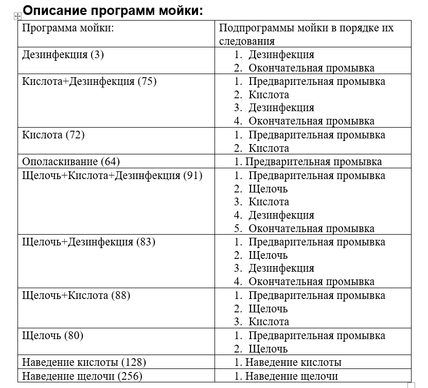

## 8 Описание возможных ошибок мойки  

8.1 Линия остановлена  
Сообщение появляется, если произошла остановка мойки – нажата кнопка СТОП.  

8.2 Нет моющего раствора кислоты в танке  
Возникает при отсутствии сигнала с датчика нижнего уровня танка кислоты. Следует проверить наполнение танка и работоспособность датчика уровня.  

8.3 Нет моющего раствора щелочи в танке  
Возникает при отсутствии сигнала с датчика нижнего уровня танка щелочи. Следует проверить наполнение танка и работоспособность датчика уровня.  

8.4 Нет расхода в возвратной трубе  
Ошибка возникает при неправильном задании объемов в рецептах мойки, неисправностях возвратного насоса.  

8.5 Нет концентрации в возвратной трубе  
Сообщение появляется при неправильном задании объемов в рецептах мойки, неправильном открытии клапанов (щелочь (кислота) уходит не по своему маршруту).  

8.6 Высокая концентрация в возвратной трубе  
Ошибка возникает при неверном задании объемов в рецептах мойки.  

8.7 Ошибка возвратного насоса  
В данной ситуации следует проверить исправность работы возвратного насоса, а также наличие сигналов обратной связи и управления (OS и UPR).  

8.8 Ошибка подающего насоса  
Необходимо проверить исправность подающего насоса, а также наличие сигналов обратной связи и управления (OS и UPR).  

8.9 Нет расхода на подаче  
Данная ситуация может возникнуть при отсутствии воды в бачке для циркуляции, при завоздушивании насоса на подаче либо при иных его неисправностях.  

8.10 Ошибка объекта CIP  
Данное сообщение выдается, если отсутствует обратная связь мойки (не  выбрана мойка объекта в другом проекте) либо возникла аварийная ситуация (не работает насос).  

### Экспорт рецептов с ICPCON

Клонируем себе папку tc3 с помощью Tortoise SVN (https://10.0.16.7/svn/tc3/trunk). Далее открываем её и переходим в OUT\SRAMBackup, в этой папке хранятся актуальные версии рецептов для моечных станций в расширение .xml и .xlsx.

Выгрузка рецептов происходит с помощью утилиты RecipeFormFilller.exe ,которая находится здесь :\tc3\OUT\SRAMBackup\DumpToExcel.

1) Конвертируем с XML в Excel с параметром blockperrecipe 2

Для этого открываем свой проект , меняем значение параметра blockperrecipe с 4 на 2. Нажимаем Сохранить и Создать и Заполнить. Перезаписываем файл Excel.

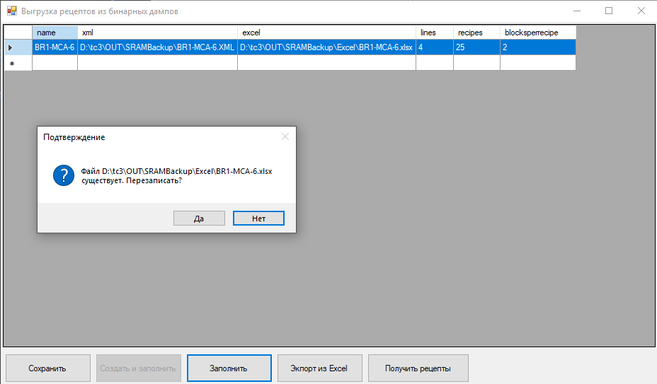

2) Конвертируем Excel в XML с параметром blockperrecipe 4

Меняем параметр blockperrecipe с 2 на 4. Жмем Сохранить и Экспорт из Excel.

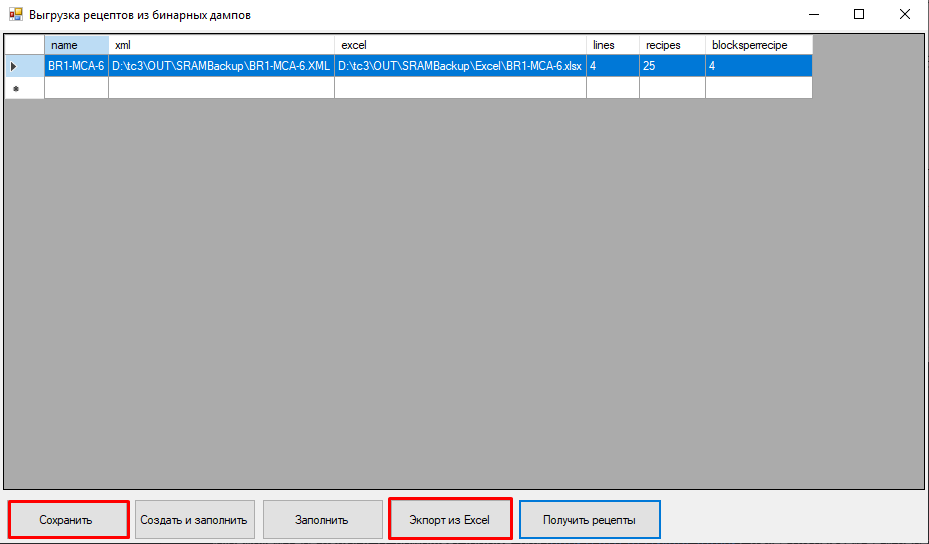

3) Получаем Excel из XML 

Сохранить >> Создать и заполнить  
Перезаписать>> Да  
Открываем полученный файл Excel и обращаем внимание на добавленные  параметры в таблице.

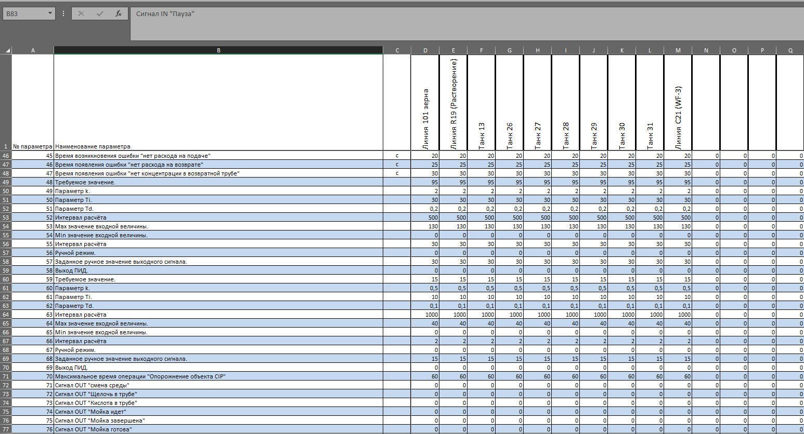

4) Изменение файла Excel вручную с добавлением недостающих параметров.

В новой версии файла должны быть добавлены новые параметры для PID-регуляторов.  

5) Конвертируем Excel в XML  файлы в папку P:\tc3\OUT\SRAMBackup\linux\

### Загрузка рецептов в контроллер

Добавляем полученные файлы рецептов в папку для контроллера.

В папке рецептов должен лежать файл .XML и файлы расширения .bin.
Эти файлы обновляются каждый день самостоятельно.

*Нельзя открывать оригиналы файлов и держать их открытыми длительное время, поскольку они не смогут обновляться.

## Запуск проекта мойки на новом контроллере

Запуск проекта для тестирования происходит локально.  
Открываем проект в Visual Studio Code. Открываем рабочу область из файла. Запускаем тестирование проекта Run debug project.
Запускаем EasyServer с нашим проектом.
Проект монитора запускаем с X:\__Ярлыки для проектов (Брест 1)\Проект

*Не нужно включать заводской VPN.
