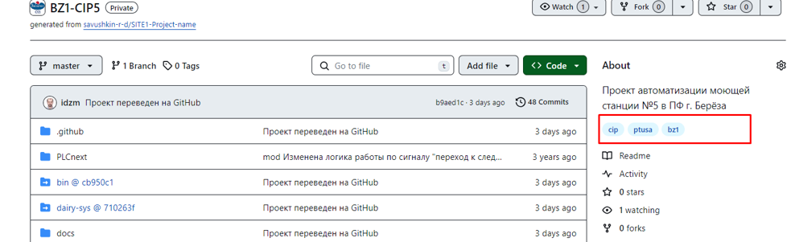
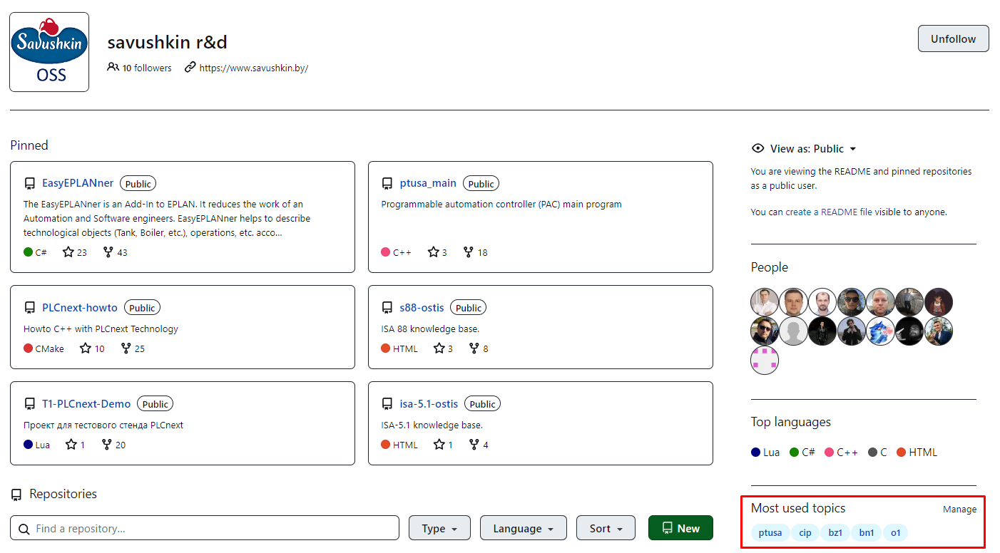
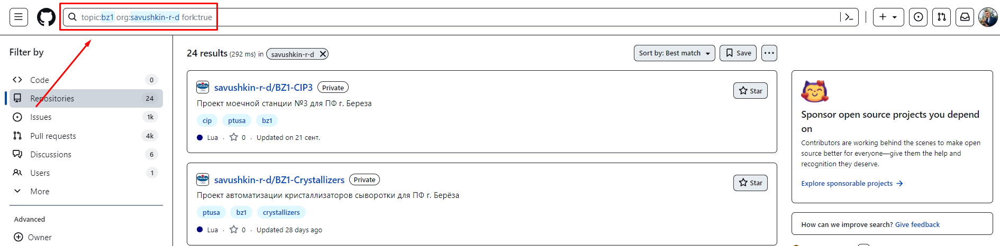
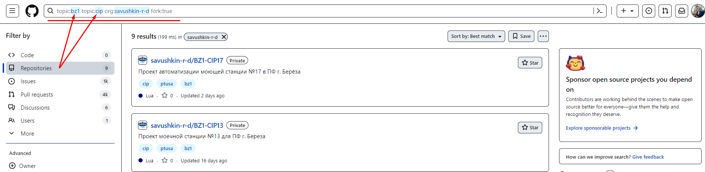
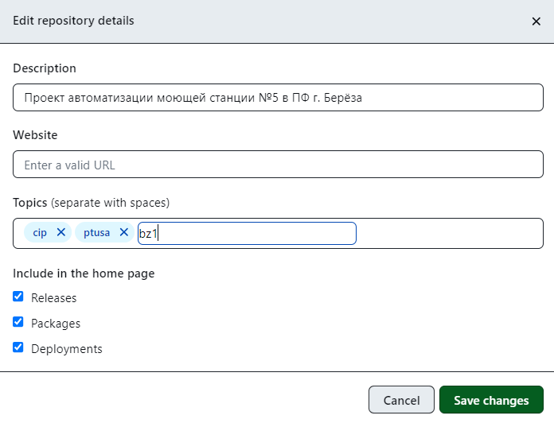

# **Классификация репозитория с помощью тем (topics)**

Чтобы помочь другим пользователям найти ваш проект и принять в нем участие, вы можете добавлять темы в репозиторий, связанные с целью проекта, его предметной областью, территориальными группами и другими важными качествами.

## **Содержание**

1. [Сведения о темах в GitHub](#Сведения-о-темах-в-GitHub)
1. [Поиск тем](#Поиск-тем)
1. [Создание тем](#Создание-тем)

## **Сведения о темах в GitHub**

С помощью тем вы можете изучать репозитории в определенной предметной области, находить проекты, в которые можно внести свой вклад, и находить новые решения конкретной проблемы. Темы отображаются на главной странице репозитория. Вы можете щелкнуть по названию темы, чтобы просмотреть связанные темы и список других репозиториев, классифицированных по этой теме:

Часто используемые темы организации отображены на главной странице в правом нижнем углу:

## **Поиск тем**

Каждому проекту автоматизации были присвоены темы по основным признакам:

- тема `ptusa` присваиваются проектам с управляющей программой **ptusa_main**;
- тема Wago присваивается проектам, разработанных на модулях Wago;
- так же присвоены темы по местоположению проекта (`bz1`, `br1` и т. п.) и его названию (`cip` и т. п.).

Вот пример поиска всех [проектов](https://github.com/search?q=topic%3Aptusa+org%3Asavushkin-r-d&type=repositories) (указан topic, organization):

Можно сузить поиск путём добавления ещё одной темы в поисковой строке как в данном [примере](https://github.com/search?q=topic%3Aptusa+topic%3Acip+org%3Asavushkin-r-d&type=repositories):

Можно искать сразу несколько интересующих тем [следующим образом](https://github.com/search?q=BR1+OR+BR2+OR+BZ1+OR+BN1+OR+S1+OR+P1+in%3Atopics+topic%3Aptusa&type=repositories):

## **Создание тем**

Администраторы репозитория могут добавлять в репозиторий любые темы, которые они захотят. Полезные разделы для классификации репозитория включают предполагаемое назначение репозитория, предметную область, сообщество или язык. Кроме того, GitHub анализирует содержимое публичного репозитория и генерирует предлагаемые темы, которые администраторы репозитория могут принять или отклонить. Содержимое частного репозитория не анализируется и не получает предложений по темам.

Добавление тем:

- На GitHub.com перейдите на главную страницу репозитория;
- В правом верхнем углу страницы, справа от «О программе», нажмите ;
- В разделе «Темы» начните вводить тему, которую вы хотите добавить в свой репозиторий, чтобы отобразить раскрывающееся меню со всеми подходящими темами. Нажмите на тему, которую хотите добавить, или продолжайте вводить текст, чтобы создать новую тему;
- Необязательно: если в поле «Темы» отображаются «Предлагаемые» темы, нажмите "+", чтобы добавить или отклонить предложенную тему "-";
- Закончив добавлять темы, нажмите "Сохранить изменения".

