# **Настройка модулей шины с помощью программного обеспечения Startup+**

## **Содержание**

1. [Установка ПО](#Установка-ПО)
2. [Загрузка каталога оборудования](#Загрузка-каталога-оборудования)
3. [Создание проекта](#Создание-проекта)
4. [Подключение к модулю и чтение данных с готового проекта](#Подключение-к-модулю-и-чтение-данных-с-готового-проекта)
4. [Загрузка новых данных в модуль](#Загрузка-новых-данных-в-модуль)

## **Установка ПО** 

Для установки программного обеспечения Startup+ необходимо:
- [перейти по ссылке](https://www.phoenixcontact.com/online/portal/us?uri=pxc-oc-itemdetail:pid=2700636&library=usen&tab=1);
- Перейти в раздел **Downloads**;
- Скачать файл формата **.exe** в ветке **Software**.

## **Загрузка каталога оборудования**

После установки Startup+ необходимо загрузить каталог оборудования:

- В окне **DTM Catalog Management** необходимо нажать кнопку **Search for installed DTMs**:

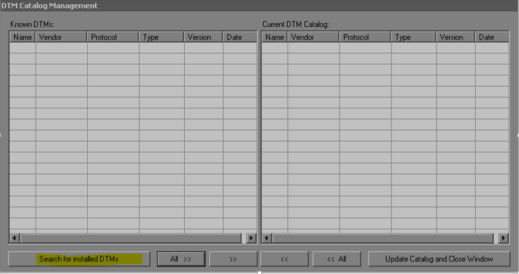

- Далее нажимаем кнопку **All**:

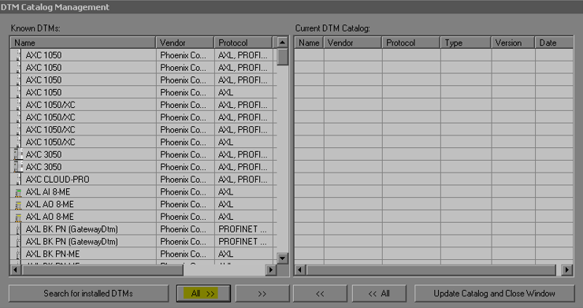

- Затем нажимаем кнопку **Update Catalog and Close Window**:

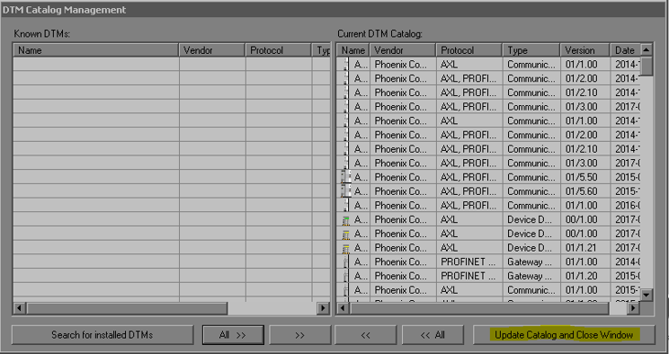

## **Создание проекта**

- **Шаг первый**: выбираем **Create new project** и жмём кнопку **Next**.

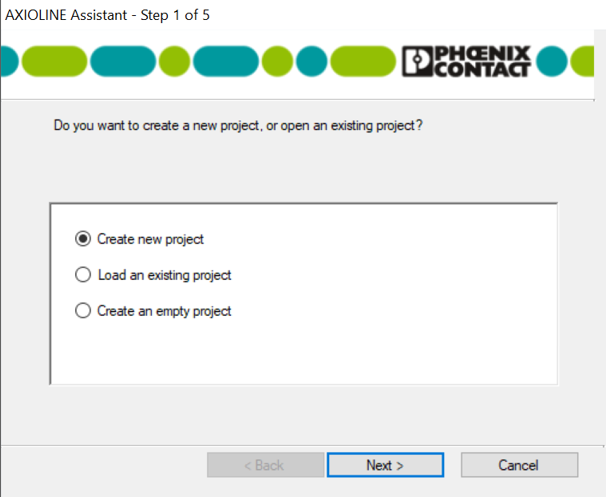

- **Шаг второй**: находим необходимое устройство, к которому подключена шина и жмём кнопку **Next**.

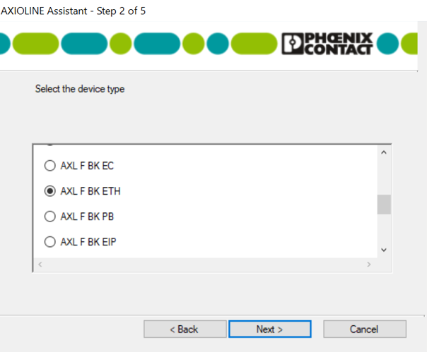

- **Шаг третий**: выбираем тип соединения (при подключении через Ethernet нужно знать IP-адрес устройства, также можно подключаться через com-порт, где не требуется знать адрес и его можно задать через программу) и жмём кнопку **Next**:

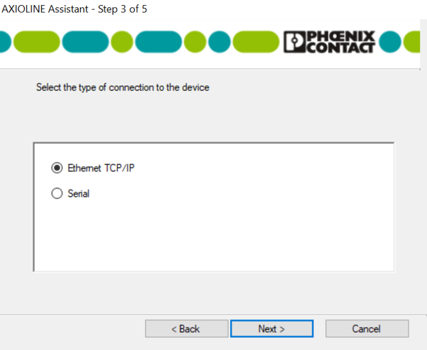

- **Шаг четвёртый**: если IP-адрес известен, необходимо выбрать **Select an already configured device via IP address**, ввести необходимый IP-адрес и жмём кнопку **Next**:

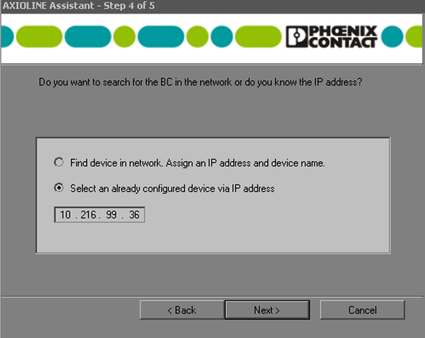

- **Шаг пятый**: Затем происходит сканирование шины. Нажимаем кнопку **Continue**:

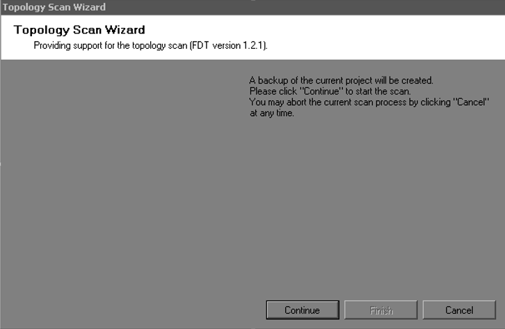

- Выбираем версии установленных модулей (При автоматическом выборе будет выбрана первая версия в списке), нажимаем **Continue**:

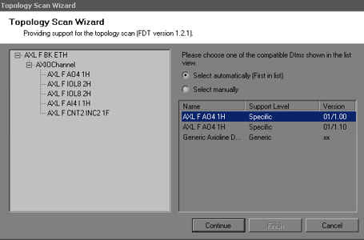

- После завершения сканирования шины необходимо нажать кнопку **Finish**:

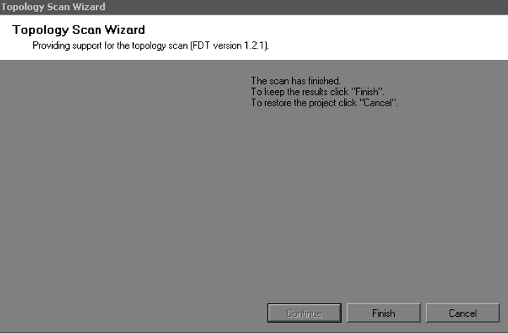

## **Подключение к модулю и чтение данных из готового проекта**

- Выбраем модуль, данные которого необходимо считать.
- Для соединения с модулем нажимаем на выделенную кнопку (Connect with device):

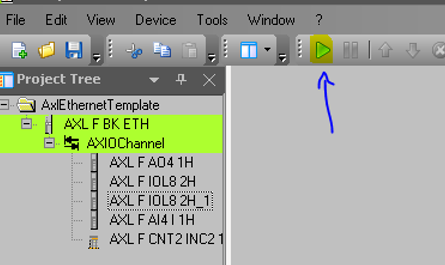

- Загружаем данные с модуля, при успешной загрузке модуль будет выделен зеленым цветом:

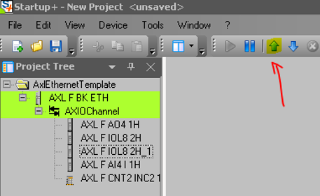

- Открываем окно оффлайн параметров модуля (нажимаем выделенную кнопку):

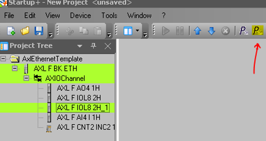

- Здесь мы можем просмотреть параметры каждого канала (выделено жёлтым цветом):

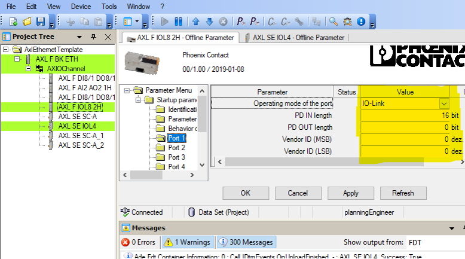

## **Загрузка новых данных в модуль**

- Для соединения с модулем нажимаем на выделенную кнопку (Connect with device):

- Далее двойным кликом переходим на сам модуль:

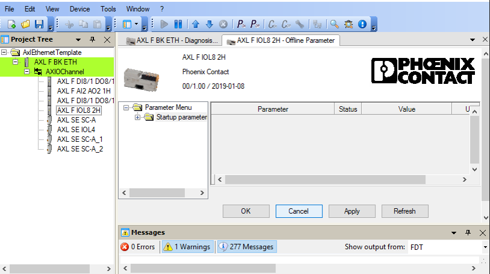

- В разделе **Parameter Menu** выбираем **Startup parametrization**, далее выбираем необходимый порт:

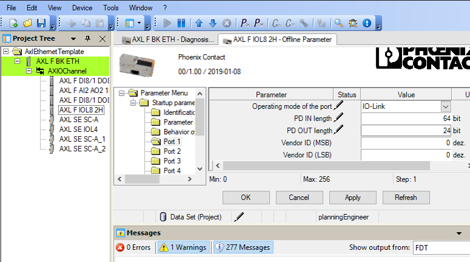

-  В настройках порта указываем тип сигнала в поле **Operating mode of the port** и указываем необходимую размерность в соответствующее поле **PD IN\OUT length**.

- Размерность для каждого канала можно посмотреть в заранее сконфигурированном файле Excel в Eplaner. Данный файл находится  **N1-Project-name.edb\DOC\N1-Project-name.xlsx**.

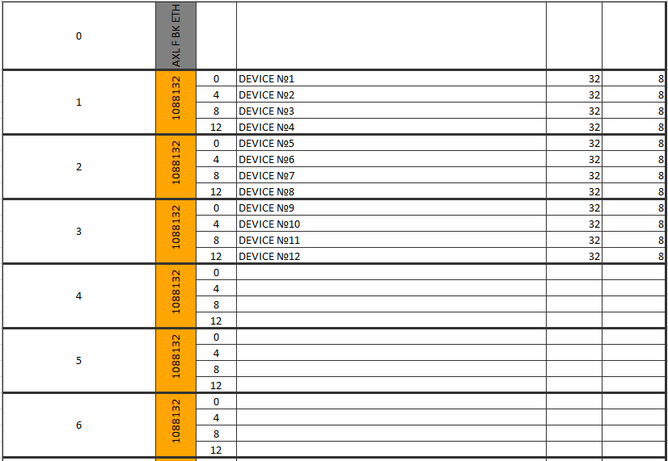

- Производим требуемую настройку и нажимаем  «Применить» (выделенная кнопка 1), потом загружаем данные на модуль (выделенная кнопка 2):

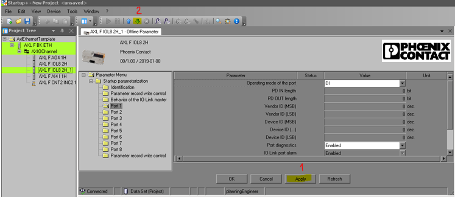

- Для просмотра графика сигналов нажимаем на уже сконфигурированный модуль правой кнопкой мыши, затем Functions >> IO Chek:

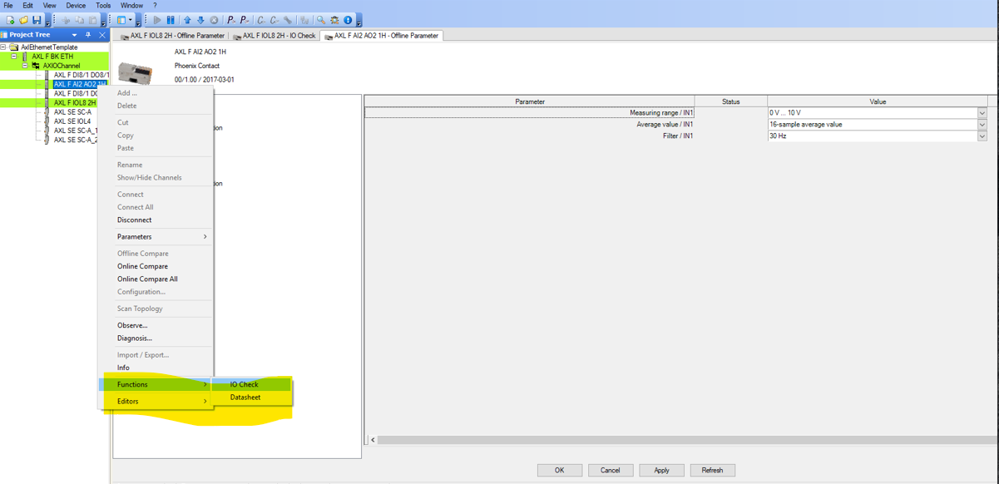

- Устанавливаем галочки для используемых каналов:

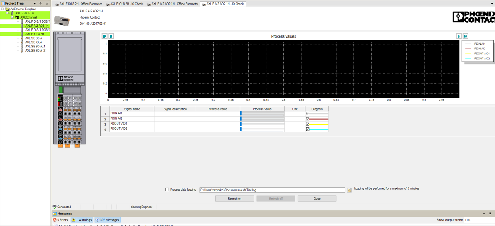

- Далее нажимаем на кнопку **Refresh on**. После чего можем считывать показания устройств в реальном времени. Так же есть возможность зафиксировать данные в отдельный документ:

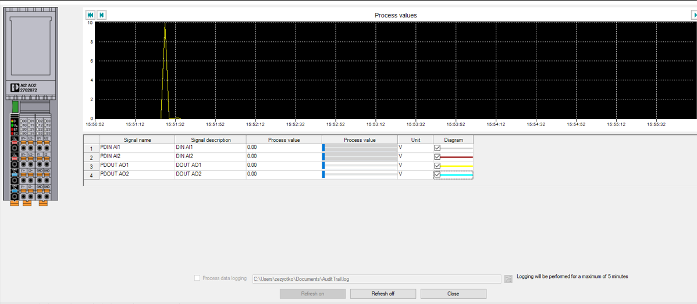

