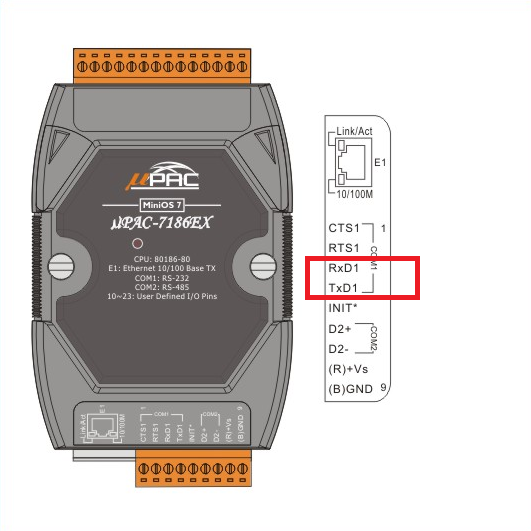
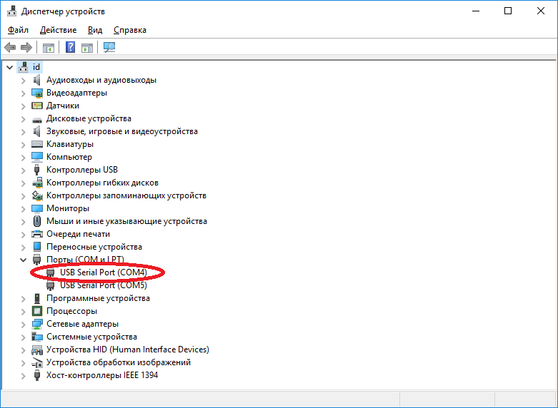
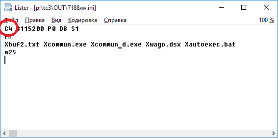
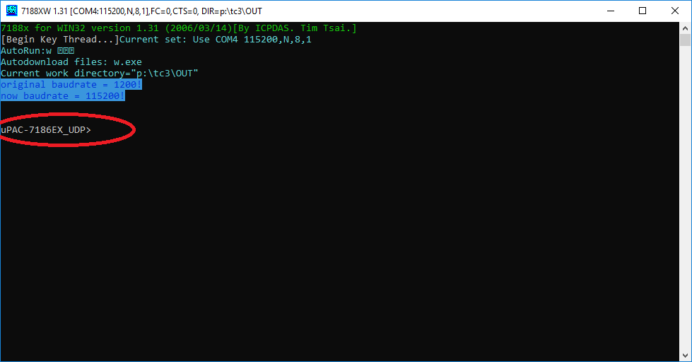
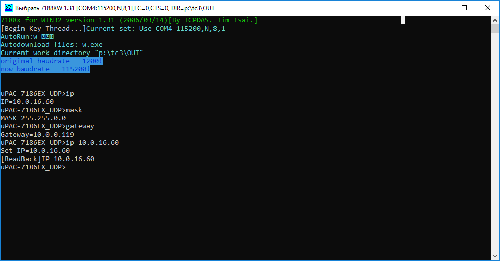
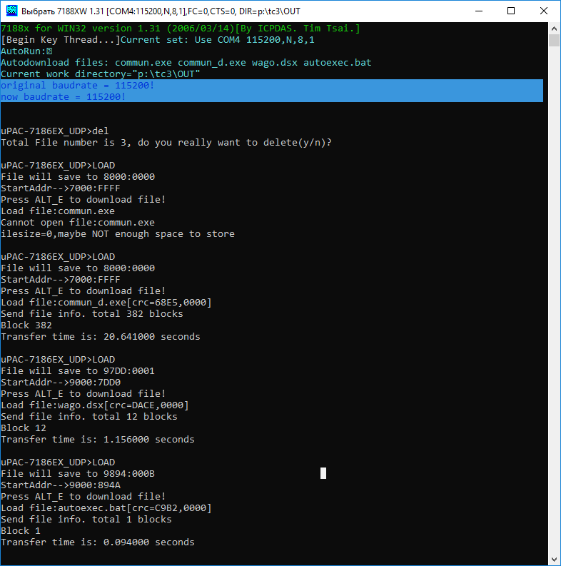
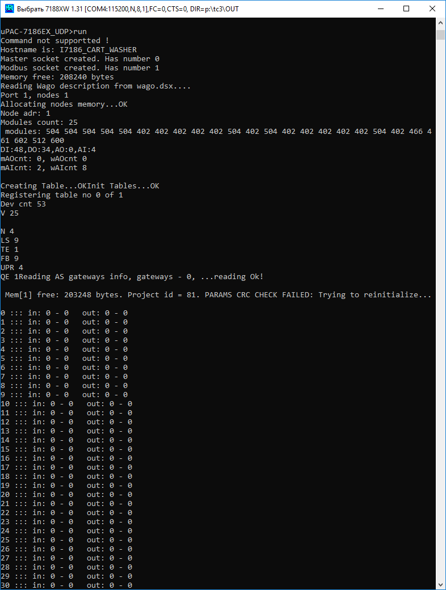

## Работа с контроллером через COM-порт ##
### Подключение контроллера через COM-порт ###

Схема подключения к компьютеру через COM-порт (можно использовать конвертер USB-COM):

Нужно определить номер используемого COM-порта (клавиши *WIN*+*PAUSE/BREAK*) через диспетчер устройств Windows:  

После чего указать номер порта в конфигурационном файле [p:\tc3\OUT\7188xw.ini](p:\tc3\OUT\7188xw.ini):

Также в этом файле изменить 3-ю строку на следующую (список файлов для автозагрузки по нажатии клавиш **ALT**+**F9**):

>  Xbuf2.txt Xcommun.exe Xcommun_d.exe Xwago.dsx Xautoexec.bat

Далее необходимо запустить утилиту [7188XW.EXE](http://ftp.icpdas.com/pub/cd/8000cd/napdos/minios7/utility/document/7188xw.htm)
Путь к программе:
>p:/tc3/OUT/7188XW.EXE

После успешного запуска программ необходимо нажать клавишу Enter и мы должны увидеть приглашение от контроллера:

### Задание\просмотр сетевого адреса (при его отсутствии\смене) ###

Перед заданием нового IP-адреса необходимо убедиться в отсутствии устройства уже использующего такой IP-адрес. Это можно сделать запустив в консоли программу ping <IP-адрес>. При отсутствии устройства утилита не получит ответ и данные адрес можно использовать, в противном случае - нельзя.

Далее для просмотра текущего IP-адреса, маски подсети и шлюза используются следующие команды:
> ip  
> mask  
> gateway  

Для смены текущего IP-адреса, маски подсети и шлюза используются такие же команды с новым значением параметра (например, ">ip 10.0.16.60" для задания IP-адреса). Для применения сетевых настроек контроллер необходимо перезагрузить. Пример работы с данными командами:

### Запуск проекта на тестовом контроллере (тестирование) ###

Файлы для тестирования новой версии управляющей программы проекта находятся в каталоге **Z:\ICP-CON\\<Название площадки>\\<Название проекта>**.

Список файлов, описывающих проект:  
- __*commun_d.exe*__ - отладочная управляющая программа (не опрашивает удаленные модули ввода\вывода);  
- __*wago.dsx*__ - список всех устройств.

Для тестирования проекта копируем в рабочий каталог **p:\tc3\OUT** из **Z:\ICP-CON\\<Название площадки>\\<Название проекта>** файлы **commun_d.exe** и **wago.dsx**.

Для обновления описания (или записи нового) проекта необходимо подключить через COM-интерфейс контроллер к компьютеру и  записать файлы проекта. Для этого используется утилита [7188XW.EXE](http://ftp.icpdas.com/pub/cd/8000cd/napdos/minios7/utility/document/7188xw.htm)
Путь к программе:
>p:/tc3/OUT/7188XW.EXE

Вначале удаляем старые файлы с помощью команды **del**, далее копируем новые требуемые файлы на контроллер используя сочетание клавиш **ALT**+**F9**:

После успешного копирования запускаем программу набирая в консоли команду **run**:

## Восстановление управляющей программы на рабочем контроллере ##

Файлы рабочего проекта находятся в каталоге **p:\PLC_exe\\<Название площадки>\\<Название проекта>**. В данном каталоге находится актуальная версия файлов, которые записаны на управляющий контроллер.

Список файлов, описывающих проект:  
- __*commun.exe*__   - управляющая программа;  
- __*commun_d.exe*__ - отладочная управляющая программа (не опрашивает удаленные модули ввода\вывода);  
- __*wago.dsx*__ - список всех устройств.

## Работа с контроллером через Ethernet (по IP-адресу) ##

Для этого используется утилита [7188eu.exe](http://ftp.icpdas.com/pub/cd/8000cd/napdos/minios7/utility/document/7188e_eng.htm)
Путь к программе:
>p:/tc3/OUT/7188eu.exe

Перед подключение к контроллеру, необходимо задать его IP-адрес в конфигурационном файле  [p:\tc3\OUT\7188eu.ini](p:\tc3\OUT\7188eu.ini):

>  P23 S10.0.16.31
