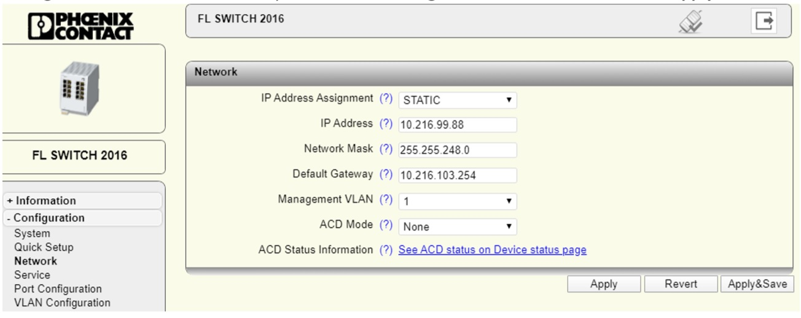
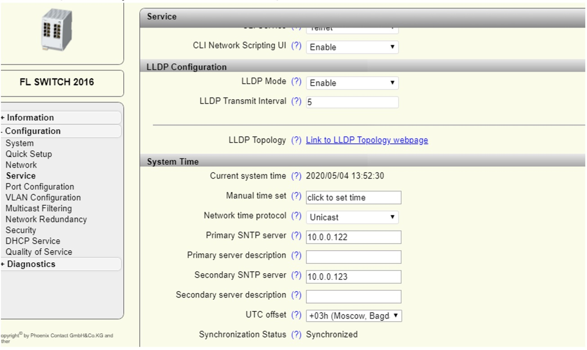
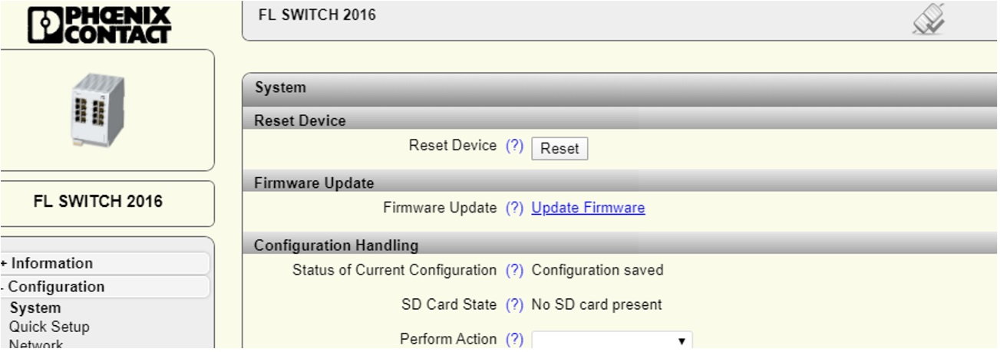
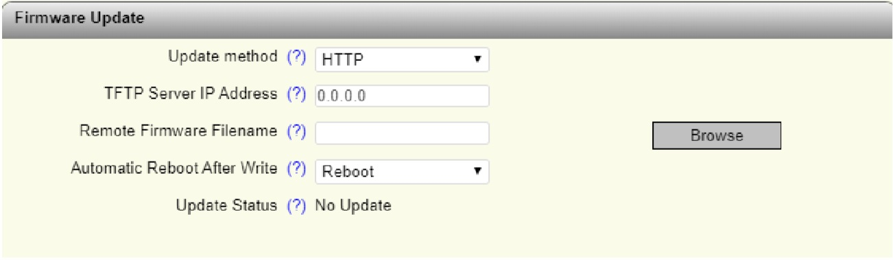
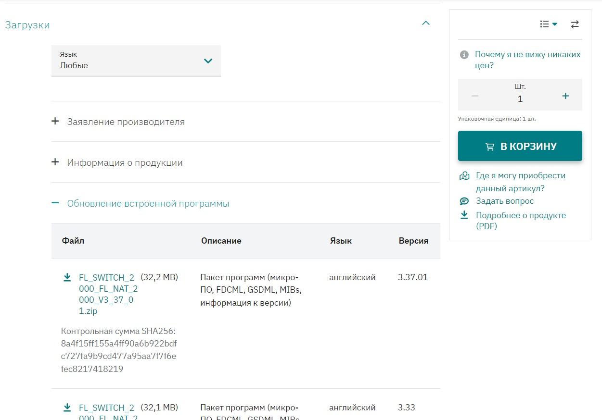
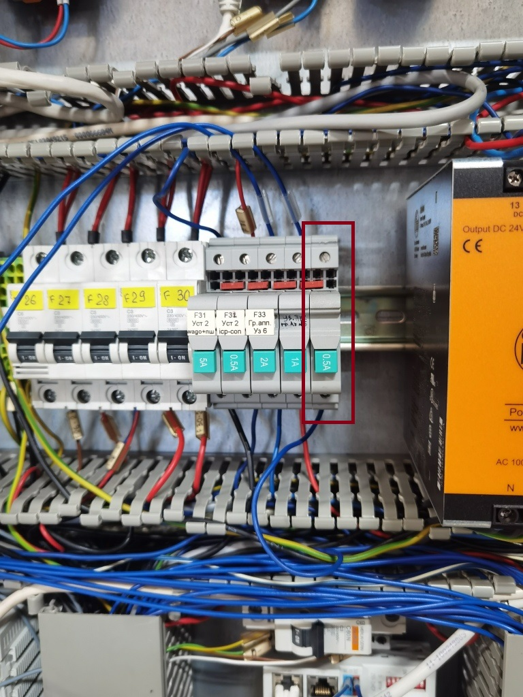
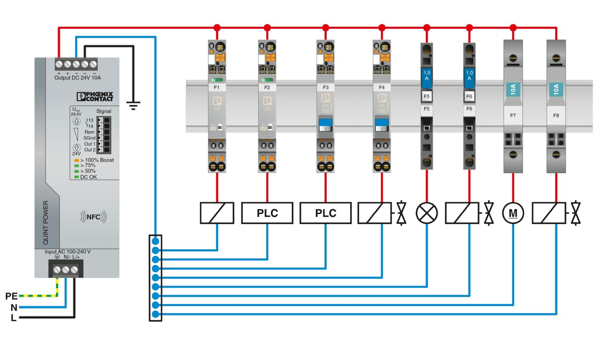
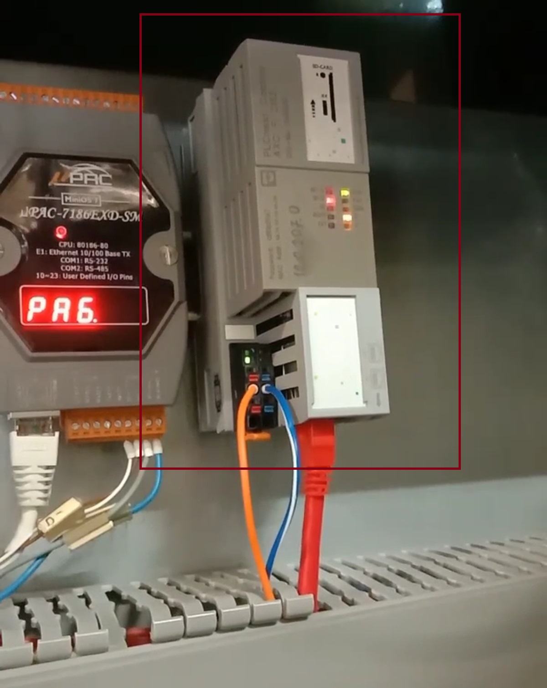

# 1. Замена контроллера ICP CON на Phoenix Contact

## 1.1 Замена коммутатора (если необходима)
Изредко бывает, что в шкафах автоматики остаётся свободен только один сетевой порт, тогда нужно либо добавить дополнительный коммутатор, либо заменить имеющийся коммутатор на новый с большим количеством портов. В нашем случае мы произвели замену коммутатора *FL SWITCH SFNB 5TX* на программируемый коммутатор *FL SWITCH 2008*.

Перед установкой коммутатора нам необходимо задать IP-адрес устройства. Чтобы задать правильный адрес в промышленной сети необходимо найти диапазон IP-адресов, которые не используются на заводе. Это можно сделать с помощью таблицы адресов **IP_Table** или веб приложения **NetBox**. Для каждой производственной площадки доступны свои диапазоны адресов, которые могут быть использованы на производстве.

## 1.2 Настройка коммутатора (необходима только для управляемых коммутаторов)
1. С помощью программы IPAssign_v1.1.3.exe задаем IP-адрес коммутатора.
2. С помощью веб-браузера заходим по адресу коммутатора (логин admin пароль private). Во вкладке *Configuration*->*Network* меняем пункт IP address Assignment на STATIC. Нажимаем *Apply&Save*.

3. На вкладке *Configuration*->*Service* ставим Network time protocol – Unicast, Primary SNMP server – 10.0.0.122, Secondary SNMP server – 10.0.0.123, UTC offset - +03h.

4. На вкладке Configuration->Service нажимаем пункт *Update Firmware*

Нажимаем кнопку Browse и выбираем файл прошивки (с расширением .bin).

Файл прошивки можно скачать с [официального сайта](https://www.phoenixcontact.com/ru-pc/produkty/promyslennyi-kommutator-fl-switch-2008-2702324) в формате ZIP. Актуальная прошивка находится в пункте «Обновление микропрограммного обеспечения» вкладки «Загрузки» на странице описания коммутатора.

После обновления коммутатор перезагрузится.

## 1.3 Установка коммутатора в шкаф автоматики

1. Устанавливаем коммутатор на Din- рейку.
2. Установливаем термомагнитный защитный выключатель на Din- рейку.

3. Подключаем питание к коммутатору через защитный выключатель.
Пример схемы подключения устройств.

При успешном подключении коммутатор проинформирует нас о включение с помощью индикации зелёного цвета.
4. Подключем кабель промышленной связи к коммутатору. Проверить подключение коммутатора в заводскую сеть можно с помощью команды *ping 000.000.000.000* в командной строке.

Коммутатором можно пользоваться.

## 1.4 Установка контроллера в шкаф автоматики

Перед установкой в шкаф автоматики необходимо настроить контроллер. Информацию по настройке контроллера можно найти [здесь](https://github.com/savushkin-r-d/T1-PLCnext-Demo).

1. Устанавливаем контроллер на Din- рейку рядом с ICPcon.

2. Устанавливаем термомагнитный защитный выключатель на Din- рейку.
3. Подключаем питание к контроллеру через защитный выключатель.
4. Подключаем сетевой кабель Ethernet от коммутатора к контроллеру и проверяем соединение. Проверить подключение контроллера в заводскую сеть можно с помощью команды *ping 000.000.000.000* в командной строке.

Контроллер успешно установлен и готов для дальнейшей настройки для запуска проекта АСУТП.