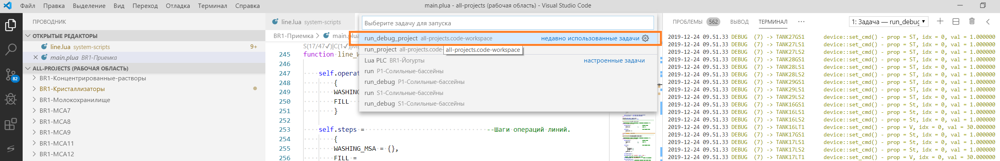
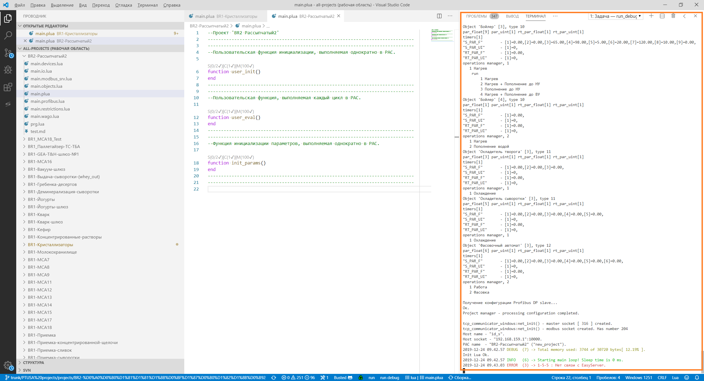
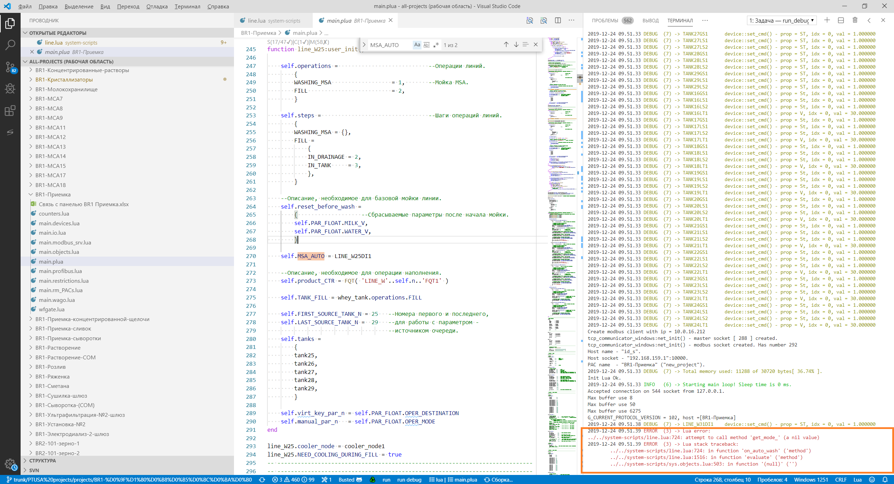

# Отладочный запуск проекта

[1.1 Общие сведения](#11-общие-сведения)

[1.2 Запуск тестирования](#12-запуск-тестирования)

[1.3 Тестирование работы управляющей программы в VS Code](#13-тестирование-работы-управляющей-программы-в-VS-Code)

Перед тестированием проекта необходимо обновить следующие каталоги:
1. Описание реализованных проектов (каталог по умолчанию - **"P:\PTUSA-projects"**);  
2. Дополнение к Eplan (**"P:\EasyEPlanner AddIn"**);  
3. Проекты EasyServer'a (**"P:\Monitor\Projects"** и **"P:\Monitor\Mpk"**);
4. Базу каналов тестируемого проекта (**"P:\Monitor\chbase\xxx"**).
5. Рабочая область с проектами (файл - **"P:\PTUSA-projects\all-projects.code-workspace"**); 

## 1.1 Общие сведения

В качестве редактора используется [**Microsoft Visual Studio Code**](https://code.visualstudio.com/).

Тестирование служит для того, чтобы обнаружить некорректную работу управляющей программы. Для того, чтобы можно было исправить ошибку, ее необходимо воспроизвести на своем рабочем месте - то есть необходимо знать, какая последовательность действий приводит к ее возникновению. Поэтому, необходимо не только описывать, что происходит не так (не отключается мойка по сигналу...), но и описывать последовательность действий, приводящих к данной проблеме (включаю мойку линии, через монитор устанавливаю сигнал - мойка не отключается, хотя должна...)

## 1.2 Запуск тестирования

Перед тестированием необходимо обновить проект.

Тестирование проекта в VS Code осуществляется несколькими способами:

1. **"Терминал"** -> **"Запуск задачи"** -> **"Debug run project"**;

2. Комбинация клавиш **CTRL+SHIFT+B**.

Остановка тестирования осуществляется несколькими способами:

1. **"Терминал"** -> **"Завершить задачу"**;

2. Комбинация клавиш **CTRL+С** при активном фокусе окна консоли. В данном случае содержимое консоли не очищается;

3. Закрыть редактор VS-Code.

### 1.2.1 **Устарело.** Запуск тестирования с глобальными Lua-скриптами

Для тестирования необходимо сделать копию проекта из Github-[репозитория](https://github.com/savushkin-r-d/ptusa-Lua-sys.git) в каталог **P:\PTUSA-projects\sys-scripts**.

Тестирование проекта в VS Code осуществляется путём запуска задачи из меню:

1. **"Терминал"** -> **"Запуск задачи"** -> **"Debug run project (use ../../sys-scripts)"**;

### 1.2.2 **Устарело.** Запуск тестирования в кодировке CP-1251

Для тестирования проекта в данной кодировке, необходимо:

1. Перейти по адресу https://github.com/savushkin-r-d/ptusa-Lua-sys/releases/tag/CP1251;

2. Скачать Source code в формате `zip` или  `tar.gz`;

3. Извлечь файлы в каталог **P:\PTUSA-projects\sys-scripts-git-CP1251**;

Запуск проекта в VS Code:

**"Терминал"** -> **"Запуск задачи"** -> **"Debug run project (CP1251)"**.

## 1.3 Тестирование работы управляющей программы в VS Code

Описание управляющей программы реализовано в виде Lua-скриптов. Для тестирования необходимо запустить программу в редакторе на своей локальной рабочей машине. 

Необходимо открыть файл проектов - **"p:\PTUSA-projects\all-projects.code-workspace"**.

Для запуска требуемого проекта необходимо в окне навигации перейти к файлу `main.plua` и выбрать его для редактирования. Далее выбираем в меню **Терминал** - **Запустить задачу**, далее выбираем соответствующий пункт меню. Пример:

Окно работающей программы представлено ниже (оранжевым выделен лог - туда пишется отладочная информация, ошибки и т.д.).

Если в скриптах проекта есть ошибка, то это приведет к некорректной работе управляющей программы. Сообщение об ошибке отобразится в логе.

Пример тестирования: включаю мойку линии `W31` - подаю сигнал `LINE_W31DI1`, ничего не происходит, а содержимое лога следующее:

Таким образом, при обнаружении ошибки:
- обновить все необходимые каталоги;
- повторить обнаруженную ошибку;
- четко описать последовательность действий, приводящих к ее возникновению;
- в **Github issues** создать соответствующий запрос (приложить содержимое лога, при наличии там сообщений об ошибках).
